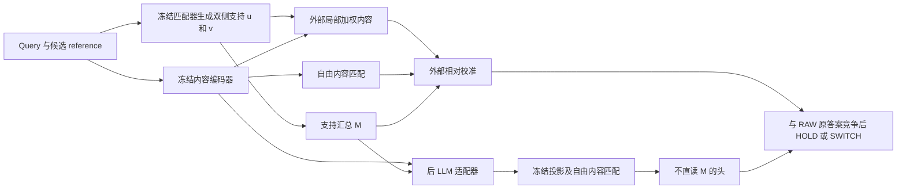

# new HYP：论文主线、贡献与证据收口稿

初稿2026-09-24；2026-09-25依据全量后 LLM 结果与归因更新。依据已完成结果重新组织写作，不更改实验协议、主次臂、历史结果或运行程序。本文件提供更新的摘要、贡献段、方法定义及主表；不是已经排版完成的投稿稿。

当前统一解释以[软支持—外部校准—内部调制收口](RC_NEW_HYP_UNIFIED_SUPPORT_CLOSURE_20260925.md)为准。该文补齐原 superregion 与软支持的功能联系，并给出逐项证据和数值来源；本稿同步更新主问题、方法图、内部主表和英文摘要。历史空间资格门及早期内部负结果仍按原协议保留。

2026-09-25本轮按用户指定，集中完成[最近邻文献与新增认识核对](REPORT_NEW_HYP_NOVELTY_AUDIT_20260925.md)。用户进一步明确：benchmark是对现有ColNomic、ColQwen、ColPali等模型的检索表现进行统一比较，由学长整理和写作；不是另建数据集。本文随后展示我们的方法对检索器的补强，再用理论与机制实验解释补强的原因。文献近邻核对与这一检索器benchmark分别承担方法定位和性能比较的作用。

旧稿 [2026-09-09 working draft](RC_RETRIEVAL_ONLY_PAPER_WORKING_DRAFT_20260909.md) 保留作历史记录。其空间问题设定、结果面板与部分符号不再代表本文最新叙事。本稿中的 RPC 定位以用户后续决定为准：仅作诊断，不列正式外部效果主表。

## 1. 主问题与核心回答

**核心表述：我们区分reference条件空间支持的生成与使用，建立保留自由内容匹配的接口。在编码器外部，空间支持调节各patch在身份匹配中的贡献；进一步将这一空间支持的汇总信号M引入编码器内部，在LLM之后、检索投影之前调制表示，仍能实现有效纠错。由此验证了同源空间支持从外部加权到内部表示调制的有效使用。**

这里用“patch关注度”概括外部作用时，具体指编码完成后各patch对匹配评分的贡献权重；内部实现读取的是空间支持的汇总M，而非完整u、v网格。两者分别对应外部证据加权和内部表示调制，不能混写成已修改LLM注意力或把同一空间图搬入内部。

**机制解释：当前模型的大部分纠错不必依赖下游逐patch重新选区；候选支持可以通过共同表示变化影响内容判断。** 依据是固定模型共同响应回放保留52/54次原救回，以及固定内容命中仍保留44/54次；部分决策仍受局部剩余响应或重新匹配影响。“外部到内部仍有效”是方法主线，这一分解解释其有效方式。

**研究问题：只用检索身份监督、推理不提供真实目标位置或正确候选时，如何利用 reference 条件的双侧支持组织目标相关证据并完成身份判断；同源支持如何用于外部校准和内部表示调制？**

当前证据支持的回答是：双图上下文与软对应分布形成带空间索引的两侧支持 u、v，其汇总 M 提供现有内容分数未充分表达的候选区分。外部模型使用局部加权及相对校准；内部模型将真实 M 转成检索表示的条件变化，再由不直读 M 的头读取内容。全量回放中，共同表示响应保留原54次内部纠错中的52次，说明使用端不必逐patch重新定位才能利用空间来源的支持。在所测外部协议中，取消局部加权后重训仍能保留总体收益；显式乘积项没有稳定额外优势。

这承接原 superregion “由 reference 组织局部证据”的目标：显式 patch 集合推广为连续的双侧软支持。推广的是表示和任务功能，不是把所有旧 P-only、连通性或独立 V 条件改记为通过。u、v 有位置，M 压缩位置；下游能使用 M，不否定上游曾利用空间关系。90张成功图展示支持的空间形态，全量实验验证不同使用路径，两类证据相互补充但不互相替代。

这里的“未充分表达”限于已经比较的读出和训练方式。它不等于 ColNomic tokens 在信息论上缺少这些信息，也不证明 RoMa 唯一或不可替代。这里的“保留总体收益”指观察到的总体正确数，不代表逐图等价或统计等效性检验通过。

建议标题：**What Does Dense Matching Add to Frozen Visual Retrieval?**

可选副标题：**Reference-Conditioned Support for External Calibration and Internal Modulation**。正文保留 new HYP 作为框架名称，定义为 reference 条件软支持与内容读取；不宣称已恢复真实目标mask或完整验证旧连通区域模型。

### 论文的整体关系：检索器比较 → 方法补强 → 理论解释

1. **检索器benchmark（学长负责）。** 在一致任务、query及图库上比较现有ColNomic、ColQwen、ColPali等模型，交代具体版本、适配器和评分设置，呈现原始检索表现及共同挑战。
2. **我们的方法补强。** 对每个已完成对照的检索器，成对报告原模型与“原模型＋我们方法”的效果；补强阶段保留该检索器自己的自然候选轴。比较检索器原始能力和衡量同一检索器的补强增量是两个表格维度，不把二者混作模块强弱排名。外部接口的跨检索器结果与ColNomic内部改造结果分别标明。
3. **理论与机制解释。** 用空间支持的生成/使用分离、自由内容匹配接口、外部patch贡献加权和内部表示调制解释为什么能补强，再用绑定、重训和共同响应等对照支持具体结论。

benchmark为性能事实提供背景，补强实验检验方法作用，理论与干预给出解释，三者组成同一篇论文的证据链。当前ColQwen-base配置不代表正式检索训练版ColQwen的成绩；学长的模型比较应按实际checkpoint分别命名。尚未汇总的比较不提前填入结果。

## 2. 四项贡献及其证据

**论文同时主张检索器比较、方法补强、统一框架与机制发现。核心方法贡献是可复用的空间支持接口，核心认识贡献是外部和内部使用方式的机制发现。** 四项分别回答问题表现、解决方式、统一解释和实验证据；下表标明已完成部分及尚待汇总的benchmark。

| 贡献 | 可以写入正文的具体结论 | 对应证据与完成范围 |
|---|---|---|
| 检索器benchmark与补强评估 | 在共同任务协议下比较现有检索器，并分别检验加入本方法的配对收益，区分候选召回与身份纠错 | 已有各自自然C128上的H593外部补强：ColNomic426→481、ColPali283→348、ColQwen-base227→322；学长负责完整原始检索比较，未汇总的checkpoint与成绩待填 |
| 可复用的空间支持接口 | 分离reference条件空间支持的生成与使用，保留完整reference上的自由内容匹配；提供外部patch贡献加权与后LLM内部表示调制两种实现，任务模块仅用检索身份监督 | 外部算子对照；ColNomic内部POST_REAL478/593；固定内部源fold0在GroZi321→339/480（18救0损）；跨检索器已验证的是外部接口 |
| 外部与内部使用的统一框架 | 用“支持生成—空间表示及压缩—内容读取—身份决策”组织两条路径，说明同源空间证据如何经评分端或表示端起作用 | 双侧支持H、汇总M、自由内容读出及内部调制的明确公式；空间压缩与共同响应的推导；同源支持的功能迁移由两种实现及干预支持 |
| 经受控干预验证的机制发现 | 支持生成与下游逐patch使用可以分离；接口改变需要配套校准；内部大部分已观察到的纠错可由共同表示响应承载 | 去局部权重套旧头441，重训481；固定POST真实478、恒定426、错绑369；共同响应477并保留52/54次原救回，固定匹配位置469并保留44/54次；内容/头交换另见主表 |

### 可直接用于引言的中文贡献段

我们围绕现有多向量检索器的身份混淆，将检索器比较、方法补强与机制解释组成统一研究主线。方法上，我们提出可复用的reference条件空间支持接口，将支持生成与使用分开，保留完整reference上的自由内容匹配。该支持在外部调节patch对身份评分的贡献，其汇总信号也能在LLM之后、检索投影之前调制内容表示，实现有效纠错。理论框架将支持生成、表示及压缩、内容读取与身份决策分层组织；受控干预进一步发现，在所测系统中，空间来源的证据经配套校准后，可以通过汇总支持或共同表示响应承载大部分收益。这为支持模块的设计、简化与解释提供了可检验的依据。

### 理论框架、推导和经验发现分别承担什么

- **定义与统一：** reference条件双侧软支持H保留空间索引，压缩接口M传递候选级支持；外部与内部路径共享支持来源，并在不同位置作用于自由内容读取。统一的是信息来源和使用层次，各模型保留自己的参数与决策。
- **可推导性质：** 已生成的u、v经过位置置换，其均值及M不变；由此可知只传M的接口不保留完整空间排列。共同响应经过冻结线性投影和归一化，可将不同patch的内容方向作不同幅度的改变，因而能够影响候选内容分差。具体公式见§3，这些推导使用既有代数性质。
- **实验支持的机制命题：** 当前外部配置取消局部权重后可经重训恢复总体正确数；当前内部模型的共同响应保留大部分纠错。是否恢复收益、保留多少纠错由实验回答，不能仅从接口定义推出。

这套框架给出可操作的设计原则：支持图的用途、传入读出的信息量和配套校准应分别检验；看到纠错增益时，应区分局部重选与候选条件的表示变化。完整u、v仍可用于重要patch展示及辅助分割先验，内部M实验验证的是压缩支持的使用。

贡献范围与已有工作的具体区别见§7。匹配置信度、检索身份监督及条件调制均有先例；本文的新增认识由上述接口与受控发现共同承担。benchmark是已有模型的统一比较，ColQwen-base与检索训练版须分列；同一总体正确数不意味着逐图等价，功能统一不意味着数学等价或M对身份充分。全文保留强简化基线和历史负结果。

## 3. 方法表述：保留两个内容定义

令冻结检索器提供自然候选集 C128、RAW 分数 B 和原答案 w。令 q_i、r_j 为图像内容 tokens，c_ij 为余弦相似度。匹配器对每个 query–reference 对产生两侧网格权重 u_i(q,g)、v_j(q,g)。前者是在 reference g 条件下 query 位置 i 的支持，后者是在 query q 条件下 reference 位置 j 的支持；空间位置由网格索引携带。这两张图构成本文的软支持表示。当前实现的整体支持量（历史结果键仍称质量/visibility mass）为：

\[
M(q,g)=\sqrt{\operatorname{mean}_i u_i\;\operatorname{mean}_j v_j}.
\]

M 是由配对匹配产生的统计量，不是人工质量标签，也不是已校准的身份正确概率。相同 query 面对不同 reference，支持图及 M 可以不同；不同支持图也可能有相同 M。压缩不传递具体位置，不能据此否定上游位置关系参与产生支持。

按任务作用，正文称M为“重要的身份判别证据/候选比较的关键参考量”。这不否定它在计算上是支持的汇总统计，也不使用“身份充分统计量”的更强主张。支持生成的上游通路按“重要来源成分”报告，不要求或宣称唯一穷尽归因。

旧完整 scorer 和简化 scorer 的内容量要分别命名：

\[
L_{\rm vis}(q,g)=\frac{\sum_i u_i\max_j[v_j c_{ij}]}{\max(\sum_i u_i,\epsilon)},
\qquad S_{\rm vis}=M L_{\rm vis};
\qquad
L_{\rm free}(q,g)=\frac{1}{N_q}\sum_i\max_j c_{ij}.
\]

两者都允许内容在完整 reference 图像 tokens 内寻找匹配，没有要求读取 RoMa 指定的单点对应。L_vis 仍受局部权重影响；L_free 不含这些权重。不能因为旧稿有 L=S/M，就把它写成最新实验的自由内容 L_free。

定义候选相对证据 d_T(g)=(T_g−T_w)/(|T_g|+|T_w|+epsilon)，RAW 差分 δ_B 另按 C128 的标准差归一化。精简加性头为：

\[
z_g=a\delta_B(g)+b d_M(g)+c d_{L_{\rm free}}(g)+d.
\]

全部127个挑战者与 HOLD=0 一起比较；只有最大挑战分数大于0才切换。MASS5 增加 d_(M L_free) 列，并按同一训练协议拟合。这一乘积列是**各候选先相乘，再作相对差分**，不是 d_M×d_L。QWEN_ML5 则仅同时加入 M、L 两列，没有乘积；QWEN_ML_PRODUCT6 才是追加乘积的实验。

图注：完整局部加权和自由内容简化是不同外部配置；图示两类外部读出与内部路径的共同来源，不将其拼成一个未测头。内部路径作用于 LLM 输出、冻结检索投影之前；没有修改 LLM attention。外部头、内部适配器及配套头由任务监督学习。小头参数量不包含冻结编码器和匹配器，不能写成整个系统计算很少。

任务训练只使用 query–reference 身份／配对监督，不增加本任务的框、mask 或点对应标注。该说法不描述基础模型的预训练监督，也不等于完全无监督或已经量化的标注时间节省。

Target-free特指推理不使用真实目标位置、目标身份或正确reference标签，各自然C128候选按同一规则形成支持与评分；训练仍有身份监督，推理仍使用完整图库候选。外部头训练不改变冻结RoMa产生的u、v，后LLM训练学会使用M；因此本文主张学习支持的身份判别用途，不将空间热图的形成全部归因于检索训练。

**分割应用声明：reference条件软支持可用于辅助目标分割，为候选目标的位置与范围提供空间先验。** 检索后保留预测reference对应的query支持图u，可向后续mask生成或细化提供输入；只保留标量M无法恢复边界。当前未量化该应用的mask/IoU表现，SAM3裁剪检索对照也不等同于分割精度对照。

**重要patch识别：u、v可识别和排序支持特定候选reference的局部patch，为内容读取和局部证据展示提供依据。** 这种重要性是候选条件的匹配支持，不是与候选无关的显著性，也不直接等同于通过逐patch干预测得的因果重要性。区域定位、重要patch识别与辅助分割共同使用带空间索引的支持图；内部调制使用其压缩量M，两者在信息保留范围上不同。

精确特征、标准化、epsilon 和实验键名见[头命名与公式](NOTE_NEW_HYP_HEAD_NOMENCLATURE_20260924.md)及绑定源码。

### 后 LLM 内部接口

对冻结 LLM 输出 h_i，在该折 TRAIN 统计下标准化 log M，训练残差适配器 A_theta(h_i,M)；冻结检索投影 W 后归一化，再对原 reference tokens 做自由内容匹配。INTERNAL3只读RAW差、改造后的相对内容与偏置，不直接读取M。reference编码保持冻结，query检索表示随候选条件改变。这是保留RoMa的内部利用，并非蒸馏去RoMa或前LLM实验。

本稿称这项已验证结果为“外部校准→内部调制的功能迁移”：将外部评分阶段使用M的能力，转为在内容表示阶段使用M。它已由H593内部模型及对照得到支持，不要求超过外部头，也不等同于直接复制外部头参数。另一个概念“跨数据集验证”专指把固定模型用于GroZi/ISIC等面板，不能与这里的内外使用位置混淆。

2026-09-25最后补充已完成：直接冻结现有H593 fold0 POST_REAL，在GroZi480原自然C128上由RAW321提升至339，18救/0损；同一模型恒定M为314、错绑M为308。全部480张及27个来源视频计入，70张target不在C128仍计入分母。没有重新训练H593或fold0，也没有在GroZi选择源模型、调整标准化或阈值；源五折478/593保持原定义。

相对RAW，query等权提升3.75个百分点；等视频权重增益2.263个百分点，95%组bootstrap区间[0.950,3.788]。相对错绑M区间[1.263,7.576]为正；相对恒定M区间[-0.494,6.675]跨0，因此不称所有绑定对照均显著。源fold0配套外部ADDITIVE4/PRODUCT5各342（24救/3损），不是下文另批外部头的349/355；内部与同源外部头差异区间跨0，不声称内部优越或统计等效。详见[完整结果](REPORT_POSTLLM_GROZI_EXTERNAL_V1_20260925.md)及[提交、校验修复记录](REPORT_POSTLLM_GROZI_EXTERNAL_SUBMITTED_20260925.md)。

全量固定模型的分解为 A(h_i,M)−A(h_i,0)=d_q(M)+e_i(M)，其中0是标准化条件零点、mean_i e_i=0。共同响应投影后使单位token成为(p_i+t_q(M))/||p_i+t_q(M)||；同一方向与不同内容及reference的点积不同，所以无需逐patch不同响应也能改变分差。这是标准代数说明与当前模型回放的结合，不是新注意力定理，d_q也不被假定为仅依赖M的跨query常量。

## 4. 主表一：原效果与更简单的解释

H593、原身份／来源组件五折、ColNomic 自然 C128、固定零阈值；目标在池内570/593，23张缺席仍计入分母。以下均为 COST1；H593 已被多轮开发使用，五折隔离不能消除后续自适应开发影响。

| 比较类别 | 模型／操作 | 正确/593 | 对RAW救回/误伤 | 主要含义 |
|---|---|---:|---:|---|
| 原系统 | RAW | 426 | 0/0 | 共同基线 |
| 原系统 | 完整 NATIVE7 | 481 | 58/3 | 原机制效果 |
| 固定头干预 | 去局部权重，仅保留M与自由内容，套旧头 | 441 | 15/0 | 原参数对改变后的统计不自动适用 |
| 同协议重训 | 上述简化算子，重新拟合头 | 481 | 57/2 | 总体收益可恢复，正确集合不同 |
| 简单解释 | 仅M的质量头 | 443 | 20/3 | 质量单独使用不及联合校准 |
| 简单解释 | RAW＋L_free | 426 | 0/0 | 当前附加内容读出未纠错 |
| 简单解释 | **RAW＋M** | **478** | **55/3** | 必须公开的强简化基线 |
| 简单解释 | RAW＋M＋L_free，加性4参数 | 481 | 57/2 | 精简可用接口 |
| 简单解释 | 再加M×L_free，5参数 | 481 | 57/2 | 对加性头全部593选择一致 |

不能由“固定头删除后下降”直接推导该操作不可替代；重训对照回答的是在同一信息／训练约束下能否恢复收益。也不能把“重训后同为481”当作不经重训即可删除该操作。两类问题须相邻呈现。

来源：[质量算子消融](REPORT_H593_QUALITY_OPERATOR_V1_20260922.md)、[简单解释全表与统计](REPORT_H593_SIMPLE_EXPLANATIONS_V1_20260924.md)。CE及训练内选择阈值的全部结果保留附录，不替换此表预定 COST1 口径。

### 候选绑定与实际纠错的连接

原H593第一折119张、其中113张目标在C128，RAW98、原完整头105、原生M＋自由内容简化头104。简化路径保留原9次救回中的8次，117/119最终选择相同。固定参数、RAW与内容，循环错配候选M后104降至80，8次保留的原救回只剩1次。

这支持候选配对信息参与实际纠错；不是把任意整体常数增大就有效。错绑属于受控输入干预，会破坏原联合分布；它不能单独证明空间ownership或信息来源的唯一性。该面板与H593重叠，不能计作另一份独立验证。来源：[第一折机制分析](REPORT_PAIR_QUALITY_FOLD0_MECHANISM_20260923.md)。

41／55／70张的原头回放、视觉干预和粗阶段结果可在机制补充页呈现：它们缩小了解释范围，但不是额外593张，也不证明可省去全量细匹配计算。[41张路径](REPORT_H593_SUBSET41_FROZEN_PATH_INTERPRETATION_20260923.md)、[55张干预](REPORT_H593_VISUAL55_FINAL_INTERPRETATION_20260923.md)、[70张粗阶段](REPORT_H593_COARSE_EXIT_V1_20260923.md)。

### SAM3对照：通用物体proposal是否已经足够

历史72gold同5413图库三臂为完整图44/72、SAM3全crop按图库项max37/72、旧part/whole头47/72；旧头不是当前COST1或POST。另一个完整H593 SAM3包采用5412图库，自己的RAW为427/593、单crop390、product-package top5聚合394，包内报告最高非oracle SAM3配置（加OCR）为402。该最高配置来自同一已打开面板的比较；oracle_any使用答案，仅作诊断。

SAM3使用通用文本提示形成query proposals，不输入真实目标框；取crop后按每个reference分数max也具有候选依赖。该对照支持“所测通用分割/裁剪加内容匹配不足以自动解决目标身份选择”，不是softmap的IoU优于SAM3，也不是对整个SAM3能力的否定。H593 SAM3的RAW427与当前主线RAW426存在协议差异，不能把它们拼成同协议净增。详见[历史同协议三臂](../../reports/REPORT_ROUTEA_THREEWAY_SAM3_COMBO_20260726.md)、[H593 SAM3完整包](sam3_colnomic_ocr_h593/package_20260918_2340/README_experiment.md)。

### 主表一补充：内部有效性与使用通路

以下为独立的后 LLM 全量实验束，仍用同一H593五折及ColNomic自然C128；训练适配器和INTERNAL3，冻结骨干与检索投影。其fresh外部ADDITIVE4为481（58救/3损），不是上表历史NATIVE7或算子重训头。

| 内部模型或同模型回放 | 正确/593 | 对RAW救回/误伤 | 保留完整内部54次救回 |
|---|---:|---:|---:|
| POST_REAL | 478 | 54/2 | 54 |
| 同模型推理时恒定M | 426 | 5/5 | 4 |
| 同模型推理时错绑M | 369 | 8/65 | — |
| 等预算另训恒定M | 406 | 5/25 | — |
| 等预算另训错绑M | 429 | 8/5 | — |
| 同模型只保留共同表示响应 | 477 | 53/2 | 52 |
| 同模型只保留patch去均值剩余响应 | 430 | 7/3 | 6 |
| 完整响应、固定恒定条件的内容命中 | 469 | 44/1 | 44 |

内容/头交换：改造内容配旧头为418（75救/83损），配最终头为478；最终头配原内容仍426。它定位到内容变化与配套校准共同作用，不分配唯一因果百分比。共同响应保留590/593最终身份选择；固定命中失去10次原救回，因此局部剩余和重新匹配仍影响部分决策。

POST_REAL相对RAW等组准确率增益为10.58个百分点，开发OOF的组bootstrap95%区间[6.71,14.83]个百分点；不能因此称未接触外部确认。内部有效不以超过外部模型为必要条件。共同响应等回放不构成新的独立训练模型，也没有外部面板迁移结果。

来源：[全量内部](REPORT_POSTLLM_H593_V1_20260924.md)、[全量通路分解](REPORT_POSTLLM_H593_DECOMPOSITION_INTERPRETATION_20260925.md)、[内容与头的归因](REPORT_NEW_HYP_ATTRIBUTION_SYNTHESIS_20260925.md)。

小面板还已验证更强的共享替代：仅用TRAIN16构造d_T(M)，不同probe query在相同M下获得同一调制增量。在已打开PROBE8中为5/8、1救/0损，全部8张决策与原POST一致，固定原内容命中亦一致；当前query的内容底座保留。可以报告“跨query仅由M决定的共享调制在该机制面板有效”，不要求先扩到593，也不把它混作全量共同响应d_q(M)的实验。[共享响应与独立验收](REPORT_NEW_HYP_MECHANISM_DEPTH_20260924.md)。

90张图用于展示高响应准确指向目标区域的成功纠错案例，例如DIFFICULT-0013正确reference的高响应覆盖前景药盒主体。这里报告案例定位现象，不声称每张完整目标边界均已验证；IoU留作后续量化。这不改变retrieval-only训练模式。上游与内部的分段干预足以支撑本文限定的统一解释，不另行要求把所有相位干预贯通同一POST模型后才允许入稿。

## 5. 主表二：适用范围，分开两种迁移

### 固定头的外部面板复核

在H593中570张目标在池内的query上拟合单一 COST1 头，先冻结，再在外部完整面板评分；外部不训练、不选阈值。主臂为预指定 MASS5，加性4参数为对照，不能因后来发现简单头同分而改写主臂。候选均为各面板原 ColNomic 自然 C128。

| 面板 | RAW | 旧完整NATIVE7 | 固定MASS5 | 固定加性4参数 | MASS5对RAW救回/误伤 | C128召回 |
|---|---:|---:|---:|---:|---:|---:|
| GroZi480 | 321 | 355 | 349 | 349 | 28/0 | 410/480 |
| ISIC537 | 466 | 500 | 506 | 506 | 40/0 | 531/537 |

GroZi按27个来源视频、ISIC按346个患者组重采样，MASS5对RAW的等组增益95%区间分别为[2.403,10.400]、[3.969,8.695]个百分点。对旧完整头则分别净−6和净+6，两个区间都跨零；不得合并抵消。MASS5和加性头的正确集合在两面板一致，GroZi有3个错误候选之间的不同选择。

这些面板此前已用于研究开发，应称固定方案的外部复核，而非首次未接触确认。ISIC是实例匹配探索，不是诊断性能。来源：[外部迁移](REPORT_SIMPLE_EXTERNAL_TRANSFER_V1_20260924.md)。

### 同一H593上的跨检索器重训

| 冻结检索器 | 自己的自然C128召回 | RAW/593 | 纯内容头COST1/593 | MASS5-COST1/593 | MASS5对RAW救回/误伤 |
|---|---:|---:|---:|---:|---:|
| ColPali | 467 | 283 | 286 | 348 | 65/0 |
| ColQwen-base实验配置 | 438 | 227 | 240 | 322 | 96/1 |

各自对完整5413张图库检索，使用各自自然C128，按原五折重新训练小头；缺席候选仍计入593分母。这支持接口经重训可用于其他检索器，不是原参数零样本迁移，也不能直接将不同候选池的正确数解释为质量模块强弱。

ColQwen-base具体为Qwen2.5-VL-3B-Instruct骨干、固定且未经过检索训练的投影、不加载检索LoRA；不能简称整个模型“未经训练”。来源：[ColPali](REPORT_COLPALI_NATIVE_MASS_H593_FINAL_20260924.md)、[ColQwen-base](REPORT_COLQWEN_BASE_NATIVE_FINAL_20260924.md)。

## 6. 主表三：对强重排还有什么价值

同一H593、同一ColNomic自然C128、同一冻结Qwen3-VL-Reranker-2B logits、同一原五折；联合头读取RAW与Qwen差分。CE为该实验预声明主分析，COST1为次分析，不能在看到结果后互换。

| 模型 | CE正确/593 | COST1正确/593 |
|---|---:|---:|
| RAW ColNomic | 426 | 426 |
| Qwen直接排序 | 522 | 522 |
| Qwen基础校准，3参数 | 523 | 477 |
| Qwen＋L，4参数 | 523 | 476 |
| Qwen＋M，4参数 | 536 | 504 |
| Qwen＋M＋L，加性5参数 | 536 | 504 |
| 追加M×L，6参数，后续独立封存实验 | 537 | 504 |

相对各自三参数基线，5参数CE为24救11损、净13，但64组件等权95%区间[−1.820,4.731]个百分点跨零。COST1为30救3损、净27，五折净增均为正，等组区间[2.161,8.652]个百分点。后者提供了更明确的同损失增量证据，却仍低于直接Qwen的522；不能写成保守联合模型全面胜过强重排。

两套COST1头在本面板对RAW均观察到零误伤，救回51→78；相对Qwen-COST1仍有3损。准确说明参照模型，比笼统写“无损提升”更重要。对未来样本没有零误伤保证。

M4与L4参数量相同，前者536/504、后者523/476；M4与ML5正确集合一致。它支持所测增量来自质量列，而非仅添加当前自由内容列或参数。乘积追加CE仅2救1损、净1，分组区间跨零；COST1无正确性变化。完整数据须保留，不能把537写成已证实的乘法突破。

来源：[Qwen联合头](../results/rc_h593_qwen_quality_joint_v1/report_zh.md)、[追加乘积](../results/rc_h593_qwen_quality_product_v1/report_zh.md)。没有包含完整RoMa开销的同硬件端到端成本结论。

## 7. 近邻工作的区别应怎样写

| 近邻 | 已有内容 | 本文具体研究的区别 |
|---|---|---|
| [DELF](https://arxiv.org/html/1612.06321v2#S4.SS2) | 图像级监督学习用于检索的局部特征注意力 | 不将无框/mask监督本身作为首次贡献；本文调用预训练匹配器形成配对支持 |
| [CVNet](https://arxiv.org/html/2204.01458v1#S4)、[ELViS](https://arxiv.org/html/2603.28603v1#S3) | 局部相关或对应精炼、聚合为图像相似度；身份配对监督。ELViS还学习描述符投影 | 研究独立支持与自由内容读取的接口，并在固定支持来源下分离局部使用、重训和表示传递；不能说已有方法都不改表示 |
| [To Match or Not to Match](https://arxiv.org/html/2504.06116v2#S4.SS2) | 用匹配验证估计检索可靠性，讨论重排损害；包含top1内点的逻辑回归校准 | 保守接受思想已有；本文的全候选代价敏感训练及通路干预需单独说明，不能说原文已实现完全相同的HOLD/SWITCH |
| [VGGT-MPR](https://arxiv.org/html/2602.19735v1#S3.SS3) | 冻结几何模型的置信度汇总后进行无需另训的重排 | “几何模型提供标量支持”已有直接先例；本文再检验支持进入内容表示的路径及保留纠错的成分 |
| [FoL++ / Region Matters](https://arxiv.org/html/2604.22390v1#S3) | 单图可靠性对局部匹配双侧加权，融合全局/局部分数 | 本文支持来自当前图像对，且检验局部权重能否经汇总及重新校准替代；可靠性加权或融合本身不是首创 |
| [Reranking Transformers](https://arxiv.org/html/2103.12236v3#S3.SS2) | 用两图描述符交互和身份标签训练重排，可联合优化特征 | 本文保持冻结检索主干，用独立配对标量调制内容，再由不直读M的头读取；不以候选条件交互本身作新意 |
| [FiLM](https://arxiv.org/abs/1709.07871)、[Conditional Similarity Networks](https://arxiv.org/html/1603.07810#S3) | 条件化特征、空间共享调制和条件相似度已有通用设计 | 不把adapter或共享位移称新算子；实验增量是实际纠错如何被共同/剩余响应及重新匹配承载 |
| [CLAY](https://arxiv.org/html/2604.11539v1#S3) | 文本条件子空间调制冻结VLM的视觉相似度 | 本文条件来自每个候选的匹配支持，而非用户语义条件；仅“修改冻结VLM表示”仍不足以形成贡献 |

文献及实现核对详见[本轮新颖性审查](REPORT_NEW_HYP_NOVELTY_AUDIT_20260925.md)及其原文笔记。冻结表示、少参数、匹配置信度、学习式校准和配对监督均有先例；RoMa自身的几何预训练和对应能力也须归于原模型。当前简单门控是本地控制，**不是这些官方方法的同协议复现**。这张表界定所核文献范围内的具体差异，不是穷尽文献后的首创证明，也不替代官方性能比较。

当前最可辩护的主张是：**以独立候选支持和自由内容匹配为接口，在同一系统中受控检验支持的外部与内部使用，并查明复杂局部使用是否必要、内部哪些表示变化实际保留纠错。** 末端不直读M不排除“将候选分数先验编码进表示”的解释；共同响应也不证明新attention。我们应正面报告这种解释，以及尚未证明内部方案与简单外部分数严格等价的事实。

### 可入稿的英文 related-work 段

Matching-supported retrieval and conditional representations both have substantial precedents. CVNet and ELViS learn to aggregate local relations, while VGGT-MPR derives reranking scores from a frozen geometric model's confidence and FoL++ combines reliability-weighted matching with global retrieval. Matching-derived reliability and protection against harmful reranking are considered in *To Match or Not to Match*. These works preclude treating confidence-based correction as a new idea. [CVNet](https://arxiv.org/html/2204.01458v1#S4), [ELViS](https://arxiv.org/html/2603.28603v1#S3), [VGGT-MPR](https://arxiv.org/html/2602.19735v1#S3.SS3), [FoL++](https://arxiv.org/html/2604.22390v1#S3), [To Match or Not to Match](https://arxiv.org/html/2504.06116v2#S4.SS2).

Conditional modulation likewise builds on established ideas, including FiLM, conditional similarity learning, and CLAY's modulation of frozen vision-language embeddings. Our contribution is a particular interface and its controlled empirical analysis: independently produced pair support enters either external calibration or a post-LLM representation adapter with no direct support input to the terminal head. Fixed-head versus refitted operators, binding interventions, and representation replay distinguish which uses retain the observed corrections. The reported common response is an empirical account of the trained model, not a new modulation operator or evidence of newly learned spatial attention. Our local controls are not official reproductions of the cited methods. [FiLM](https://arxiv.org/abs/1709.07871), [Conditional Similarity Networks](https://arxiv.org/html/1603.07810#S3), [CLAY](https://arxiv.org/html/2604.11539v1#S3).

## 8. 更新的英文摘要与贡献段

### Abstract draft

How can spatial matching support improve identity decisions made by a frozen multi-vector retriever, and how should that support enter the system? We introduce a reference-conditioned support interface that separates support generation from its use while preserving unrestricted content matching. Our framework connects external patch-contribution weighting with internal representation modulation after the LLM and before the frozen retrieval projection. Added task modules use retrieval identity supervision. On a repeatedly used 593-query medicine panel with grouped cross-validation and fixed natural candidates, external weighting improves correct predictions from 426 to 481. Removing local weights gives 441 with the original head and 481 after refitting, revealing the role of interface-specific calibration. The internal path reaches 478; replacing its conditioning with constant or candidate-mismatched support gives 426 and 369. Fixed-model replay preserving only the query-dependent response shared across patches retains 52 of 54 original rescues, while fixing content match indices retains 44. These findings show that, in the tested system, spatially generated evidence can support correction without requiring most of its downstream effect to be patch-specific. A preselected source-frozen internal model improves GroZi from 321 to 339 out of 480, with 18 rescues and no observed breaks. Retriever-specific external augmentation and frozen external-head evaluations provide separately scoped evidence of applicability. Together, the interface, unified account, and controlled findings identify effective ways of using spatial support for content retrieval.

### Contribution paragraph draft

Our study combines retriever comparison, method augmentation, a unified framework, and controlled mechanism analysis. We introduce a reusable reference-conditioned spatial-support interface that preserves unrestricted content matching and separates support generation from its use. The interface supports external weighting of patch contributions and internal modulation of representations after the LLM and before the frozen retrieval projection. Our framework distinguishes spatial support, its pooled representation, and the content readout, connecting these two implementations through a common evidence source. Binding interventions, operator removal and refitting, content/head swaps, and representation replay establish how the tested models use this evidence: calibration can recover aggregate gains after local weighting is removed, and a response shared across patches retains most internal corrections. Paired evaluations within each retriever's natural candidates and separately reported frozen transfers examine the scope of the interface. The contribution is the combination of a reusable interface, an explicit framework, and experimentally established consequences for how matching support should be used.

英文四项贡献可分别列为 **retriever benchmarking and paired augmentation; a reusable spatial-support interface; a unified framework for external and internal use; intervention-based mechanism findings**。摘要当前只采用已完成实验；学长完整benchmark尚待汇总，模型版本、指标和结论核对后再加入最终摘要，不用当前ColQwen-base代替正式训练版ColQwen。

### Limitations paragraph draft

H593 has been used repeatedly for development, and the external panels were previously accessed; these experiments do not provide untouched confirmatory evaluation. Candidate sets are fixed, so missing references remain uncorrectable. Matching support can favor incorrect but visually similar candidates, and observed low break rates do not guarantee future safety. Refitted simplifications can match aggregate accuracy without reproducing individual decisions or establishing statistical equivalence. The tested content-only readers and distillation failures do not prove that the frozen encoder lacks the required information. The internal model retains the matcher; its frozen external validation covers one preselected source-fold model on the previously used GroZi product-crop panel. The aggregate advantage over constant conditioning is not conclusive under source-video grouping, and full H593 representation decompositions have not been repeated externally. Selected heatmaps illustrate spatial support but do not establish region-level causal localization. Upstream and downstream interventions support a segmented mechanism account, not complete mediation of every upstream intervention through the internal model. We do not establish information-theoretic sufficiency, end-to-end computational superiority, spatial ownership, or superiority over official implementations of the closest matching-based methods.

## 9. 正文组织与剩余写作工作

建议正文按以下证据链组织，避免按历史试验版本堆叠：

1. **任务与检索器benchmark：** 统一身份检索问题和评价口径，展示现有模型比较及失败模式，交代每个checkpoint与候选召回；完整比较由学长汇总。
2. **方法补强：** 给出可复用的空间支持接口、外部patch贡献加权和后LLM内部调制；同一检索器内成对比较补强前后，外部跨检索器与ColNomic内部结果分列。
3. **统一框架与理论性质：** 从原superregion到双侧软支持，定义支持生成、表示及压缩、内容读取、身份决策；区分L_vis与L_free，列清定义、推导和经验命题。
4. **机制归因：** 固定头干预/重训、强简化基线、内部真实/恒定/错绑、共同响应与固定命中，以及内容/头交换；每项标明模型和面板，回答接口怎样发挥作用。
5. **适用范围与近邻定位：** 固定头外部复核、内部冻结迁移和跨检索器重训分别报告；强重排按各自基线列配对增量。Related Work说明与已有匹配验证、可靠性加权和条件调制的具体关系。
6. **局限与复现：** 数据复用、统计口径、预训练来源、计算范围和未验证主张，提供完整实验配置与逐候选结果入口。

附录保留完整配置、逐候选结果入口、训练耗时、全部历史负结果、六项消融、手填参数/CRISP、旧32/128面板、蒸馏及早期内部M配方。全量后LLM结果及主要归因进入正文。RPC仅为诊断。不会因负结果影响叙事而删除原始记录。

剩余收尾以写作为主：将本稿迁入实际投稿模板，核对数据与预训练来源、划分及损失的完整可复现说明；完成图表与引用交叉核对。当前仅定位到旧历史工作稿，未发现已整合本轮结果的独立投稿主稿。本文件没有宣称这些排版与完整性工作已完成。

历史内部M V3负结果保留：TRAIN16上真实与恒定M均为8/16，外部头为12/16，详见[旧内部M解释](REPORT_COLNOMIC_INTERNAL_M_LEARNED_USE_V3_FINAL_20260924.md)。它不再代表当前内部方向的最终状态：后LLM H593五折及全量归因已完成，并已进入上文主表。不能把二者混为同一模型，也不能据早期失败否定后续已验证的使用路径。用户授权的最后一组内部GroZi冻结验证现已完成，480张预测及独立核算通过；本轮不自动新增优化实验。统一解释与证据整理完成，投稿排版和最终文献定位继续按写作工作处理。论文接收仍取决于发现的分量、对照覆盖和论证质量。

## 10. 核验入口

- [最近邻工作、贡献边界与benchmark交接](REPORT_NEW_HYP_NOVELTY_AUDIT_20260925.md)。
- [2026-09-25统一定义、证据与范围收口](RC_NEW_HYP_UNIFIED_SUPPORT_CLOSURE_20260925.md)。
- [后LLM全量结果](REPORT_POSTLLM_H593_V1_20260924.md)、[全量归因](REPORT_POSTLLM_H593_DECOMPOSITION_INTERPRETATION_20260925.md)。
- [2→3→1完整收口与独立核算入口](REPORT_NEW_HYP_THREE_REMAINING_CLAIMS_COMPLETED_20260924.md)。
- [质量算子：固定与重训](REPORT_H593_QUALITY_OPERATOR_V1_20260922.md)。
- [简单解释：全部头、损失、阈值口径](REPORT_H593_SIMPLE_EXPLANATIONS_V1_20260924.md)。
- [第一折六臂与原纠错连接](REPORT_PAIR_QUALITY_FOLD0_MECHANISM_20260923.md)。
- [头命名、L定义与乘积项](NOTE_NEW_HYP_HEAD_NOMENCLATURE_20260924.md)。
- [外部头迁移完整报告](REPORT_SIMPLE_EXTERNAL_TRANSFER_V1_20260924.md)。
- [冻结内部模型GroZi480结果与独立核算](REPORT_POSTLLM_GROZI_EXTERNAL_V1_20260925.md)。
- [Qwen联合结果](../results/rc_h593_qwen_quality_joint_v1/result.json)、[乘积追加结果](../results/rc_h593_qwen_quality_product_v1/result.json)。
