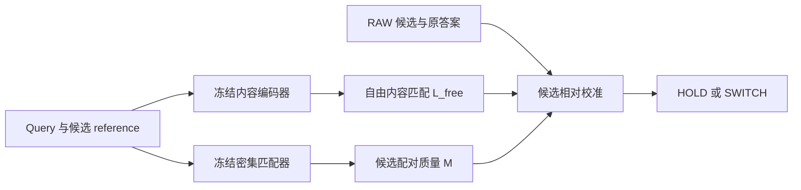

# new HYP：论文主线、贡献与证据收口稿

2026-09-24。依据已完成结果重新组织写作，不更改实验协议、主次臂、历史结果或运行程序。本文件提供更新的摘要、贡献段、方法定义及主表；不是已经排版完成的投稿稿。

旧稿 [2026-09-09 working draft](RC_RETRIEVAL_ONLY_PAPER_WORKING_DRAFT_20260909.md) 保留作历史记录。其空间问题设定、结果面板与部分符号不再代表本文最新叙事。本稿中的 RPC 定位以用户后续决定为准：仅作诊断，不列正式外部效果主表。

## 1. 主问题与核心回答

**研究问题：密集匹配提供的什么信息，能补充冻结内容检索器？为了保留这些纠错收益，究竟需要哪些读出操作？**

当前证据支持的回答是：候选配对质量提供了现有内容分数未充分表达的区分证据。正确绑定这些质量、相对于原答案进行校准，可以改善身份选择。在所测协议中，取消局部加权后重新拟合读出，仍能保留原系统的总体纠错收益；显式乘积项没有显示出稳定的额外优势。

这里的“未充分表达”限于已经比较的读出和训练方式。它不等于 ColNomic tokens 在信息论上缺少这些信息，也不证明 RoMa 唯一或不可替代。这里的“保留总体收益”指观察到的总体正确数，不代表逐图等价或统计等效性检验通过。

建议标题：**What Does Dense Matching Add to Frozen Visual Retrieval?**

可选副标题：**Candidate-Conditioned Quality and the Limits of Local Reweighting**。正文保留 new HYP 作为框架名称，并明确它不指一个已经得到空间定位证明的隐变量模型。

## 2. 三项贡献及其证据

| 贡献 | 可以写入正文的具体结论 | 关键证据 | 不应扩大为 |
|---|---|---|---|
| 区分配对质量与局部加权的作用 | 原复杂读出的总体收益可由整体质量与自由内容经重新校准保留 | H593 完整 COST1 为481；去局部加权套旧头441、重训481；第一折复现原9次纠错中的8次 | 精确对应、局部权重或细匹配在任何任务都无用 |
| 检验真正需要的校准信息 | 配对质量是所测简化读出中的主要有效补充；乘法不是所测收益的必要条件 | RAW426、RAW＋M478、RAW＋M＋L481；加性与乘积头在H593全部选择相同；质量错绑破坏纠错 | 六项缺一不可、乘法是唯一机制、478/481代表因果贡献比例 |
| 检验接口的适用范围与限制 | 简化质量接口经固定头外部复核、跨检索器重训，以及强重排联合校准得到支持 | GroZi321→349、ISIC466→506；ColPali283→348、ColQwen-base227→322；Qwen-COST1同协议477→504 | 全部结果属于同一模型、已超过所有重排器、普遍零误伤、未经接触的新外部确认 |

**新增认识的分量应由上述受控发现承担。** “七参数很小”“只用检索监督”“使用匹配置信度”“设置 HOLD/SWITCH”均不能单独承担首创性。简单模型复现大部分收益是正文必须面对的结果，也是机制解释的一部分。

## 3. 方法表述：保留两个内容定义

令冻结检索器提供自然候选集 C128、RAW 分数 B 和原答案 w。令 q_i、r_j 为图像内容 tokens，c_ij 为余弦相似度。匹配器对每个 query–reference 对产生两侧网格权重 u_i、v_j。当前实现的整体质量为：

\[
M(q,g)=\sqrt{\operatorname{mean}_i u_i\;\operatorname{mean}_j v_j}.
\]

M 是由配对匹配产生的统计量，不是人工质量标签，也不是已校准的身份正确概率。相同 query 面对不同 reference，会得到不同 M。

旧完整 scorer 和简化 scorer 的内容量要分别命名：

\[
L_{\rm vis}(q,g)=\frac{\sum_i u_i\max_j[v_j c_{ij}]}{\max(\sum_i u_i,\epsilon)},
\qquad S_{\rm vis}=M L_{\rm vis};
\qquad
L_{\rm free}(q,g)=\frac{1}{N_q}\sum_i\max_j c_{ij}.
\]

两者都允许内容在完整 reference 图像 tokens 内寻找匹配，没有要求读取 RoMa 指定的单点对应。L_vis 仍受局部权重影响；L_free 不含这些权重。不能因为旧稿有 L=S/M，就把它写成最新实验的自由内容 L_free。

定义候选相对证据 d_T(g)=(T_g−T_w)/(|T_g|+|T_w|+epsilon)，RAW 差分 δ_B 另按 C128 的标准差归一化。精简加性头为：

\[
z_g=a\delta_B(g)+b d_M(g)+c d_{L_{\rm free}}(g)+d.
\]

全部127个挑战者与 HOLD=0 一起比较；只有最大挑战分数大于0才切换。MASS5 增加 d_(M L_free) 列，并按同一训练协议拟合。这一乘积列是**各候选先相乘，再作相对差分**，不是 d_M×d_L。QWEN_ML5 则仅同时加入 M、L 两列，没有乘积；QWEN_ML_PRODUCT6 才是追加乘积的实验。

图注：这是已经验证的外部校准接口，内容编码器在编码时不读取 M，内部 attention 没有因此改变。匹配器提供配对信息，任务小头学习如何使用相对证据。参数量不包含冻结的编码器与匹配器，不能把小头很小写成整个系统计算很少。

任务训练只使用 query–reference 身份／配对监督，不增加本任务的框、mask 或点对应标注。该说法不描述基础模型的预训练监督，也不等于完全无监督或已经量化的标注时间节省。

精确特征、标准化、epsilon 和实验键名见[头命名与公式](NOTE_NEW_HYP_HEAD_NOMENCLATURE_20260924.md)及绑定源码。

## 4. 主表一：原效果与更简单的解释

H593、原身份／来源组件五折、ColNomic 自然 C128、固定零阈值；目标在池内570/593，23张缺席仍计入分母。以下均为 COST1；H593 已被多轮开发使用，五折隔离不能消除后续自适应开发影响。

| 比较类别 | 模型／操作 | 正确/593 | 对RAW救回/误伤 | 主要含义 |
|---|---|---:|---:|---|
| 原系统 | RAW | 426 | 0/0 | 共同基线 |
| 原系统 | 完整 NATIVE7 | 481 | 58/3 | 原机制效果 |
| 固定头干预 | 去局部权重，仅保留M与自由内容，套旧头 | 441 | 15/0 | 原参数对改变后的统计不自动适用 |
| 同协议重训 | 上述简化算子，重新拟合头 | 481 | 57/2 | 总体收益可恢复，正确集合不同 |
| 简单解释 | 仅M的质量头 | 443 | 20/3 | 质量单独使用不及联合校准 |
| 简单解释 | RAW＋L_free | 426 | 0/0 | 当前附加内容读出未纠错 |
| 简单解释 | **RAW＋M** | **478** | **55/3** | 必须公开的强简化基线 |
| 简单解释 | RAW＋M＋L_free，加性4参数 | 481 | 57/2 | 精简可用接口 |
| 简单解释 | 再加M×L_free，5参数 | 481 | 57/2 | 对加性头全部593选择一致 |

不能由“固定头删除后下降”直接推导该操作不可替代；重训对照回答的是在同一信息／训练约束下能否恢复收益。也不能把“重训后同为481”当作不经重训即可删除该操作。两类问题须相邻呈现。

来源：[质量算子消融](REPORT_H593_QUALITY_OPERATOR_V1_20260922.md)、[简单解释全表与统计](REPORT_H593_SIMPLE_EXPLANATIONS_V1_20260924.md)。CE及训练内选择阈值的全部结果保留附录，不替换此表预定 COST1 口径。

### 候选绑定与实际纠错的连接

原H593第一折119张、其中113张目标在C128，RAW98、原完整头105、原生M＋自由内容简化头104。简化路径保留原9次救回中的8次，117/119最终选择相同。固定参数、RAW与内容，循环错配候选M后104降至80，8次保留的原救回只剩1次。

这支持候选配对信息参与实际纠错；不是把任意整体常数增大就有效。错绑属于受控输入干预，会破坏原联合分布；它不能单独证明空间ownership或信息来源的唯一性。该面板与H593重叠，不能计作另一份独立验证。来源：[第一折机制分析](REPORT_PAIR_QUALITY_FOLD0_MECHANISM_20260923.md)。

41／55／70张的原头回放、视觉干预和粗阶段结果可在机制补充页呈现：它们缩小了解释范围，但不是额外593张，也不证明可省去全量细匹配计算。[41张路径](REPORT_H593_SUBSET41_FROZEN_PATH_INTERPRETATION_20260923.md)、[55张干预](REPORT_H593_VISUAL55_FINAL_INTERPRETATION_20260923.md)、[70张粗阶段](REPORT_H593_COARSE_EXIT_V1_20260923.md)。

## 5. 主表二：适用范围，分开两种迁移

### 固定头的外部面板复核

在H593中570张目标在池内的query上拟合单一 COST1 头，先冻结，再在外部完整面板评分；外部不训练、不选阈值。主臂为预指定 MASS5，加性4参数为对照，不能因后来发现简单头同分而改写主臂。候选均为各面板原 ColNomic 自然 C128。

| 面板 | RAW | 旧完整NATIVE7 | 固定MASS5 | 固定加性4参数 | MASS5对RAW救回/误伤 | C128召回 |
|---|---:|---:|---:|---:|---:|---:|
| GroZi480 | 321 | 355 | 349 | 349 | 28/0 | 410/480 |
| ISIC537 | 466 | 500 | 506 | 506 | 40/0 | 531/537 |

GroZi按27个来源视频、ISIC按346个患者组重采样，MASS5对RAW的等组增益95%区间分别为[2.403,10.400]、[3.969,8.695]个百分点。对旧完整头则分别净−6和净+6，两个区间都跨零；不得合并抵消。MASS5和加性头的正确集合在两面板一致，GroZi有3个错误候选之间的不同选择。

这些面板此前已用于研究开发，应称固定方案的外部复核，而非首次未接触确认。ISIC是实例匹配探索，不是诊断性能。来源：[外部迁移](REPORT_SIMPLE_EXTERNAL_TRANSFER_V1_20260924.md)。

### 同一H593上的跨检索器重训

| 冻结检索器 | 自己的自然C128召回 | RAW/593 | 纯内容头COST1/593 | MASS5-COST1/593 | MASS5对RAW救回/误伤 |
|---|---:|---:|---:|---:|---:|
| ColPali | 467 | 283 | 286 | 348 | 65/0 |
| ColQwen-base实验配置 | 438 | 227 | 240 | 322 | 96/1 |

各自对完整5413张图库检索，使用各自自然C128，按原五折重新训练小头；缺席候选仍计入593分母。这支持接口经重训可用于其他检索器，不是原参数零样本迁移，也不能直接将不同候选池的正确数解释为质量模块强弱。

ColQwen-base具体为Qwen2.5-VL-3B-Instruct骨干、固定且未经过检索训练的投影、不加载检索LoRA；不能简称整个模型“未经训练”。来源：[ColPali](REPORT_COLPALI_NATIVE_MASS_H593_FINAL_20260924.md)、[ColQwen-base](REPORT_COLQWEN_BASE_NATIVE_FINAL_20260924.md)。

## 6. 主表三：对强重排还有什么价值

同一H593、同一ColNomic自然C128、同一冻结Qwen3-VL-Reranker-2B logits、同一原五折；联合头读取RAW与Qwen差分。CE为该实验预声明主分析，COST1为次分析，不能在看到结果后互换。

| 模型 | CE正确/593 | COST1正确/593 |
|---|---:|---:|
| RAW ColNomic | 426 | 426 |
| Qwen直接排序 | 522 | 522 |
| Qwen基础校准，3参数 | 523 | 477 |
| Qwen＋L，4参数 | 523 | 476 |
| Qwen＋M，4参数 | 536 | 504 |
| Qwen＋M＋L，加性5参数 | 536 | 504 |
| 追加M×L，6参数，后续独立封存实验 | 537 | 504 |

相对各自三参数基线，5参数CE为24救11损、净13，但64组件等权95%区间[−1.820,4.731]个百分点跨零。COST1为30救3损、净27，五折净增均为正，等组区间[2.161,8.652]个百分点。后者提供了更明确的同损失增量证据，却仍低于直接Qwen的522；不能写成保守联合模型全面胜过强重排。

两套COST1头在本面板对RAW均观察到零误伤，救回51→78；相对Qwen-COST1仍有3损。准确说明参照模型，比笼统写“无损提升”更重要。对未来样本没有零误伤保证。

M4与L4参数量相同，前者536/504、后者523/476；M4与ML5正确集合一致。它支持所测增量来自质量列，而非仅添加当前自由内容列或参数。乘积追加CE仅2救1损、净1，分组区间跨零；COST1无正确性变化。完整数据须保留，不能把537写成已证实的乘法突破。

来源：[Qwen联合头](../results/rc_h593_qwen_quality_joint_v1/report_zh.md)、[追加乘积](../results/rc_h593_qwen_quality_product_v1/report_zh.md)。没有包含完整RoMa开销的同硬件端到端成本结论。

## 7. 近邻工作的区别应怎样写

| 近邻 | 已有内容 | 本文具体研究的区别 |
|---|---|---|
| ELViS | 处理局部相似度矩阵，以最优传输和学习式投票形成相似度；使用正负图像对监督 | 将独立匹配质量与自由内容读出分开，并通过算子、绑定和交互项对照定位哪些信息支持纠错 |
| To Match or Not to Match | 研究重排的损害与匹配不确定性；用top1内点数及逻辑回归估计检索可靠性 | 对全部候选进行相对质量/内容校准，检验简化接口的作用、迁移边界以及对强重排的增量 |

原文核对：[ELViS §3](https://arxiv.org/html/2603.28603v1#S3)、[To Match §4.2及图6](https://arxiv.org/html/2504.06116v1#S4.SS2)。冻结表示、少参数、匹配置信度、学习式校准和配对监督均有先例。当前简单门控是本地控制，**不是这两篇官方方法的同协议复现**。这张区别表界定贡献，不是穷尽文献后的首创证明，也不替代官方性能比较。

### 可入稿的英文 related-work 段

Local matching and reliability estimation provide important precedents. ELViS learns image similarity through optimal-transport refinement and aggregation of local correspondences. *To Match or Not to Match* examines when matching-based reranking helps or harms retrieval and studies matching-derived confidence. Our study focuses on a specific interface between independently produced pair quality and unrestricted content matching. We use binding interventions and fixed-head versus refitted operator controls to examine which parts of that interface account for correction. The resulting evidence concerns this design and its empirical limits; our local controls do not constitute official reproductions of these methods. [ELViS](https://arxiv.org/html/2603.28603v1#S3), [To Match or Not to Match](https://arxiv.org/html/2504.06116v1#S4.SS2).

## 8. 更新的英文摘要与贡献段

### Abstract draft

Dense matching can improve visual retrieval, but its benefits may arise from candidate-level evidence rather than precise local reweighting. We study how matching-derived pair quality complements a frozen content retriever under identity-only task supervision. Our analysis separates unrestricted content matching, candidate-conditioned quality, and correction relative to the initial retrieval answer. On a repeatedly used 593-query medicine benchmark with grouped cross-validation, the original quality-weighted system improves correct predictions from 426 to 481. Removing local weights and refitting the readout retains 481 correct predictions, whereas reusing the original head yields 441. A simpler RAW-plus-quality head reaches 478, and explicit multiplicative fusion provides no improvement over an additive quality-and-content head in this comparison. Candidate-binding interventions connect the quality evidence to observed corrections. A source-trained simplified head also improves retrieval on previously used GroZi and ISIC instance-matching panels, while heads refitted for other retrievers show gains on their own candidate pools. Quality further improves conservative calibration of a strong VLM reranker; the higher-accuracy cross-entropy comparison remains uncertain under group-level analysis. These findings characterize a useful quality interface and delimit the roles of local weighting and calibration, without establishing exact correspondence as necessary or the matcher as irreplaceable.

### Contribution paragraph draft

We make three contributions. First, we separate candidate-conditioned matching quality from local content reweighting and test both fixed-head dependence and recoverability after refitting. Second, we identify a compact quality-calibration interface that retains substantial correction gains, while documenting strong simpler baselines and the absence of a stable benefit from explicit product features. Third, we evaluate the interface through source-frozen external-panel re-evaluation, retriever-specific refitting, and controlled integration with a strong reranker. We report candidate recall, rescued and broken predictions, and group-level uncertainty to distinguish these forms of evidence.

### Limitations paragraph draft

H593 has been used repeatedly for development, and the external panels were previously accessed; these experiments do not provide untouched confirmatory evaluation. Candidate sets are fixed, so missing references remain uncorrectable. Scalar quality can favor incorrect but visually similar candidates, and observed low break rates do not guarantee future safety. Refitted simplifications can match aggregate accuracy without reproducing individual decisions or establishing statistical equivalence. The tested content-only readers and distillation failures do not prove that the frozen encoder lacks the required information. We do not establish end-to-end computational superiority, spatial ownership, or superiority over official implementations of the closest matching-based methods. Internal quality conditioning is a separate exploratory direction rather than a premise of the present conclusions.

## 9. 正文组织与剩余写作工作

建议正文按以下证据链组织，避免按历史试验版本堆叠：

1. **问题与近邻工作：** 为什么只看准确率提升无法解释匹配器的作用；承认已有匹配验证与校准。
2. **方法与监督：** 图示两个冻结模块、质量/内容接口、固定候选和相对动作；区分L_vis与L_free。
3. **机制主表：** 原效果、固定头干预、同协议重训、RAW＋M强简化基线、加性/乘积及绑定控制。
4. **适用范围：** 固定头外部复核与跨检索器重训分表，始终列候选召回和救回/误伤。
5. **强重排：** 直接Qwen、CE/COST1各自基线与质量增量同表，报告主分析的不确定性。
6. **局限：** 数据复用、统计口径、依赖预训练模块、不能支持的空间/信息论/成本主张。

附录保留完整配置、逐候选结果入口、训练耗时、全部历史负结果、六项消融、手填参数/CRISP、旧32/128面板、蒸馏和内部M。RPC仅为诊断。不会因负结果影响叙事而删除原始记录。

剩余收尾以写作为主：将本稿迁入实际投稿模板，核对数据与预训练来源、划分及损失的完整可复现说明；完成图表与引用交叉核对。当前仅定位到旧历史工作稿，未发现已整合本轮结果的独立投稿主稿。本文件没有宣称这些排版与完整性工作已完成。

内部M V3现已完成：同一TRAIN16上，128步真实M与恒定M内部臂均为8/16，外部加性及乘积头均为12/16；真实M换为常量或错绑未改变最终选择。内部与外部优化预算不同，且没有held评测，结果仅限制当前内部配方，不能证明注入位置原则上无效。详见[内部M最终解释](REPORT_COLNOMIC_INTERNAL_M_LEARNED_USE_V3_FINAL_20260924.md)。这条探索不作为主结论成立的前提。本次不提交新实验、不改现有作业。论文能否获得接收仍取决于这些具体发现的分量、对照覆盖和论证质量；重新命名或更强措辞不能替代证据。

## 10. 核验入口

- [2→3→1完整收口与独立核算入口](REPORT_NEW_HYP_THREE_REMAINING_CLAIMS_COMPLETED_20260924.md)。
- [质量算子：固定与重训](REPORT_H593_QUALITY_OPERATOR_V1_20260922.md)。
- [简单解释：全部头、损失、阈值口径](REPORT_H593_SIMPLE_EXPLANATIONS_V1_20260924.md)。
- [第一折六臂与原纠错连接](REPORT_PAIR_QUALITY_FOLD0_MECHANISM_20260923.md)。
- [头命名、L定义与乘积项](NOTE_NEW_HYP_HEAD_NOMENCLATURE_20260924.md)。
- [外部迁移完整报告](REPORT_SIMPLE_EXTERNAL_TRANSFER_V1_20260924.md)。
- [Qwen联合结果](../results/rc_h593_qwen_quality_joint_v1/result.json)、[乘积追加结果](../results/rc_h593_qwen_quality_product_v1/result.json)。
