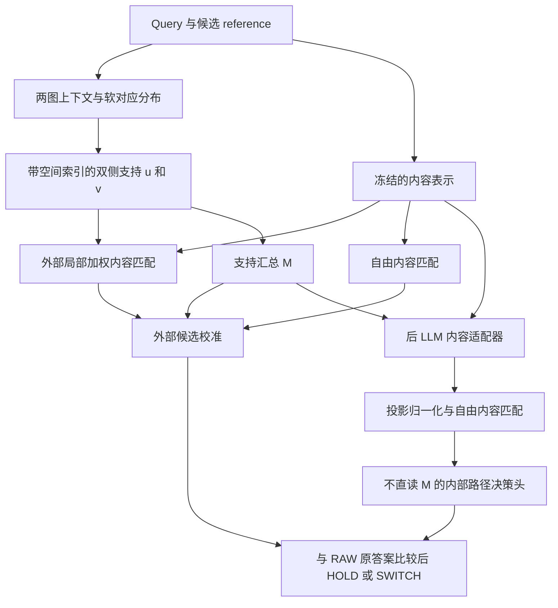

# new HYP 收口：由 reference 条件软支持到内容读取

2026-09-25。本文件汇总现有封存结果，统一原 superregion 思想、外部校准和后 LLM 改造；不更改历史资格门、模型、数据划分或主次臂。用户随后授权的最后一组冻结内部模型GroZi480验证已完成并独立核算，结果及模型来源见第7节。本文中的“收口”指已有证据的解释和写作收口，不代表所有上游语义已被唯一归因，也不把历史 NO-GO 改记为 GO。

## 1. 最终主张

**在仅用检索身份监督、推理不提供真实目标位置或正确候选的条件下，系统利用 reference 条件的双侧软匹配支持组织目标相关证据，并学习如何用于身份判断。这种支持可以补充固定内容读出的候选区分，既能在外部调整局部匹配贡献与决策分数，也能汇总后在内部调制检索表示。**

本文将**检索器benchmark、可复用的空间支持接口、外部与内部使用的统一框架、经干预验证的机制发现**一起列为贡献。benchmark由学长汇总现有模型的统一检索比较；本文件负责接口、理论组织及机制证据，已完成的补强结果按各自协议列出。核心方法与认识可以概括为：**可复用的空间支持接口，以及外部和内部使用方式的机制发现。** 完整四项贡献及状态见[主稿§2](RC_NEW_HYP_PAPER_CLOSURE_DRAFT_20260924.md#2-四项贡献及其证据)。

对应的统一链条是：

图中的局部加权外部路径和自由内容简化路径是不同实验配置；不能把它们的特征和参数拼成一个未经实验的头。内部路径保留真实 RoMa，冻结原 LLM 与检索投影，仅训练后 LLM 适配器及配套小头。

统一的是**证据来源、条件化用途和身份决策任务**。外部与内部并非同一个函数，已观察到它们救回的样本有交集也有差异；内部有效不要求超过外部模型。

**外部校准→内部调制的功能迁移已经完成。** 这里“外部”指编码器外的评分/决策接口，“内部”指后 LLM、检索投影前的内容适配器。两条路径均保留真实 RoMa 支持，内部模型通过改造后的内容取得纠错，末端头不直读 M。迁移的是对支持证据的使用能力：内部适配器和配套头重新训练，不是直接复制外部头参数，也不是蒸馏去掉 RoMa。下文如讨论 GroZi/ISIC 等迁移，明确称“跨数据集验证”，与这项已完成的功能迁移区分。

### Retrieval-only 与 target-free 是方法设定的一部分

Retrieval-only 指本任务新增训练只使用 query–reference 身份/配对关系，不用目标框、mask、人工对应点或额外的目标区域标签。Target-free 指推理时不知道真实目标位置，也不告知哪个 reference 是正确答案：对自然 C128 的所有候选按同一规则形成支持、评分和选择。它不表示训练不用身份标签，不表示图库不存在正确候选，也不表示目标必然不在图中。

因此“关注到目标区域”在本文指**系统利用候选条件软支持读取目标相关内容**，展示案例有高响应准确指向目标区域的现象。当前 RoMa 冻结，训练外部头不会改变缓存中的 u、v；不能将这些热图的形成全部归因于检索标签从零学出了定位器。学到的是如何利用已有支持进行身份区分；后 LLM 适配器进一步学会在表示中使用 M。RoMa/ColNomic 的预训练监督不计作本任务新增标注，也不能称完全无空间预训练。

实现核对：`programs/run_rc_postllm_h593_v1.py` 的 `load_context` 仅将 TRAIN 身份标签并入训练行，推理 manifest 拒绝 `target_id/target_positions/raw_correct`；完整 C128 预测记录 `held_label_reads=0`，预测封存后另行核算。源码中的 `image_mask` 是图像token位置标记，不是目标分割标注。

### 重要 patch 识别与分割用途

**Reference 条件软支持也可用于识别和排序与候选身份相关的重要 patch。** 同一 query 面对不同 reference，由 u 给出不同的 query patch 支持，v 对 reference patch 提供对应的支持排序。这里的重要性定义为“该候选条件下的匹配支持及其内容读取用途”；如需衡量某个 patch 对最终身份决策的因果重要性，还需固定模型后遮挡或移除该 patch，并与等面积对照比较。匹配权重不直接等于因果贡献。

**Reference 条件软支持可用于辅助目标分割，为候选目标的位置与范围提供空间先验。** 检索选定 reference 后，可保留对应 query 支持图 u，将其作为后续 mask 生成或细化模块的输入。这一用途承接“没有任务级区域标注、推理未给出真实目标位置”的设定；所选 reference 由系统预测，不能用真实答案代替。

该声明针对保留空间索引的 u、v；压缩后的标量 M 本身不能恢复分割边界。现有展示与检索结果支持空间先验的用途，尚未完成从该先验到分割 mask 的定量验证；不将其表述为已建立完整分割器或已超过 SAM3 的分割精度。后续 mask/IoU 评测检验的是这项应用的边界质量，不改写当前身份识别结果。

### 已有 SAM3 对照应进入动机与比较

SAM3 对照回答“先用通用分割器提取物体，再检索，是否已经解决问题”。已完成的两组实验应分开呈现：

| 协议 | 该协议的完整图 ColNomic | SAM3 裁剪后检索 | 其他同协议结果 |
|---|---:|---:|---|
| 历史72gold difficult诊断；同一5413图库 | 44/72 | 全crop逐图库项取max：37/72 | 历史part/whole头47/72；不是当前COST1或POST |
| H593 SAM3包；478 outcome＋86 difficult＋29 new_difficult_train；5412图库全库检索 | 427/593 | 单crop390/593；product-package top5聚合394/593 | 包内已报告SAM3最高非oracle配置为加OCR的402/593 |

H593 的 SAM3 使用 `product package`、`box`、`medicine package`、`medicine box` 等通用文本提示产生query proposal bank，没有传入真实目标框；`box`在此是提示词。随后按SAM分数选取或对多个crop的每候选内容分数取max，因此它的最终选择也可以依赖reference；不能把它描述成完全不读取reference。`oracle_any`使用答案作诊断，不列为可部署结果。402是同一已打开面板上多个预设配置中的报告最高值，没有独立选择集证明该配置最优。

这些结果支持：**在所测方案中，通用物体分割和多crop内容匹配不足以自动完成目标身份选择；需要检验reference条件支持与身份读出怎样配合。** 它们不是当前软支持图比SAM3具有更高IoU的证明，也不唯一隔离裁剪选择、输入变化或聚合的影响。当前主线RAW426、自然C128与H593 SAM3包RAW427、5412图库协议不同，不能把427→481写成一个严格配对因果对照。旧72gold的47也不能转记为当前模型成绩。

来源：[历史72gold同协议三臂](../../reports/REPORT_ROUTEA_THREEWAY_SAM3_COMBO_20260726.md)、[H593 SAM3完整包](sam3_colnomic_ocr_h593/package_20260918_2340/README_experiment.md)、[H593全部配置表](sam3_colnomic_ocr_h593/package_20260918_2340/results/h593_summary.csv)。旧7图SAM区域读出亦有局部正结果，见[缓存区域诊断](REPORT_RC_CACHED_SAM3_REGION_CLOSURE_V1_20260909.md)；不将上述裁剪负结果扩大为SAM3在任何区域读取方式下都无用。

## 2. 原 superregion 与现在的软支持是什么关系

对 query patch 坐标 x_i 和 reference patch 坐标 y_j，定义当前实现的支持表示：

\[
\mathcal H(q,g)=\bigl(\{(x_i,u_i(q,g))\}_i,\{(y_j,v_j(q,g))\}_j\bigr).
\]

- u_i：reference g 条件下，query 第 i 个位置的预测匹配支持。
- v_j：query q 条件下，reference 第 j 个位置的预测匹配支持。
- 位置由网格索引/坐标携带；数值是该位置的支持权重。这里 u、v 指两侧可见性权重，不是 warp 的两个坐标分量，也不是 RoMa 粗、细两套特征。

一个显式 patch 集合可用 0/1 指示权重表示，因此用连续权重表达局部支持，是原 superregion 思想在**表示形式上的推广**。原方案已明确先形成“candidate 对完整 query 提出的哪里值得进一步解释的软证据”，随后才要求连贯的候选 patch 集合。这说明当前机制承接了原 HYP 的功能目标，而不是与它无关的另一课题。

这项表示上的联系不等于所有旧算法操作逐项等价：当前支持可能分散或不连通，没有恢复旧方案的固定 H0/K、独立 V 或全部 P-only 资格要求。尤其不能把 0/1 权重直接当成精确删 token 的评分等式：原 weighted MaxSim 中零权重乘积仍在候选轴内，负余弦时可能成为最大值。历史失败仍说明那些具体设计没有通过当时检验，不否定软支持实现的任务价值。

因此正文称其为 **reference 条件的软支持 HYP**，保留 new HYP 名称，不另造一个含义不明的 H。这里的“验证”指检索与受控机制实验支持其用途；不是宣称当前小头就是旧 P→独立 V 的实现。

来源：[原 HYP 方案](../plan/RouteA_Latent_Target_Hypothesis_最终方案.md)。

## 3. u、v 有空间信息，M 是其压缩；二者不矛盾

当前支持汇总及原内容评分是：

\[
M(q,g)=\sqrt{\bar u(q,g)\bar v(q,g)},\qquad
L_{\mathrm{vis}}=\frac{\sum_i u_i\max_j[v_jc_{ij}]}{\max(\sum_i u_i,\epsilon)},\qquad
S=M L_{\mathrm{vis}}.
\]

其中 c_ij 是冻结 ColNomic token 的余弦相似度。内容仍可搜索完整 reference；RoMa 没有把它硬绑定到唯一坐标。另一个实验使用不含局部权重的自由内容 L_free，不能与 L_vis 混写。

M 是预测的双侧匹配支持量，不是正确身份概率、完整对应表、定位精度或分布熵。不同空间分布可能具有相同 M；在**生成 u、v 之后**置换位置可保持 M 不变。这一数学性质只说明压缩接口不传递具体位置，不能推导“RoMa 在生成支持时没有利用空间关系”。

论文按任务作用称 M 为**重要的身份判别证据或候选比较的关键参考量**。它由 u、v 汇总，计算形式仍属于统计量；“有判别作用”与“是统计量”不冲突。“充分统计量”是更强的数学命题，本文不采用。受控回放支持真实 M 在特定纠错中改变候选竞争或是否超过 HOLD 的决定性作用，不将其写成所有 query 均由 M 单独决定。

据此区分三个问题：

| 层级 | 当前已知作用 | 相应证据 |
|---|---|---|
| 支持怎样形成 | 双图上下文与软对应分布参与产生候选相关支持；受控小面板识别出相对排列的成分 | 上游入口、范数/相位干预 |
| 支持怎样表示 | u、v 保留空间索引；M 压缩成双侧支持量 | 公式、源码、真实缓存图 |
| 支持怎样使用 | 外部加权/校准及内部表示调制均可进行有效纠错 | 固定头与重训对照、内部真实/恒定/错绑 M、全量表示分解 |

**使用端可以压缩，不等于产生端不需要结构。** 同样，内部 M 有效也不等于内部重新生成了那两张支持图。当前实验不把这两种推断相互替代。

## 4. 为什么这种支持能补充内容检索

自由 MaxSim 保留各行最高内容相似度再汇聚。同一个最大值可来自一个突出的匹配，也可来自多个近似匹配；这个标量读出不能唯一恢复完整匹配分布。RoMa 的支持预测则读取两图上下文与软对应位置分布。二者的读出对象不同，因此最高内容相似度接近时，支持仍可能不同。该性质不证明完整 ColNomic tokens 缺少这些信息。

现有证据把这一解释推进了三步：

1. **区分信息不是仅靠成功图挑选出来的。** 在同 query 内满足 |L_target−L_wrong|≤0.005 的候选对上，先 query 内平均、再等组统计：H593 的164张/48组中，M 对正确候选的排序一致性为85.52%；GroZi 为100张/23组、97.69%；ISIC 为79张/57患者组、94.59%。这不是检索准确率或因果贡献比例，是内容近分条件下的观察性区分证据；这些面板均已打开。
2. **一部分区别来自对混淆对应的约束。** 范数/相位实验的预定8张中有7张 target 在池内。保持对应编码的范数、逐频幅度并匹配干预能量，LOCAL 相比 GLOBAL 改变相对位置关系后，target 对固定最强内容错误 reference 的 log M 优势平均减少0.026597，7组探索性区间[−0.042368,−0.012411]。两者 M 都可能升高，但错误候选升得更多。它支持当前模型利用相对排列与固定上下文配合约束混淆支持，不能外推为全部 M 的唯一根因。
3. **这些差异必须与身份比较和接受配套。** 外部头读取相对原答案的支持差异；内部模型把支持转为内容分差。错误 reference 也可能得到高支持，因此仅“支持高”不是身份真值，配套的任务校准决定它能否形成正确的候选竞争和 HOLD/SWITCH。

来源：[内容近分与跨面板分析](REPORT_M_INFORMATION_AND_EXTERNAL_INTERNAL_UNIFICATION_20260924.md)、[支持区分来源干预](REPORT_M_DISCRIMINATION_SOURCE_20260924.md)、[双图与对应分布入口](REPORT_ROMA_PAIR_RELATION_LOCALIZATION_20260924.md)。相位结果只覆盖 COARSE 小面板，不能作为全593或完整 RoMa 的同一端到端中介实验。

## 5. 两条使用路径的归因已经进行到哪里

以下检索结果均为 H593 原分组五折、ColNomic 自然 C128；593张全部计入，570张 target 在池内。它们来自不同实验束，按行标明，不能把相同正确数当成相同模型或相同决策。

| 实验束与操作 | 正确/593 | 对 RAW 救回/误伤 | 能说明什么 |
|---|---:|---:|---|
| 共同 RAW 基线 | 426 | 0/0 | 原内容检索 |
| 历史完整 NATIVE7-COST1 | 481 | 58/3 | 双侧加权与任务头的效果 |
| 算子消融：M×自由内容、去局部权重，套旧头 | 441 | 15/0 | 接口变化后原校准不自动适用 |
| 同一算子、同协议重训 COST1 | 481 | 57/2 | 支持汇总可保留总体收益，不是逐图等价 |
| 后 LLM 束：fresh 外部 ADDITIVE4 | 481 | 58/3 | 本轮输入/训练来源下的外部参照，非历史原头 |
| 后 LLM 束：POST_REAL＋INTERNAL3 | 478 | 54/2 | 末端不直读 M，内部使用有效 |
| 同一 POST_REAL，推理时恒定 M | 426 | 5/5 | 依赖真实条件变化 |
| 同一 POST_REAL，推理时错绑 M | 369 | 8/65 | 候选绑定参与行为；错绑也改变联合分布 |
| 等预算另训内部恒定 M | 406 | 5/25 | 补充固定模型干预的训练对照 |
| 等预算另训内部错绑 M | 429 | 8/5 | 所测新增模块本身不能复现真实 M 效果 |

后注入模型全量回放进一步分解为：

\[
h_i(M)-h_i(0)=d_q(M)+e_i(M),\qquad \operatorname{mean}_i e_i(M)=0.
\]

0 指该折 TRAIN 标准化 M 的零条件，而不是原始 M=0。d_q(M) 是**同一 query、同一候选条件下**跨 patch 的共同响应，可随 query、候选 M 和折模型改变。

| 同一封存内部模型的回放 | 正确/593 | 保留原54次救回 |
|---|---:|---:|
| 完整响应 | 478 | 54 |
| 只保留共同响应 | 477 | 52 |
| 只保留 patch 去均值剩余响应 | 430 | 6 |
| 完整响应但固定恒定条件的内容 MaxSim 命中 | 469 | 44 |

共同响应投影为 t_q(M) 后，单位 token 近似写为：

\[
z_i(M)=\frac{p_i+t_q(M)}{\|p_i+t_q(M)\|}.
\]

同一个方向与不同 patch 内容及 reference token 的点积不同，因此可以改变内容分差；它不是统一正比例缩放，也不要求修改 LLM attention。52/54 的回放说明这是当前全量模型的主要有效通路。仍有部分决策需要 patch 剩余响应或重新匹配；不能写成局部作用为零。d_q 也不能改写为已经验证的、仅依赖 M 的跨 query 共享函数。

校准同样有直接证据：改造后内容接联合训练前的头得到418/593（75救、83损），接最终配套头为478；最终头接未改造内容仍为426。它支持**内容变化与配套校准共同起作用**，并非“只换一个更激进的小头”。交换头会改变输入分布，故不分配唯一的因果贡献百分比。

来源：[外部算子](REPORT_H593_QUALITY_OPERATOR_V1_20260922.md)、[全量内部结果](REPORT_POSTLLM_H593_V1_20260924.md)、[内容/头交换](REPORT_NEW_HYP_ATTRIBUTION_SYNTHESIS_20260925.md)、[全量内部归因](REPORT_POSTLLM_H593_DECOMPOSITION_INTERPRETATION_20260925.md)。数值映射及源结果 SHA 见[收口数据](data/new_hyp_unified_support_closure_20260925/evidence.json)与[主表 CSV](data/new_hyp_unified_support_closure_20260925/metrics.csv)。

### 跨 query 仅由 M 决定的共享调制：小面板已有正面验证

这是与 H593 共同响应不同、已经完成的具体实验。固定旧 POST_REAL128 及 INTERNAL3，只用 TRAIN16 的隐响应构造 d_T(M)：先对每个训练 patch 计算 M 引起的非线性增量，再在 query 内平均、最后对16张等权平均。固定这个池和模型后，相同 M 在不同测试 query 上给出同一个增量向量。

在已打开 PROBE8 上，TRAIN_POOL_COMMON 为5/8、1救/0损，全部8张身份决策与原 POST_REAL 一致；同时固定原内容命中的版本也一致。共享函数没有新训练、没有用 probe 特征或标签拟合。当前 query 的恒定条件内容底座和与 reference 的内容匹配仍保留。

因此可以正面主张：**在所测小面板中，仅由 M 决定的跨 query 共享调制已经验证有效。** 小面板足以支持这个范围内的机制发现，无须以先扩到593作为入稿前提；它不证明该共享替代在所有数据上等价。找到 query/reference 对应关系本身并不自动证明共享调制，后者的依据是上述共享函数替换及回放。

[共享响应的定义、结果与独立验收](REPORT_NEW_HYP_MECHANISM_DEPTH_20260924.md)、[原始 PROBE8 结果](../results/rc_postllm_train_pool_common_v2/summary.json)。

### “完整中介归因”具体还指什么

它指把**同一个上游干预**一路接到同一内部模型：改变对应编码的相位，得到干预后的支持及 M，再把该 M 输入冻结的同一个 POST 适配器和头，观察内容分差与决策的改变，并用控制区分通过 M 传递的变化。当前已分别验证相位影响 M 和 M 影响内部内容读取；尚未完成所有相位条件的这条同模型贯通回放。即便补齐回放，也不自动建立上游全部成分的唯一因果分解。

当前采用的表述是：**上游与内部的分段干预证据共同支持统一机制。** “完整中介归因”不列为已经完成的实验，也不作为本文收口的必要主张。

## 6. 90张图在论证中承担什么

图集来自原 COST1 的成功纠错：药盒、GroZi、ISIC各30张。相同 query 对错误/正确 reference 的真实 u 网格，展示了 reference 条件的空间支持；逐例还保留两侧 u、v 和完整候选分数。它们适合解释软支持怎样承接原区域思想。

**我们展示了高响应准确指向目标区域的成功纠错案例。** 例如 [DIFFICULT-0013](figures/new_hyp_rescue90_en_20260924_v1/medicine/01_medicine_DIFFICULT-0013.png)，正确 reference 条件的强响应覆盖前景药盒主体，错误 reference 条件的响应明显较弱。这里“准确指向”描述展示案例的空间定位现象，不声称全部成功图已精确恢复完整目标边界。IoU 留作后续量化，应明确评测区域定义、热图转区域规则以及是否只评估选出的成功案例，不按结果为每张图单独挑阈值。IoU 属于评测，不改变 retrieval-only 训练监督。

这些图按成功纠错挑选，不能用于估计总体定位准确率，也不能单独说明正确 reference 的高亮总比错误 reference 更符合物体。内部 M 模型不是这90张图的生成模型，因此不把它的成功标成逐图高亮区域的独立验证。正文并列展示**同源支持的可视形态**与**使用通路的干预结果**，不要求为当前论文补回 ownership。

[90图及选择/模型来源](figures/new_hyp_rescue90_en_20260924_v1/README.md)。

## 7. 论文的四项贡献与可用表述

2026-09-25已补[最近邻文献与新增认识审查](REPORT_NEW_HYP_NOVELTY_AUDIT_20260925.md)。VGGT-MPR、FoL++等已涉及置信度汇总/可靠性加权；FiLM、条件相似度学习、CLAY已覆盖条件表示这一方法类别。因此下文的新增认识由受控简化、绑定干预和表示分解承担，不以匹配置信度、无空间标签训练或adapter插入位置本身作首次性主张。按用户本轮安排，只深化此项；学长负责现有ColNomic、ColQwen等检索器的benchmark比较，我们的方法提供补强，本文理论和干预解释其原因。这里没有新增数据集建设任务，其他接收风险不扩展为新增实验。

分别列出两类迁移及其模型来源，避免把不同模型的成绩合并：

| 已完成的工作 | 实际接受验证的模型和协议 | 已有结果 |
|---|---|---|
| 外部校准→内部调制的功能迁移 | H593原五折，ColNomic自然C128，POST_REAL＋不直读M的INTERNAL3 | RAW426→478/593，54救/2损 |
| 冻结内部模型的跨数据集验证 | 预先固定现有H593 fold0 POST_REAL；GroZi原ColNomic自然C128；外部不训练、不挑折 | RAW321→339/480，18救/0损 |
| 原完整头的跨数据集验证 | 冻结源域COST1/NATIVE7；各外部面板原ColNomic自然C128；外部不训练 | GroZi321→355/480；ISIC466→500/537 |
| 简化接口的跨数据集验证 | 冻结源域MASS5主臂、ADDITIVE4对照；相同外部候选协议 | GroZi321→349/480；ISIC466→506/537；两头在各面板正确数相同 |

GroZi与ISIC均已有实际外部面板结果；简化接口的复核使用的是此前已打开的面板，ISIC是同病灶实例匹配而非诊断。以上模型身份必须保持：外部标量头的跨数据集结果，不自动成为POST内部适配器的跨数据集结果。原候选召回分别为GroZi410/480、ISIC531/537。

最后一组补充已完成：固定已经训练好的H593 fold0 POST_REAL与配套头、源TRAIN的M标准化和0阈值，GroZi上不训练、不校准、不选折。它是固定单模型的跨数据集验证，和五折留出合并的478/593不同。全部480张、27个来源视频计入；C128中70张没有target，也保留在分母。

| GroZi480：同一源fold0实验束 | 正确/480 | 救回/误伤RAW | 说明 |
|---|---:|---:|---|
| RAW | 321 | 0/0 | 原自然候选与排序 |
| 冻结POST_REAL | 339 | 18/0 | 内部M利用迁移至外部面板 |
| 同一POST_REAL，恒定M | 314 | 2/9 | 标准化条件固定为0 |
| 同一POST_REAL，错绑M | 308 | 4/17 | 沿原候选轴循环置换M |
| 源fold0无适配器INTERNAL3 | 304 | 2/19 | 冻结源域内容头 |
| 源fold0外部ADDITIVE4 / PRODUCT5 | 342 / 342 | 各24/3 | 与旧完整头355、另批简化头349不同 |

POST相对RAW按query等权净增3.75个百分点；等视频权重增益为2.263个百分点，27组bootstrap95%区间[0.950,3.788]个百分点。真实M相对错绑M的等组区间为[1.263,7.576]个百分点；相对恒定M虽总正确数多25，其等组区间[-0.494,6.675]跨0，不宣称全部对照均已显著。相对同源外部头净少3张、等组区间[-4.700,0.692]跨0；本轮证明的是内部利用有效，不是内部更优或两者统计等效。

这补齐了“一个预先固定的内部模型在外部数据仍有效”的证据。它不将内部H593表示分解自动外推到GroZi，也不把此前已使用过的商品裁剪面板改称全新盲测。未新增ISIC内部模型实验。[完整结果与独立核算](REPORT_POSTLLM_GROZI_EXTERNAL_V1_20260925.md) · [提交、轴校验修复记录](REPORT_POSTLLM_GROZI_EXTERNAL_SUBMITTED_20260925.md)。

来源：[固定头外部面板复核及原完整头对照](REPORT_SIMPLE_EXTERNAL_TRANSFER_V1_20260924.md)、[H593内部结果](REPORT_POSTLLM_H593_V1_20260924.md)。

1. **检索器benchmark与补强评估。** 比较现有检索器的原始表现及其配对补强增量，区分候选召回、最终正确数和救回/误伤。完整benchmark由学长汇总；已完成的跨检索器外部接口结果、ColNomic内部结果及冻结外部验证分别列示，尚未汇总部分保持待填。
2. **可复用的空间支持接口。** 将reference条件支持的生成与使用分开，保留完整reference上的自由内容匹配；支持在外部调节patch评分贡献，汇总后在后LLM接口调制检索表示。新增任务模块只用检索身份监督，推理不输入真实目标位置或正确候选。
3. **外部与内部使用的统一框架。** 将支持生成、空间表示及压缩、内容读取与身份决策分层组织。由支持压缩的性质和共同响应的表示公式说明两种路径如何使用同源证据，并用实际纠错检验其功能联系。框架统一信息来源与用途，不要求两种模型参数相同、数学等价或内部优于外部。
4. **经干预验证的机制发现。** 算子删除/重训说明支持接口改变需要配套校准；真实、恒定和错绑条件检验候选绑定；内容/头交换与全量表示分解表明内部大部分原纠错可由共同响应承载。这些结果为简化下游局部操作及解释表示变化提供依据。保留RAW＋M、加性头及历史负结果，限定于已测模型与协议。

理论写作将定义、可推导性质和经验命题分开：H及M定义接口；生成后的置换不变性和归一化表示公式提供推导；总体收益恢复与52/54次纠错保留是实验事实。已有匹配器的空间能力和通用条件调制算子归于原工作，本文贡献落在具体接口、统一组织与受控发现。

可直接用于中文结论：

> 我们区分reference条件空间支持的生成与使用，建立保留自由内容匹配的接口。在编码器外部，空间支持调节各patch在身份匹配中的贡献；进一步将这一空间支持的汇总信号M引入编码器内部，在LLM之后、检索投影之前调制表示，仍能实现有效纠错。由此验证了同源空间支持从外部加权到内部表示调制的有效使用。任务模块只用检索身份监督，推理不提供真实目标位置与正确候选。已有SAM3对照表明，所测通用分割后检索方案不能自动实现这项目标。内部共同表示响应保留了绝大多数原纠错，预先固定的内部模型在GroZi上由321提升至339且本面板未误伤原正确。这些证据将软支持、外部加权与内部适配连接起来，同时保留各模型和实验面板的适用范围。

English claim:

> We separate the generation and use of reference-conditioned spatial support through an interface that preserves unrestricted content matching. Outside the encoder, support reweights patch contributions to identity matching. Inside the encoder, its pooled signal M conditions representations after the LLM and before the frozen retrieval projection, where it remains effective for correction. Controlled replay shows that a query-dependent response shared across patches retains most corrections of the tested internal model. These results establish effective external and internal uses of the same support source; they do not require that the internal path reconstruct its spatial maps or modify LLM attention.

## 8. 收口判定

现有工作足以支撑上面这个**限定于已测试模型与面板的 new HYP 方法命题和分段机制解释**。原空间假设的思想得到一种软支持实现，外部和内部的作用有了共同描述与对应证据；不再把它们写成互不相干的试验。

采用以下正面、分级的主张，不将“充分、唯一、每张精确”作为当前论文要求：

| 当前表述 | 证据级别 | 后续可扩展部分 |
|---|---|---|
| 展示了高响应准确指向目标区域的成功纠错案例 | 案例空间定位证据 | IoU留作后续量化，未据此声称每张完整边界均已验证 |
| M 是重要的身份判别参考信息，可促成具体纠错 | 候选对照与固定模型回放 | 更强的统计充分性不作为当前主张 |
| 两图上下文及对应分布/相对排列是支持区分的重要来源成分 | 已测通路和小面板受控归因 | 不声称全部成分的唯一分解 |
| 上游支持形成与内部使用由分段干预连接 | 各段已有实验支持 | 同相位条件贯通同一内部模型的中介回放可后补 |
| 仅由M决定的跨query共享调制可有效工作 | TRAIN16构造共享函数、PROBE8回放已完成 | 是否保持全H593行为是另一个扩展问题 |
| 外部校准→内部调制已完成；内部模型GroZi冻结迁移有效 | H593内部全量426→478；固定fold0在GroZi321→339、18救0损；外部头另有GroZi/ISIC结果 | 多源模型与更多域的内部验证可后续扩展，不作为本轮收口前置 |

当前已验证实现保留 RoMa 产生双侧匹配支持，不能直接删去并声称效果保留。这里不要求证明 RoMa 理论上不可替代。后续范围不自动成为继续收口的前置任务；所有历史负结果保留，ownership 和新的编码器训练留作后续方向。

本次完成统一定义、归因证据表、数值来源和论文摘要/贡献更新；投稿排版与最终文献定位仍属于论文写作工作。“收口”不等于保证 ICLR 接收，不通过改名或改门制造新的实验成功。
