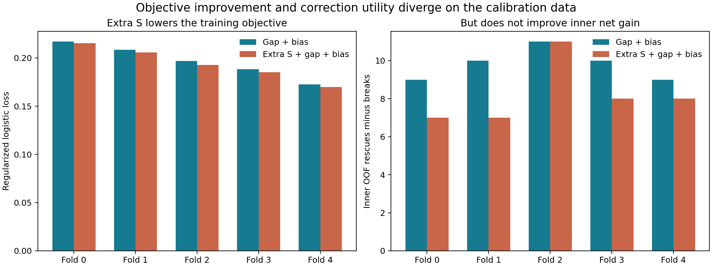
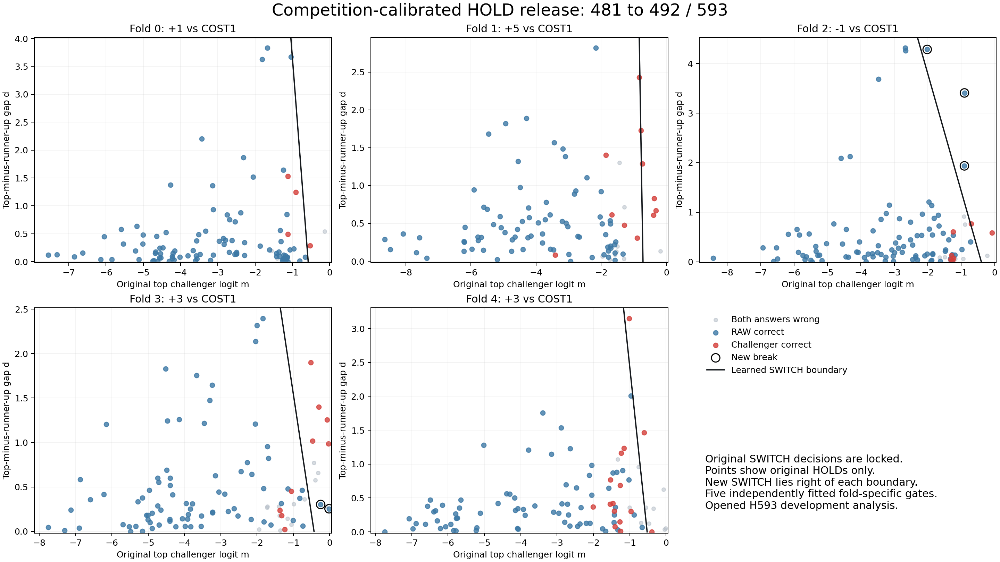

# 492/593之后：候选竞争、目标错位与原答案保护

2026-09-21。分析对象：原COST1六特征＋偏置基头，H593 grouped nested OOF5，自然RAW C128，593张query/64组件；23张target缺失仍计入分母。已完成GAP_BIAS2=492/593（原COST1=481，16救5损），预定主臂S_GAP3=486。本文件是封存结果之后的机制分析，不改模型、参数或外层结果。

## 1. 已能具体定位的两种瓶颈

**候选排序与是否采用排序是两件事。** 原COST1给127个challenger打分，再将最高分与固定HOLD=0比较。新门保持最高challenger身份不变，只增加对最高、次高challenger差值的读取。原头已经正确识别到的一部分身份，被绝对放行阈值挡住；原代码并非完全不进行候选竞争，而是最终放行不读取第二名分数。

**当前训练损失与净纠错收益确实不一致。** 这次不仅有外层准确率不同：加入额外S后，五折的凸正则logistic目标都改善，但同一内层OOF校准数据上，最终净收益四折降低、一折持平。新增参数的求解已通过收敛残差检查，不能简单解释为优化器没有收敛。

| 外层折 | 分差＋偏置的训练损失 | 加额外S后的训练损失 | 分差＋偏置的内层净增 | 加额外S后的内层净增 |
|---|---:|---:|---:|---:|
| 0 | 0.216984 | 0.215407 | 9 | 7 |
| 1 | 0.208499 | 0.205890 | 10 | 7 |
| 2 | 0.196760 | 0.192655 | 11 | 11 |
| 3 | 0.188305 | 0.185287 | 10 | 8 |
| 4 | 0.172679 | 0.169930 | 9 | 8 |

各折校准query相互重叠，不能将这些净增加总为新样本成绩。两个模型都在学好斜率后，精确重选偏置以最大化内层净增，所以这里暴露的是**损失偏好的斜率方向**不等于**决策收益最优方向**，不只是忘记调bias。

S_GAP3包含alpha=0的GAP_BIAS2子族，数学表达能力没有因为多一个参数而变弱；本次具体训练规则却选到净纠错收益较低的方向。这个结论只解释本轮对照，不能倒推全部历史失败具有同一根因。

## 2. 492究竟改变了什么

记原最高challenger分数为m，次高为z2，`d=m-z2`。原HOLD上的新决策为：

`g=m+beta*d+bias`，g>0才替换RAW，beta>=0。既有78次正SWITCH完全保留。

| 检验 | 正确/593 | 解释 |
|---|---:|---|
| 原COST1 | 481 | 原最高分过0才SWITCH |
| 独立拟合纯偏置BIAS1 | 484 | 普遍降低放行门 |
| 分差＋偏置GAP_BIAS2 | 492 | 在原最高分之外读取竞争关系 |
| 固定GAP_BIAS2的bias，将beta置0 | 488 | 分差在这组参数下额外7救3损 |
| 固定GAP_BIAS2的beta，将bias置0 | 484 | bias在这组参数下额外11救3损 |

488沿用了带分差训练时学出的bias，属于事后固定参数干预，不是新的免训练模型或独立拟合纯偏置臂。两种去项净增不可相加。原COST1仍保留S、M、L等全部六特征；新门没有再加S，并不意味着原S被删除。

外层16次救回分布于14个组件；5次损失在3个组件。对BIAS1为12救4损，其中有8张恢复了纯偏置误伤的原正确、4张额外救回原错误；新增损失包括3张原正确以及1张BIAS1救回的样本。提高准确率不等于所有旧正确均保留。

## 3. 大分差的剩余缺陷：竞争集合不包含原答案

5张新增错误中，OUTCOME-0717、0721、0722都把原本正确的`cuvitru-19`改成`cuvitru-13`，另一个排名靠前的challenger为`Bivigam Carton 100mL`。

| query | 原最高分m | challenger分差d | 新放行分数g |
|---|---:|---:|---:|
| OUTCOME-0717 | -0.904178 | 1.936011 | +0.310491 |
| OUTCOME-0721 | -2.017507 | 4.287175 | +0.189124 |
| OUTCOME-0722 | -0.902901 | 3.408521 | +0.933024 |

这里的分差比较的是127个替代候选中的第一名和第二名。正确RAW已经从这127个候选中排除，因此错误候选可以显著领先其余替代候选，同时仍然不值得替换RAW。m原本为负，但beta*d+bias将其推过0。

视觉核对：已实际查看0721的query和两个reference。query清晰显示10g/50mL；正确`cuvitru-19`reference也是10g/50mL，错误`cuvitru-13`为2g/10mL。不是据文件名猜剂量，也不能说此例原照片根本不含区分信息。它具有同系列近似版式、不同规格的局部区分线索；本轮没有证明冻结token是否完整编码了这些字符。

- [实际query 0721](</hkfs/work/workspace/scratch/ap7811-benchmark/1/outcome/cuvitru-19_00000000000000000006.png>)
- [正确reference](</hkfs/work/workspace/scratch/ap7811-benchmark/dailymed/data/box_flat_20000_images/data/raw_images/other/cuvitru-19.jpg>)
- [错误reference](</hkfs/work/workspace/scratch/ap7811-benchmark/dailymed/data/box_flat_20000_images/data/raw_images/other/cuvitru-13.jpg>)

也不能简单“把RAW放回分差”就宣布修复。若将其作为0分候选，定义`d_all=m-max(0,z2)`，在所有原HOLD上m<=0且z2<=m，故`d_all=m`，第二维退化为第一维，门变成`(1+beta)*m+bias`。这会失去新读入的替代候选竞争信息。需要同时表达“领先其它替代候选”与“确有理由推翻RAW”，而非无条件奖励gap或代数重复m。

另外两张新增错误为OUTCOME-0794和0618；各自gap仅0.303和0.255，主要靠bias放行。不能把全部5次损失都归为大gap失效。

## 4. 为什么再加S会丢掉6张

比较S_GAP3与GAP_BIAS2的最终工作点：

`Delta_g = alpha*S_plus + (beta_both-beta_gap)*d + (bias_both-bias_gap)`。

五折alpha都为正，beta略上升，但bias全部下移。它相当于对S较强样本提高放行倾向，同时对S较弱样本收紧。

- OUTCOME-0809：正确challenger的S_plus=0.251，GAP门+0.0219，额外S门-0.4479，原可救回变成HOLD。
- OUTCOME-0529：S_plus=0.177，GAP门+0.1211，额外S门-0.1361，同样损失纠错。
- OUTCOME-0130：错误challenger的S_plus=0.984，GAP门-0.1289保留RAW，额外S门+0.2723误伤。
- OUTCOME-0717/0721：S_plus接近0，额外S模型更低的bias保护了这两张原正确；这部分保护没有抵消其他损失。

因此不是“S加入时直接加了负数”。所有样本一起重新校准后，偏置与S系数联动，改变了信任哪些样本。局部匹配S强弱仍不等同于精确身份正确；全局统一奖励S会两面作用。原S仍参与m和d的生成，不得将这一发现表述成S没有价值。

## 5. 原头还存有多少可用排序信息

原COST1错误中，有46张满足：RAW错误、正确身份已是最高challenger、但其分数<=0而HOLD。本轮救回其中16张，还有30张没有放行。

492之后剩余101张错误的互斥分类如下（先判候选缺失）：

| 原因 | 张数 | 本轮固定排序/原SWITCH架构能否修复 |
|---|---:|---|
| target不在自然C128 | 23 | 不能，需要候选召回改进 |
| 原来的错误正SWITCH被锁住 | 15 | 不能，需要允许重新判断既有SWITCH |
| 原HOLD且最高challenger也错误 | 28 | 不能，需要改进排序/身份证据 |
| target已是最高challenger，但新门仍HOLD | 30 | 仍有放行层的潜在空间 |
| 本轮误伤原正确HOLD | 5 | 需要更好地区分应保持RAW的情况 |

用外层真值事后选择每次正确动作，当前架构上限为481+46=527。这是oracle计数，**不是模型结果、可训练保证或下一轮预期**。真实成绩仍492；30张未释放和5张误伤提供具体问题集合，不能用其外层标签手选参数。

## 6. 分差关联的证据没有强到可以忽略不确定性

固定所有已学参数，做1000次query间分差置换（事后控制，无重新训练）：

| 分差输入 | 正确数或分布 | >=真实492的次数 |
|---|---|---:|
| 原始正确配对分差 | 492 | — |
| 同外层折随机借用另一query分差 | 均值488.311，中位488，2.5%–97.5%分位485–492 | 40/1000 |
| 同外层折且相近m箱内借用分差 | 均值488.624，中位489，2.5%–97.5%分位485–492 | 62/1000 |

m箱边界仅由该外层的内层OOF HOLD分数五分位确定，不按外层正确性定箱。此控制比任意打乱更接近保留原m/分差关系，但箱内仍可有残余相关、组相关和分布偏移。尾部比例不是确认性p值，也未补偿选择最佳臂。

真实分差配对总体较好，但部分随机配对也达到或超过492；不能说竞争关联已经获得压倒性统计证据。此前对COST1的64组件增益bootstrap95%[-0.711,+5.149]个百分点仍有效。保留492的真实净增，同时保留这些限制。

## 7. 可以怎样概括为new HYP的进一步解释

候选条件证据先产生各reference得分；决策再比较“替代答案比原答案更可能正确吗”。若E是推理时可见证据、g0是RAW、g*是最高challenger，则保持或切换的真实期望准确率差为：

`Delta(E) = P(Y=g* | E) - P(Y=g0 | E)`。

当Delta>0才值得SWITCH。这个恒等关系来自两项正确性指标的条件期望，不要求空间ownership，也不需要框/mask监督。训练所需delta标签完全可由query-reference检索身份生成。它不是说目前线性g已校准成概率；g只是这个决策量的一种代理。

本轮支持的解释是：**身份证据的排序能力、证据在其它候选中的独特程度、替换原答案的风险应分别被表达。** m只保留最高分，d补充替代候选竞争，错误案例进一步显示原答案风险不能被d替代。这是new HYP决策层的可检验扩展，并未建立普遍理论或空间归属结论。

相关概念有先例。Lowe 2004已通过最近与次近匹配的相对距离抑制歧义；2023年的后处理选择性分类研究说明，固定分类器的排序/准确率能力与置信度读出质量可以不一致。前者针对局部描述子，后者针对允许拒答的分类；此处HOLD仍输出RAW答案，因此不能把它们的结果直接当作本方法的证明。贡献不能只写成“首次使用第一、第二名分差”，应围绕reference证据与保留/替换原答案的检索决策实证展开。[Lowe 2004，§7.1](https://www.cs.ubc.ca/~lowe/papers/ijcv04.pdf)；[Cattelan与Silva，2023](https://arxiv.org/abs/2305.15508)。

历史核对：`rc_h593_endpoint_competition_v1`曾在BASE7/COST4=440上得到ENDPOINT2=439、RELATIVE2=445。其额外输入为winner/challenger端点J的相对值和符号，允许改变所有候选分数；不是本轮冻结COST1=481并读取z1-z2。不能混称相同实验，也不能拿440/439否定492。

## 8. 接下来值得优先检验的最小改动

第一优先：保留本轮m、d、两参数和原排序，单独检验学习目标。训练应按内层留组净收益选择方向，保留当前beta/bias作为可行候选，确保新拟合不会在其自身选择依据上无理由倒退；外层五折仍独立封存后评测。降低训练损失不再作为改头成功的依据。即使内层净增提高，也不能保证外层492提高，需完整救/损和分组区间验证。

第二优先：在模型无关的推理证据中区分“替代候选独特”和“原答案不可信”。先检验这些输入是否在内层可用，再考虑条件门；不能为cuvitru这3张图加身份名单、剂量人工规则或看图标签，也不能使用刚统计的30张外层机会直接选门。

本轮仅完成分析、图表和逐例数据；没有新增训练作业、改变已封存参数或自动替换部署。

## 可复核产物

- `results/rc_h593_competition_mechanism_v1/analysis.json`：输入SHA、五折损失与净增、oracle分类、1000次分差控制、593条解析记录。
- `results/rc_h593_competition_mechanism_v1/changed_cases.csv`：16救5损及10个额外S正确性分歧的m/d/S、门分数、候选身份与三个分数变化项。
- `programs/analyze_rc_h593_competition_mechanism_v1.py`：完全可重放的零拟合分析程序。
- `reports/figures/h593_competition_mechanism_20260921_v1/`：五折真实分界图、训练损失与净收益对照图。
- 原实验与完整统计仍以`results/rc_h593_s_bias_competition_v1/result.json`及对应validation为准。
