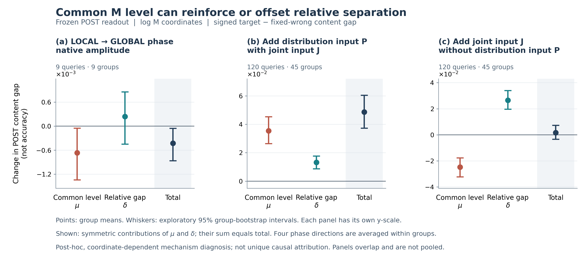

# M归因深化：配准、共同水平与实际纠错的收口

两条新增实验链和独立核算均完成。这里的“完成”指已冻结的有限实验，不表示所有原系统收益已有唯一根因。没有训练新模型，没有新增准确率纪录。

## 已经推进了什么

上游证明了输出支持依赖内容与对应编码的配合：两侧支持同时提高，logM比例分差未显示稳定改善，但原始M绝对分差与POST内容分差出现正向信号。这三种端点不能混用。下游拆出了旧反向现象的共同水平与相对差距来源。已有完整C128结果也已逐query核算，粗通路的实际纠错作用不是空白。

## 上游：提高支持强度，不自动提高身份区分

固定9个已打开身份组，每个query比较target与一个固定wrong，共18个query–reference候选对；四个方向在组内平均，29臂共522次CPU双向DPT缓存回放。所有编码器、匹配器和参数保持冻结。P完整不变的对照与保留P向量集/通道Gram/Fourier幅度的对照同时保留。

| 配准对照 | target logM | wrong logM | target−wrong logM |
|---|---:|---:|---:|
| 对齐相对错位（主对比） | +0.0560826 [+0.0394782, +0.0732798] | +0.0574454 [+0.0384345, +0.0784599] | -0.0013628 [-0.0207628, +0.0171387] |
| P完整固定，仅移动A/J | -0.0485959 [-0.0706622, -0.0268977] | -0.0483484 [-0.0739856, -0.0251030] | -0.0002475 [-0.0225519, +0.0217745] |
| A/J/P共同移动 | +0.0061943 [-0.0025211, +0.0169926] | +0.0104483 [+0.0024981, +0.0180581] | -0.0042541 [-0.0126183, +0.0047665] |
| A固定时J×P交互 | +0.1113596 [+0.0863070, +0.1386255] | +0.0983758 [+0.0685492, +0.1303928] | +0.0129838 [-0.0155294, +0.0433180] |
| A移动时J×P交互 | +0.1091031 [+0.0835815, +0.1372635] | +0.0981177 [+0.0683849, +0.1300915] | +0.0109854 [-0.0189285, +0.0422219] |

主对比两侧logM变化均9/9为正；logM分差区间跨0，不等于证明无效或等价，更不等于所有尺度上的身份分差均无改善。完整DPT不是平移等变网络，共同移动对照必须保留。整场sigmoid均值构成的log分差也跨0，这只限制“本现象由exact token池化独自造成”的解释，不能排除完整支持图含有被均值压缩掉的身份信息。
本轮在query网格移动编码，旧GLOBAL/LOCAL则旋转每块对应坐标的编码相位，两者不是同一干预；不能由本轮近零分差抹掉旧相位干预的正向证据。

## 同一次上游干预怎样进入外部与内部模型

固定原折NATIVE7、M_FREE及POST_REAL，仅沿M及代数派生量传播，原局部权重形状/内容保持固定。完整置信度场已保存，但此处不宣称全部上游变化的总效应。以下仍是两个固定候选的分差，不是全C128准确率。

| 对比 | 外部NATIVE7动作差 | 外部M_FREE动作差 | POST内容差 | POST动作差 |
|---|---:|---:|---:|---:|
| 对齐相对错位（主对比） | -0.0028253 [-0.0233834, +0.0154663] | -0.0038447 [-0.0278946, +0.0177058] | +0.0025333 [+0.0003985, +0.0054064] | +0.1310706 [-0.0019905, +0.3236159] |
| P完整固定，仅移动A/J | +0.0047651 [-0.0160922, +0.0264293] | +0.0081006 [-0.0167299, +0.0337268] | -0.0026053 [-0.0055255, -0.0004020] | -0.1341876 [-0.3298071, +0.0053501] |
| A/J/P共同移动 | -0.0004206 [-0.0061553, +0.0069973] | +0.0005780 [-0.0075908, +0.0120643] | -0.0001329 [-0.0002928, +0.0000096] | -0.0066165 [-0.0146074, +0.0005081] |
| A固定时J×P交互 | +0.0115051 [-0.0179622, +0.0423442] | +0.0163276 [-0.0184577, +0.0512652] | +0.0050804 [+0.0010914, +0.0103239] | +0.2645251 [+0.0241542, +0.6135474] |
| A移动时J×P交互 | +0.0096039 [-0.0219952, +0.0416161] | +0.0136569 [-0.0237688, +0.0512613] | +0.0049899 [+0.0010167, +0.0102691] | +0.2609044 [+0.0185808, +0.6139003] |

主对比的原始M分差变化为 +0.0028567 [+0.0008714, +0.0050625]，POST内容分差为 +0.0025333 [+0.0003985, +0.0054064]；两者探索区间均在0以上。但POST动作分差区间仍跨0，不能把内容端点的变化宣布为稳定新增纠错。
logMt−logMw衡量比例区分，Mt−Mw衡量绝对差；相近比例变化作用在不同原始M水平上，也可能改变绝对差。这说明不能用logM分差单独代表所有下游可利用的变化。这里没有把原始M差认定为POST变化的唯一中介。条件J×P对比中的POST正向结果完整保留，但属于预定次级对比，不能替代主对比或独立确认。
这组结果与下面的共同水平/相对差距检验一起，支持“不同读出利用M的不同方面”：外部动作主要依赖相对证据，内部内容调制还会响应绝对工作水平。它不是把所有上游性质唯一分解的证明。

## 下游：共同水平可以帮助，也可以抵消相对优势

主坐标μ=(logMt+logMw)/2、δ=logMt−logMw。表中为同一冻结POST的内容分差变化；两项是四格有限对照的对称分配，不是唯一因果份额。方括号为探索性按组bootstrap区间。

| 条件 | 共同水平分量 | 相对差距分量 | 总变化 |
|---|---:|---:|---:|
| 原幅度相位对照，9组 | -0.0006673 [-0.0013393, -0.0000514] | +0.0002380 [-0.0004502, +0.0008535] | -0.0004293 [-0.0008630, -0.0000535] |
| 置换幅度相位对照，9组 | +0.0014863 [+0.0003462, +0.0028712] | +0.0006929 [-0.0000600, +0.0014775] | +0.0021793 [+0.0008168, +0.0035674] |
| 保留J恢复P，120张/45组 | +0.0354121 [+0.0263804, +0.0452633] | +0.0131528 [+0.0087328, +0.0176330] | +0.0485649 [+0.0372881, +0.0604755] |
| 没有P恢复J，120张/45组 | -0.0247747 [-0.0321878, -0.0176515] | +0.0264536 [+0.0196229, +0.0339326] | +0.0016789 [-0.0033868, +0.0072987] |
| 没有J恢复P，120张/45组 | -0.0011899 [-0.0030038, +0.0009117] | -0.0062798 [-0.0101546, -0.0027177] | -0.0074698 [-0.0113539, -0.0036819] |

旧反向现象的负共同水平分量超过正相对差距点估计；后者区间含0，不能说每个query皆如此。另一方面，P with J中的共同水平分量明确为正，因此不能统一删除绝对M。J without P近零是两路抵消，不等于内部完全未利用M。
两套坐标全部报告。J with P的log-M交叉有21张M>1，未裁剪/未计算非法输入；99张合法子集与全部120端点分开。logit对照覆盖全量，但M不是身份概率；贡献/交互会随坐标改变。部分干预输入超原TRAIN范围，因此不能把数值合法写成分布内验证。
本面板93张RAW=target、27张RAW=fixed_wrong，没有第三RAW锚。外部对共同缩放近似不变是这种配对下归一化公式的既有性质，本轮只是复核；内部还依赖候选绝对M工作水平和内容。二者共享M接口，不是等价读出。

## 粗通路已经承担了哪些原有纠错

H593执行清单前128张，原held折、ColNomic自然C128；RAW93/128，target在候选中120/128。不是旧EVAL128，也不是全593。独立重算三模型×五世界×128共1920组完整候选分数和0阈值HOLD/SWITCH。

| 模型 | M来源 | 正确/128 | 救回RAW | 误伤RAW | 原HR1救回保留 |
|---|---|---:|---:|---:|---:|
| NATIVE7 | 原HR1 | 102 | 10 | 1 | 10/10 |
| NATIVE7 | 完整COARSE | 102 | 10 | 1 | 10/10 |
| NATIVE7 | 去P | 100 | 7 | 0 | 7/10 |
| NATIVE7 | 去J | 93 | 0 | 0 | 0/10 |
| M_FREE | 原HR1 | 102 | 10 | 1 | 10/10 |
| M_FREE | 完整COARSE | 102 | 10 | 1 | 10/10 |
| M_FREE | 去P | 100 | 7 | 0 | 6/10 |
| M_FREE | 去J | 93 | 0 | 0 | 0/10 |
| POST | 原HR1 | 101 | 8 | 0 | 8/8 |
| POST | 完整COARSE | 100 | 8 | 1 | 8/8 |
| POST | 去P | 94 | 2 | 1 | 2/8 |
| POST | 去J | 93 | 1 | 1 | 0/8 |

恢复集合有重叠，不能相加成独立贡献比例。POST的HR1→COARSE漂移单列；同样的救回数也可能是不同query集合。这里沿M传播粗通路删除，原局部形状固定，不等于删除整条RoMa作用。“去J/没有J”只删除预测器的直接J输入；P仍由原匹配上下文生成，不等于去掉全部双图交互信息。

## 判断与剩余问题

上游与下游都可能尚未充分兑现可用信息，但本轮没有训练修复模型，不能保证优化后准确率提高。上游还需分开输入信息不足、预测器读出不足及压缩损失；当前两种全局均值不能代表完整空间场。下游已明确绝对水平与相对证据的条件作用，修复必须使用推理可见信息，不能借用诊断中的target/wrong真值。
更细的相位、幅度、配准性质各自承担多少原生全C128救回仍未闭合。本轮量化的是固定接口的条件作用和粗通路的实际纠错集合，不是全593收益的唯一根因。没有新增QRR、所有权、分割或外部迁移主张。

详细数据与独立解读：`results/rc_m_context_binding_v1/`、`results/rc_post_m_level_gap_v1/`、`results/rc_m_coarse_path_correction_audit_v1/`。全部可用中间张量留在workspace，Git导出保留源码、协议、标量结果、来源哈希与科学图。
