# COST1 药盒热图

12 张 3200×1800 高清图，图上不标注折号。

- [缩略总览](contact_sheet.jpg)
- [下载全部图片 ZIP](COST1_medicine_images.zip)
- [合订 PDF](COST1_medicine_12cases.pdf)
- `index.html`：下载后可离线浏览。
- `data/*.json`：原结果、头参数来源、缓存哈希及验证记录。

## 图片

### 01_COST1_OUTCOME-0438

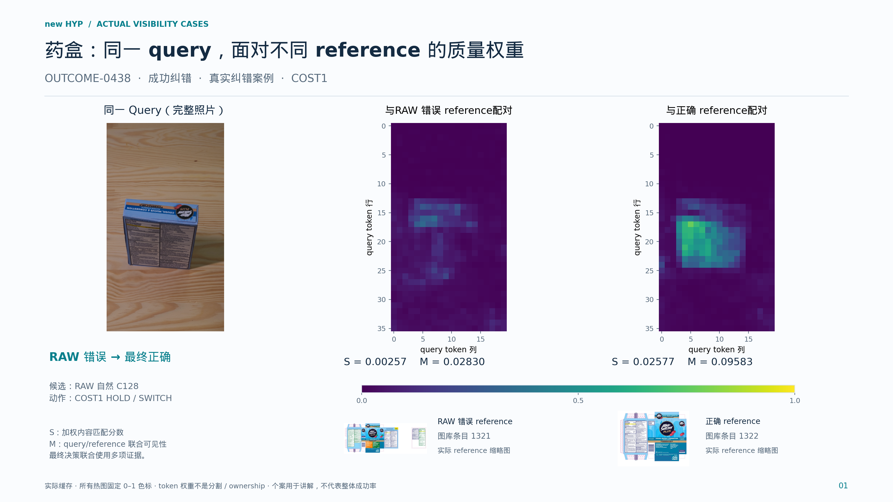

### 02_COST1_DIFFICULT-0013

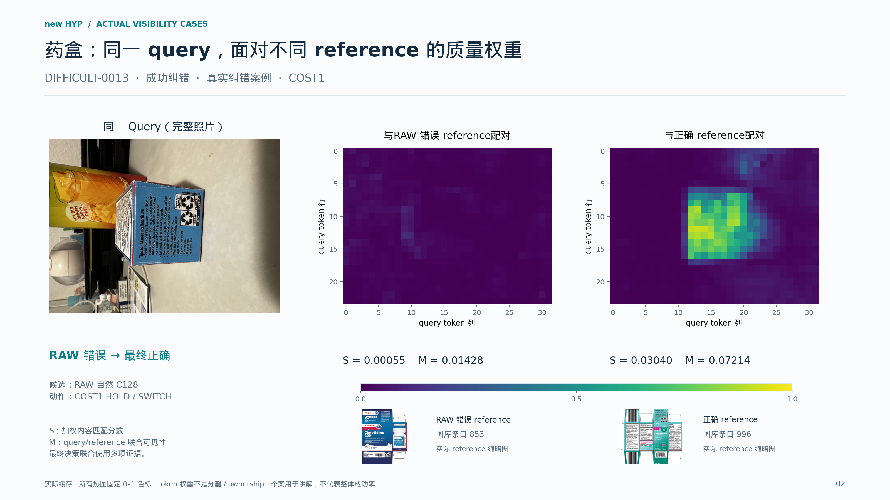

### 03_COST1_DIFFICULT-0023

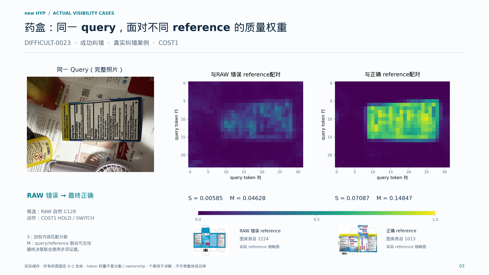

### 04_COST1_DIFFICULT-0043

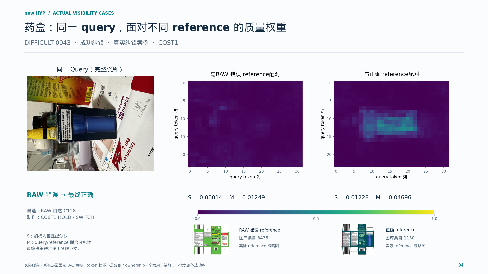

### 05_COST1_DIFFICULT-0061

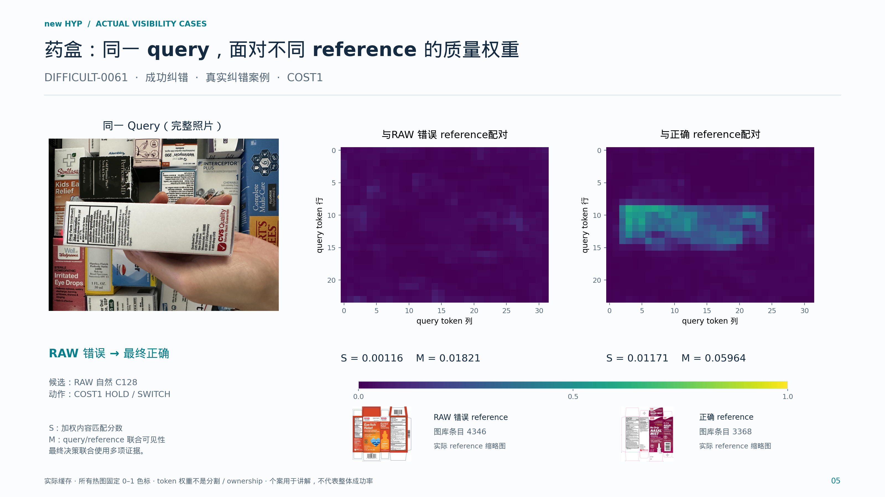

### 06_COST1_DIFFICULT-0083

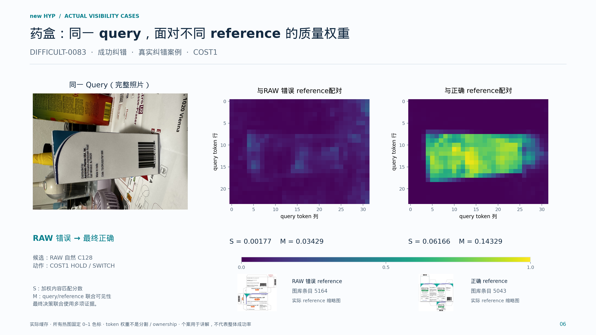

### 07_COST1_DIFFICULT-0102

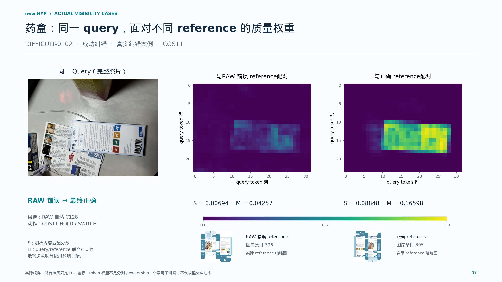

### 08_COST1_NDV2-011-P04

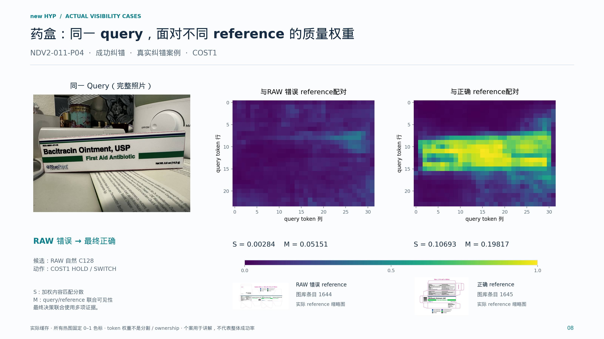

### 09_COST1_OUTCOME-0015

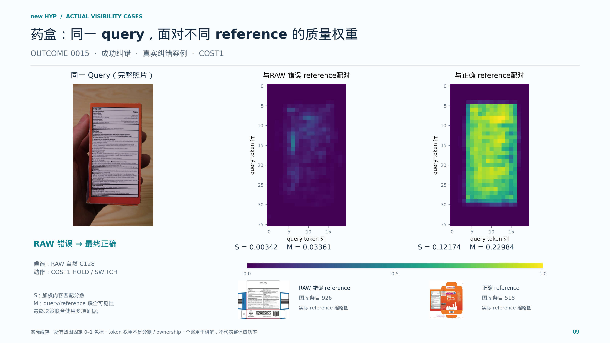

### 10_COST1_OUTCOME-0087

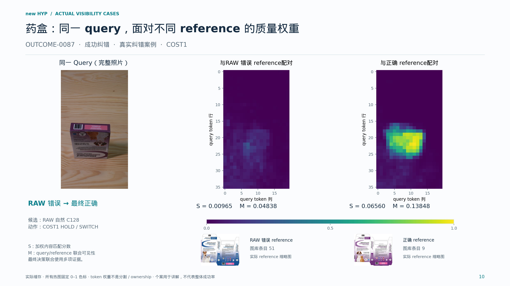

### 11_COST1_OUTCOME-0108

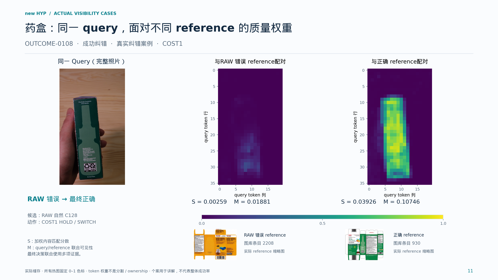

### 12_COST1_OUTCOME-0131

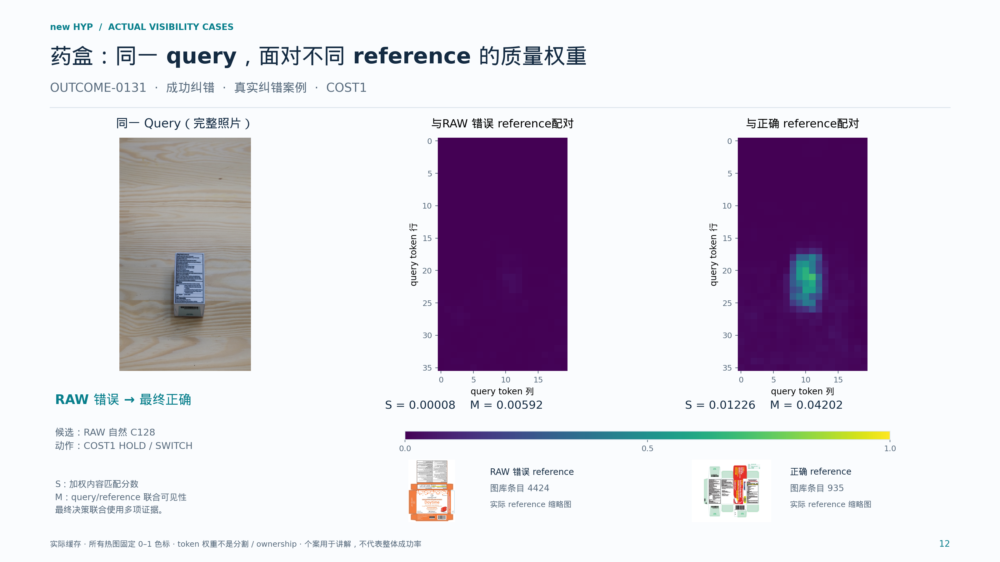

## 来源说明

案例来自 H593 原分组留出预测，各图对应头未训练该 query；折号仅保存在配套 JSON，不出现在图片中。选择 OUTCOME-0438 后，按原 query 编号取其他身份的成功纠错案例，共 12 个身份。选图用于讲解，不代表总体准确率。

热图使用原 RoMa 缓存，固定 0–1 色标，未逐图归一化；无新训练或编码器/匹配器推理。逐例决策与封存 COST1 输出核对，最大 logit 误差小于 2e-15。

本次上传图片、PDF/SVG、仅图片 ZIP、生成程序和来源 JSON；逐例 NPZ 数值及重复的完整资料 ZIP 留在原 workspace。
