# new HYP 展示讲义

2026-09-15 · 建议讲解时长 15–20 分钟。用途：组会、合作者交流与论文机制说明。

## 一句话介绍

我们用登记reference提供身份依据，把候选条件的匹配质量与内容相容性联合起来，用检索身份监督学习共享纠错规则；同一固定商品训练头在GroZi、RPC取得外部净增，在ISIC取得跨域探索信号。

## 术语速查

- **Reference**：某个具体身份的登记照片。**Gallery**：reference图库。
- **Query**：待识别照片。**Target**：正确身份，只用于训练监督和评测核对。
- **RAW**：基础ColNomic全库MaxSim检索。**C128**：RAW自然检索前128个候选。
- **Challenger**：除RAW首选外的127个候选。**HOLD**：保留RAW答案。**SWITCH**：改选一个challenger。
- **COST4 / COST1**：同一七参数结构，不同错误压制代价。**CE**：预定次模型，候选竞争交叉熵。
- **CBIND**：打乱候选与配对证据的关联，检验正确绑定是否有贡献。
- **Retrieval-only**：本任务新增训练只用身份/检索关系；不表示基础模型全部预训练都无其他监督。

## 完整统计表：相同full-H593固定头

| 数据 | RAW | COST4 | GROUP_COST4 | COST1主 | CE次 | COST1救/损（vs RAW） |
|---|---:|---:|---:|---:|---:|---:|
| GroZi480，外部确认 | 321/480 | 326/480 | 329/480 | 355/480 | 367/480 | 34/0 |
| RPC600，外部确认 | 192/600 | 194/600 | 196/600 | 207/600 | 217/600 | 18/3 |
| ISIC537，已打开队列探索 | 466/537 | 469/537 | 470/537 | 500/537 | 513/537 | 34/0 |

共同推理为自然RAW C128、127 challenger、原阈值0的HOLD/SWITCH。外部零训练或校准。GroZi旧5413物理reference追加120张；RPC独立200-reference；ISIC独立390-reference。所有11个原结果臂及其MRR见Excel与CSV，不合并分母。

## 逐页讲解
### 01 从参考照片到可靠纠错

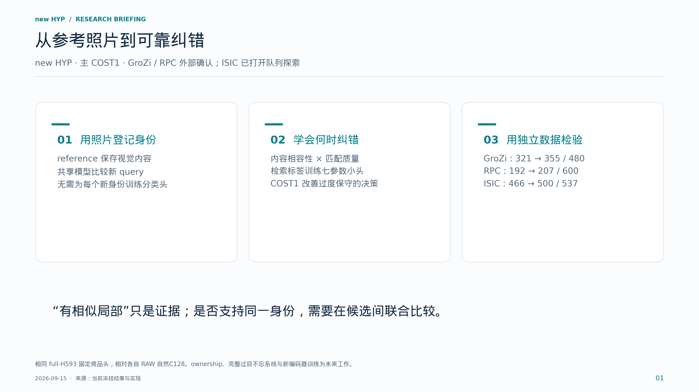

**本页要点：先说明任务、机制和证据范围，再介绍模型名称。**

开场先定义任务：我们要认出同一个具体物体或病灶，而不是只判断商品或疾病类别。reference是登记照片。当前方法把图像匹配提供的质量信息，与内容编码器提供的相似性结合，再学习何时修改基础检索结果。右侧三组都是同一固定COST1商品头相对各自RAW的结果。GroZi和RPC属于预定范围的外部确认；ISIC是已打开队列的跨域探索，三者不合并统计。

### 02 Reference 如何变成可检索的记忆

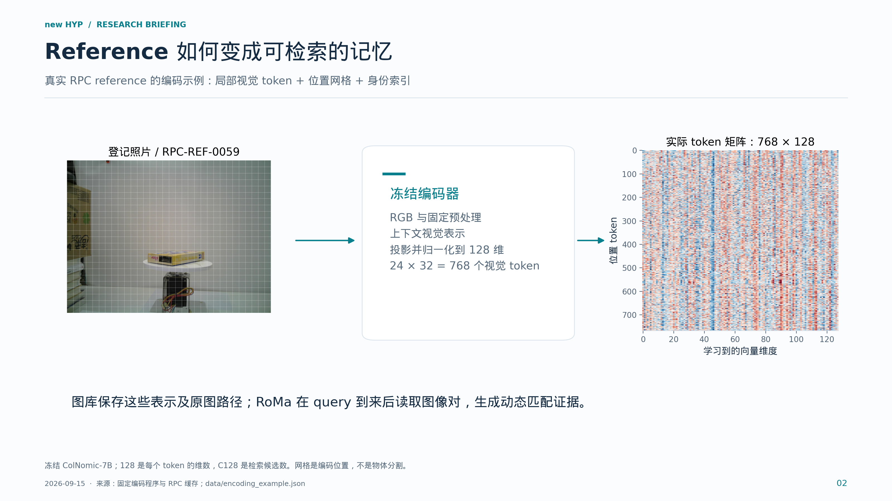

**本页要点：reference 是一组可复用视觉表示；配对证据在 query 到来后产生。**

这页展示真实RPC缓存中的reference。它的网格为24乘32，共有768个图像token，每个128维。右图就是保存的数值矩阵，颜色只表示向量分量，不能把某一维直接命名为文字或颜色属性。每个token包含编码器上下文，并非独立裁图特征。RAW阶段还保留固定processor模板token；局部加权评分只读取图像token。reference登记不训练身份专属参数，也不输入身份编号、mask或诊断文字。

### 03 推理的完整路径

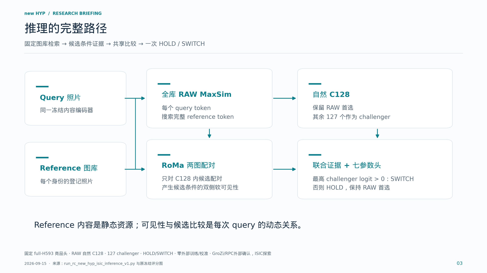

**本页要点：质量信息参与内容读取，决策同时保留 RAW 先验。**

按箭头讲清两条路径。RAW用全库内容相似性提出128个候选；RoMa对query和每个候选reference做配对，提供双侧软权重。内容匹配仍可在完整reference内寻找最相似token，没有变成硬坐标单点绑定。共享小头比较每个challenger与RAW首选，最终最多切换一次。HOLD只表示保留原答案，不是未知对象拒识。这里只使用冻结模型前向，没有根据测试标签选候选。

### 04 质量与内容怎样联合起来

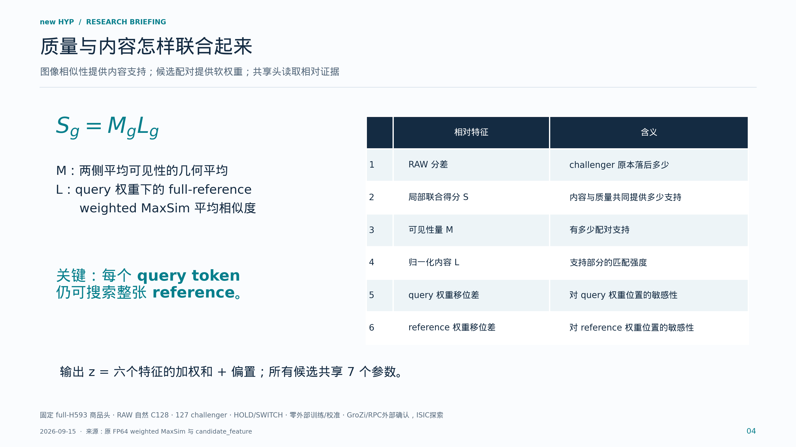

**本页要点：小头比较的是质量与内容的联合证据，不是只看一个相似性数值。**

M与L是当前评分图的因子化描述：S等于M乘L。M反映两侧软可见性总量，L是带reference权重的内容匹配平均值。头输入是challenger相对RAW首选的六项特征，含RAW分差以及质量、内容和移位控制。虽然最终头是线性的，输入已经包含乘积、最大匹配和相对归一化等非线性计算。移位特征的存在本身不证明ownership。

### 05 训练改变了什么：COST4 → COST1

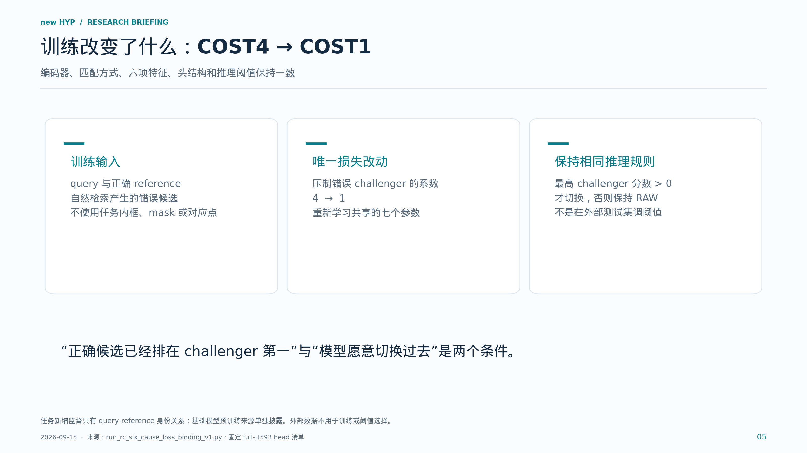

**本页要点：优化的是共享决策规则；reference 编码方式沿用原实现。**

retrieval-only指我们新增的任务监督只需要query-reference身份关系，不需要逐图空间标注。训练头学会正确候选超过HOLD和竞争候选，同时控制错误切换。COST4对错误challenger施加4倍压制，COST1改为1倍，其余训练结构沿用冻结协议。这个改动在更广开发数据和跨数据集上有收益。它没有训练新的token编码器，也不能概括为所有历史错误都只是过度保守。

### 06 同一固定商品头，在三个数据集上评测

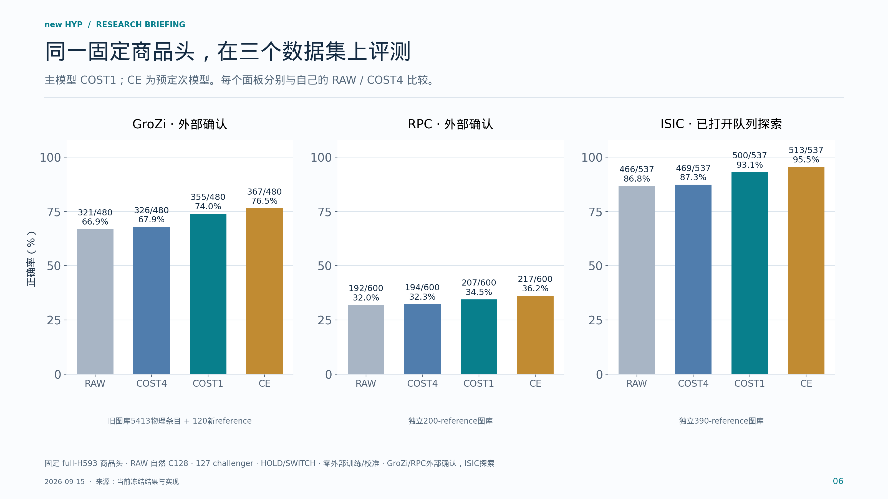

**本页要点：跨数据集收益成立；各面板保留各自的任务和分母。**

这张图的准确率纵轴统一从零到百分之百，并在每根柱上标出分子分母。COST1从各自RAW的321、192、466，提升到355、207、500。CE结果也完整展示，但仍是预定次模型。不同数据集的图库、任务和抽样不同，不把它们连成样本扩大曲线，不以准确率高低推断难度，也不合并为一个总分。

### 07 主模型 COST1：救回与损失同时报告

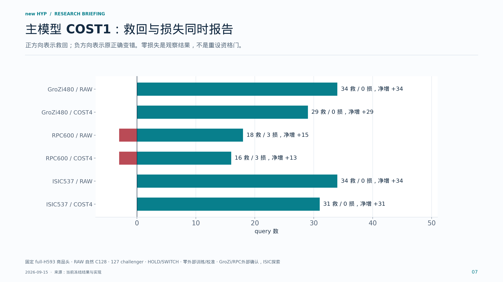

**本页要点：准确率增益需要展开为救回与损失，不能只报告切换次数。**

救回和损失必须成对报告。相对RAW，GroZi是34救0损，RPC是18救3损，ISIC是34救0损。相对相同数据同结构的COST4，分别是29救0损、16救3损、31救0损。RPC说明当前主张是可靠群体净增，不保证每一张原正确都保持。新模型的SWITCH还可能是错误换成另一错误，所以切换次数不能直接算救回次数。

### 08 Reference 绑定：证据必须属于当前候选

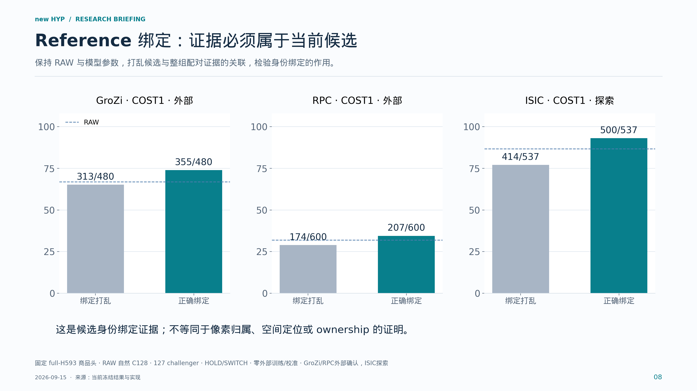

**本页要点：当前建立的是候选身份层面的证据绑定。**

CBIND把候选关联的整组配对证据移给另一候选，保持RAW候选轴和头参数。COST1打乱后分别为313、174、414，完整绑定为355、207、500。这个干预说明正确reference与证据的关联在当前系统中有作用。它并不隔离每一个token位置，也不意味着我们已经找到了目标的真实mask。

### 09 群体可靠性：按相关样本的组来统计

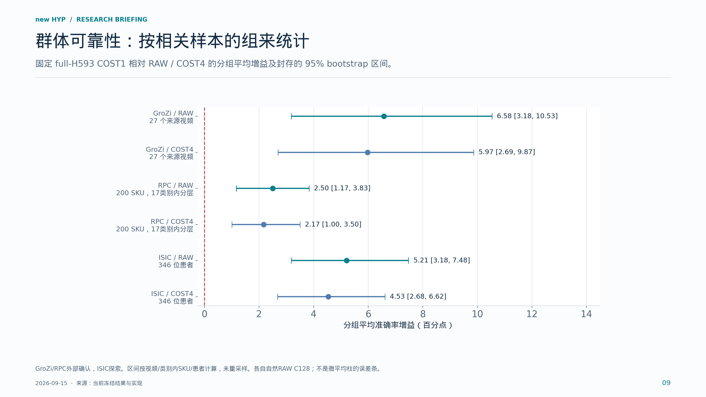

**本页要点：可靠净增需要考虑组内相关性，而不仅是多出几张正确。**

不能把同一视频、同一商品或同一患者的照片全部视为独立样本。这里复用原方案封存的分组bootstrap区间。显示的是等组平均的配对准确率差，和前面的query微平均不是同一个估计量。主COST1相对RAW和COST4的这些区间下界均大于零。CE相对COST1在GroZi和RPC的区间跨零，因此它没有取代预定主模型。

### 10 一次明确的失效修复：找到 target，却没有切换

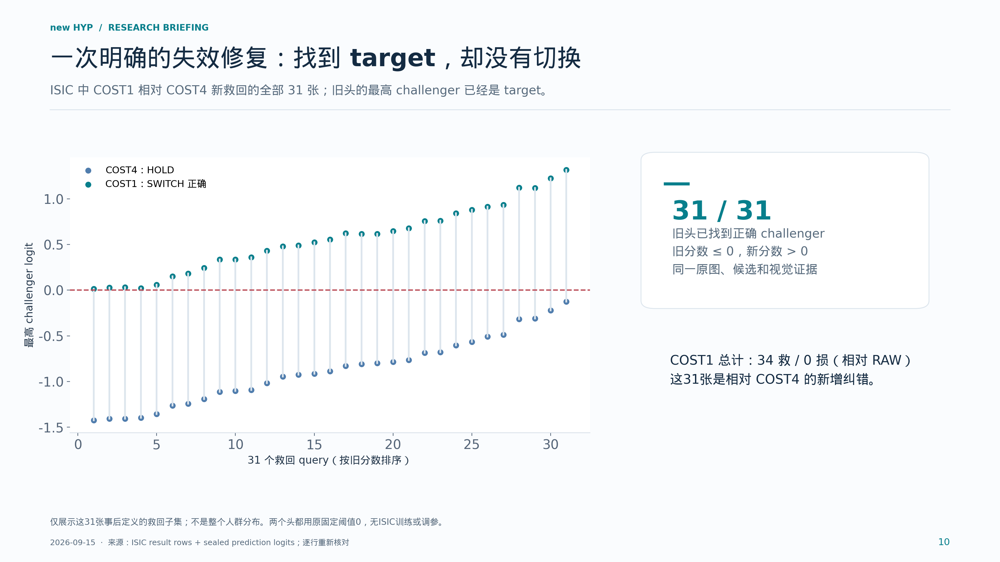

**本页要点：部分瓶颈位于从“候选最好”到“愿意纠错”的决策环节。**

这是最具体的机制解释。我们从原始封存logit逐行核对了31个query。对这些照片，COST4和COST1的最高challenger相同，并且就是target；区别在于旧头最高输出不大于零，所以HOLD，新头大于零，所以切换正确。不是重新给模型补入正确reference，也不是改变阈值。这只解释这31次改进，不能推广成所有错误的唯一原因。

### 11 真实图片：成功纠错长什么样

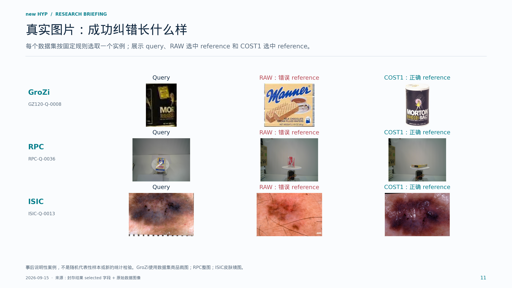

**本页要点：真实图片把“救回”落到具体 query-reference 决策。**

这页只描述模型输出，不凭外观编造错误原因。GroZi案例从已登记120个reference内可展示的救回案例按query编号选第一例；RPC与ISIC按同一规则选第一例。左侧是query，中间是RAW错误选择，右侧是COST1正确选择。请注意reference和query不是同一张文件。对ISIC也只讲同病灶实例检索，不讲疾病诊断。

### 12 同一 query，面对不同 reference 的质量权重

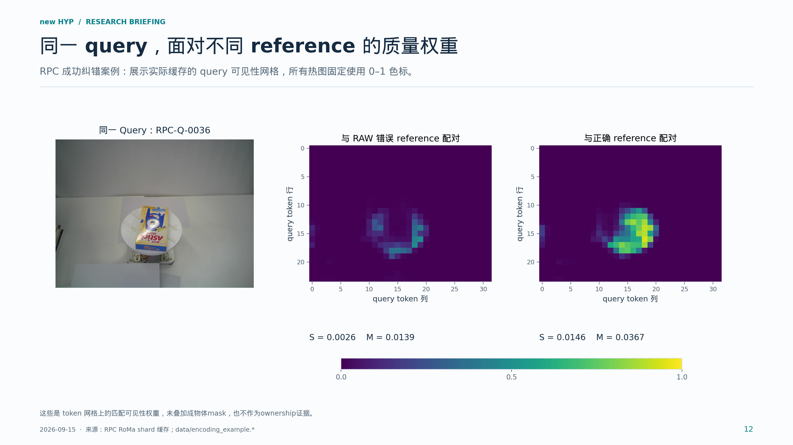

**本页要点：动态关系证据依赖 reference；高可见性本身不等于正确身份。**

这里展示实际RoMa缓存，不是手工画出的注意力。左边的同一query和两张reference配对后，产生右边两幅query可见性网格。色标固定为零到一，因而颜色可以直接比较。权重高表示当前配对模型认为更有重叠支持，并不保证身份正确；错误reference也可以形成高权重。所以还需要ColNomic内容与共享决策。网格不是分割mask，也没有以目标标签参与计算。

### 13 完整展示边界：仍有损失，也仍有无法救回的 query

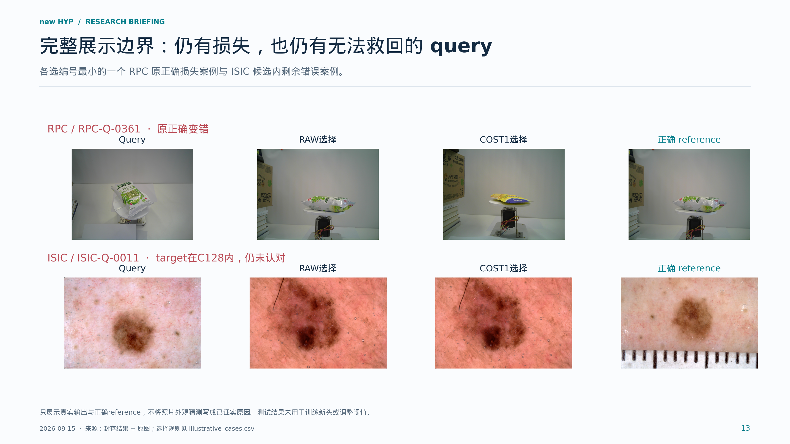

**本页要点：成功机制和群体增益并不意味着所有剩余问题已经解决。**

这页保留负例，说明我们主张群体净增而不是每张都正确。RPC有3张RAW原正确被COST1破坏，展示其中编号最小的一张。ISIC展示target已经在C128内但COST1仍未认对的一张。因此未解决问题既包含候选召回，也包含候选内的表示、比较和决策问题。我们不根据这一页主观猜测为每张图确定根因。

### 14 历史成绩各自保留；突破不靠更换分母

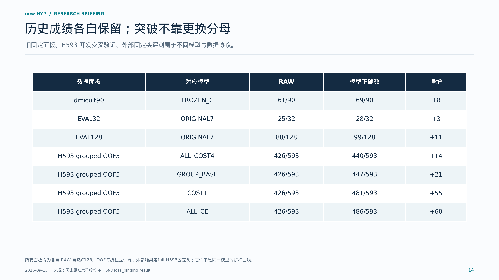

**本页要点：所有贡献有明确模型、数据和证据归属。**

这一页专门防止历史结果混淆。旧32面板25到28，旧128面板88到99，旧90面板61到69都保留自己的头与协议。H593五折开发结果中COST1是481，CE是486，但这是各折独立训练后的留出预测。外部数据使用重新以全部H593开发数据训练并封存的头，因此不能把外部增益写成旧99/128被突破，也不能把593图上的成绩当作旧128图上的成绩。

### 15 当前论文收口：机制与增益；未来继续扩展

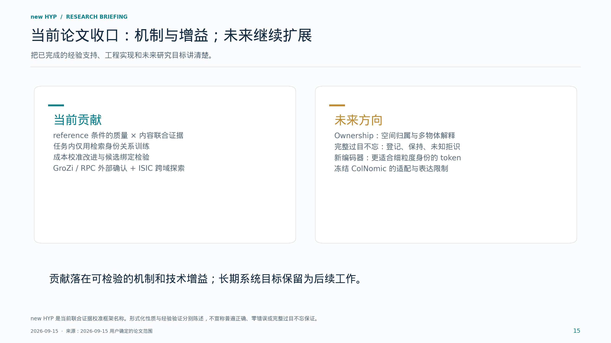

**本页要点：当前主线可以收口，未来系统目标不再阻塞当前论文。**

结尾回到用户已经确定的论文边界。当前我们建立并验证的是reference条件下质量和内容的联合校准，以及训练改进带来的群体收益。Ownership作为独立扩展。完整过目不忘系统还需要更完整的登记、图库增长后保持、未知拒识和复杂场景验证。ColNomic是本轮已验证实现，但不是预先认定的最终编码器；新的检索监督编码器作为未来工作，不能提前承诺一定提升。

## 常见问题与建议回答

**是不是又训练了大模型？** 这轮没有。ColNomic与RoMa冻结，任务训练更新共享七参数头。新token编码器列为未来研究。

**新身份要重训吗？** 当前结构允许登记reference后沿用共享头；跨数据集实验实际复用了固定商品头。它不保证任何新身份一定被召回或识别，也不等于完整过目不忘。

**理论贡献只是改一个系数吗？** 系数改变是具体技术实现。研究内容是把reference条件的质量、内容和决策关系形式化，隔离评分接口与决策失效，并通过冻结协议、对照和跨数据集检验验证可迁移收益。不能把已有MaxSim或简单代数恒等式称为新发明。

**COST1是不是在测试集选了阈值？** 不是。系数在训练目标里改变，推理仍采用事先固定的logit阈值0。GroZi、RPC、ISIC都不训练或校准头。

**为什么CE数字更高却仍是次模型？** 主次角色在外部结果前已指定。CE相对COST1在GroZi与RPC的分组区间跨零；ISIC次模型对照为正，也不事后改写主模型。

**是否每个旧正确都保住？** 没有这样的普遍保证。RPC COST1有18救3损，主张是可靠群体净增。GroZi和ISIC的零损失是本次观察。

**是不是证明了目标区域/ownership？** 没有。当前是候选身份绑定与联合证据校准；质量网格只是RoMa输出，ownership留作独立扩展。

**ISIC是不是疾病诊断？** 不是。任务是同一病灶的实例检索，且使用已打开并经历史筛选的队列，结论是跨域探索。不同文件/像素哈希不保证独立拍摄会话，也没有排除近重复或未知预训练暴露。

**旧28/32、99/128被突破了吗？** 这批外部数字不能这样解释。旧固定面板成绩保持原有模型与协议；H593是开发OOF，外部为full-H593冻结头。

**ColNomic是唯一瓶颈吗？** 尚未证明。冻结表示的适配性和无法由本轮小头学习新视觉特征是系统限制；候选召回、reference可辨识信息和决策也各有边界。新编码器的收益仍需未来受控实验。

## 展示时的四个提醒

1. 每次报数字同时说出数据集、模型与分母；不把H593 OOF和外部固定头混在一起。
2. 先说主COST1，再完整披露次CE。净增同时报告救回和损失。
3. 图像案例按明确事后规则选取，用于解释输出；不代表整体错误类型的占比。
4. 当前可收口的是限定范围的机制与收益。ownership、完整过目不忘和新编码器属于未来工作。

## 可复现材料

原始结果、程序、图片与缓存的哈希记录在 `source_manifest.json`。全部表格来自原结果逐行复算，bootstrap区间原样读取；本包没有训练、推理、重设阈值或重新抽样。`data/illustrative_cases.csv`说明选图规则，`data/ISIC31_held_to_rescue.csv`列出31次决策变化，`data/encoding_example.*`保存实际编码与质量网格示例。
