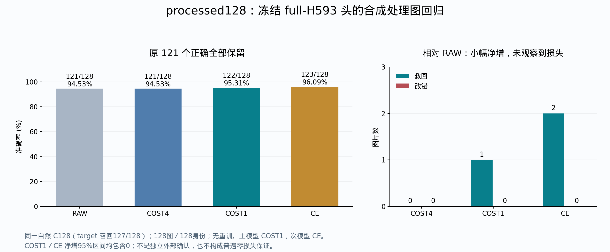

# processed128：完整冻结头回归读出

## 3.3 processed128：高 RAW 准确率下的冻结头回归（2026-09-19归档）

从 `ap7811-benchmark/1/processed` 在查看结果前按固定hash选入128张合成处理图，对应128个不同reference身份。使用2026-09-13冻结的full-H593头，零新增训练、零阈值调整。全库5413物理reference／5412校正身份，RAW自然C128后评价全部127个challenger；最高logit大于0才SWITCH，否则保留RAW。该面板独立列账，不与旧EVAL128的88→99或H593五折合并。

| 模型 | 正确/128 | 准确率 | 对RAW救回／改错 | 净增 | SWITCH |
| --- | --- | --- | --- | --- | --- |
| RAW | 121 | 94.53% | 0／0 | +0 | 0 |
| COST4 | 121 | 94.53% | 0／0 | +0 | 0 |
| GROUP_COST4 | 121 | 94.53% | 0／0 | +0 | 0 |
| COST1 | 122 | 95.31% | 1／0 | +1 | 2 |
| CE | 123 | 96.09% | 2／0 | +2 | 3 |
| RAW2_CE | 121 | 94.53% | 0／0 | +0 | 0 |

**RAW原正确121张全部保留：COST1救回1张，CE救回2张。** COST1共2次SWITCH（1救回、1错换另一个错），CE共3次SWITCH（2救回、1错换另一个错）。COST4、GROUP_COST4和RAW2_CE均没有正确数净增。

自然C128包含target为127/128，1张正确候选缺席并保留在分母中。COST1剩余6错＝1张候选缺席＋5张候选内判断错；CE剩余5错＝1＋4。

| 相对RAW的比较 | 净差/128 | 准确率差 pp | 来源组bootstrap 95%区间 pp |
| --- | --- | --- | --- |
| CE | 2 | +1.5625 | [0.0000, 3.9062] |
| COST1 | 1 | +0.7812 | [0.0000, 2.3438] |

两组区间下界均为0，所以只报告观察到小幅净增和零改错，不宣称可靠正净增或总体永不损失。此面板是合成处理图回归，不是独立外部确认。与H593训练图的字节重叠为0，但有5个身份重叠；其余123身份上RAW116、COST1 117、CE118，新增救回全部来自该非重叠部分。字节不重复不等于来源或语义完全独立。

### 实际救回与候选绑定对照

- `PROC-Q-0099`：`50mLcarton__motion_blur+aged_05.jpg`，COST1和CE均救回。
- `PROC-Q-0091`：`cla04-0002-05__aged+motion_blur_02.jpg`，CE额外救回。

| 模型 | 正确绑定/128 | 候选证据错绑/128 |
| --- | --- | --- |
| COST4 | 121 | 118 |
| GROUP_COST4 | 121 | 118 |
| COST1 | 122 | 92 |
| CE | 123 | 74 |
| RAW2_CE | 121 | 121 |

上述错绑是候选级联合证据控制，不能作为空间ownership或每个token精确对应必要性的证明。按处理类型及训练身份重叠分组的所有臂保留在CSV/Excel，未按最好子集筛选。

[全部11臂](processed128_all_models.csv) · [比较与区间](processed128_comparisons.csv) · [逐图结果](processed128_per_query.csv) · [所有COST1/CE改变决策](processed128_changed_queries.csv) · [处理类型](processed128_by_corruption.csv) · [训练身份重叠](processed128_by_overlap.csv)

[原始结果JSON](processed128_evidence/result.json) · [原验证记录](processed128_evidence/result_validation.json) · [完整原报告](processed128_evidence/report_zh.md)。本次归档复算128图、11臂的正确数、救损和分组计数，并核对16片验证SHA；未重训、未重新推理。
