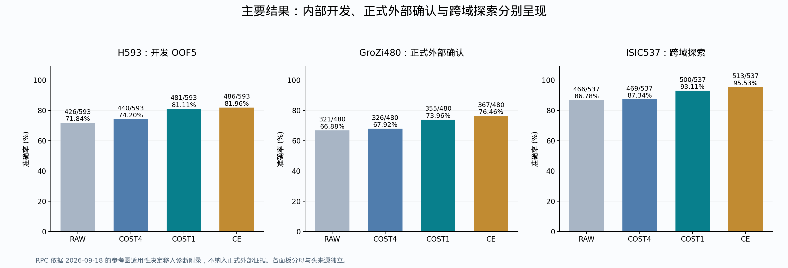
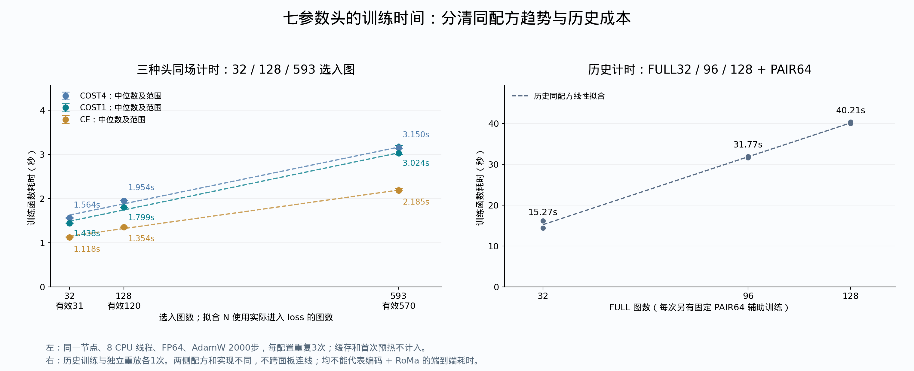

# 药盒与外部数据集：当前实验结果总账

原结果整理截至 2026-09-16；训练耗时与证据范围更新于 2026-09-18；理论原文与processed128归档补齐于 2026-09-19，Europe/Berlin。范围：当前 RAW＋RoMa＋ColNomic → P-only/空间分支 → new HYP 的药盒/商品开发实验，以及已经完成的 GroZi、RPC、ISIC 评测。按实验族汇总科学结果；序列化修复、取消任务和工程预检不重复计算为新实验。旧 DINO/召回开发等独立路线不并入当前模型准确率；受保护的 D1-MI、formal392 不在本次读取范围。

**当前结论：原模型的正向收益保留；new HYP 的技术改进已在 H593 分组开发和 GroZi 商品外部确认中出现；ISIC作为跨域探索，RPC仅保留参考图不足诊断。最清楚的可修机制是训练成本过于保守，已有正确 challenger 被 HOLD 拒绝。当前成功的是 reference 条件下的联合身份证据与决策校准；旧空间 P-only NO-GO 不改写，ownership、完整过目不忘系统和新编码器训练作为未来工作。**

原2026-09-16整理未训练或推理；2026-09-18加入同配方耗时重放、固定手工规则对照与RPC范围修订。2026-09-19补齐理论原文及已完成的processed128结果，仅复算计数和整理文件，不进行新训练或推理，不替换现有头。核心准确率、MRR、配对救损及分组点估计从原逐 query 结果复算；置信区间读取原封存结果。数学证书和专项视觉诊断引用归档报告，不重新求解或扩大其适用范围。

2026-09-16底账覆盖36个结果/面板检查条目及原128干预，导出418行模型汇总（含不同账本的重复基线，不是独立实验数）。后续CRISP/手填对照与耗时独立列账；本次另复算processed128的128图、11臂与分组统计，补入完成报告，并保留80份历史报告索引。

**2026-09-18 范围修订：RPC缺少本任务认可的信息充分的专用参考图，退出正式外部确认与训练必要性论证；保留为诊断附录。GroZi是正式商品外部确认，ISIC仍是已打开队列上的跨域探索。**

## 1. 所有数字先对齐模型与数据

| 数据账本 | RAW | 原配方/模型 | 后续结果 | 证据级别与限制 |
|---|---:|---:|---:|---|
| difficult90 | 61/90 | FROZEN_C 69/90 | 本轮保留 | 已打开历史困难回归集，8救0损 |
| 旧 EVAL32 | 25/32 | FROZEN_C 27/32；另一套 ORIGINAL7 28/32 | LISTWISE 26/32 | 内部固定面板；27与28是不同头 |
| 扩大 EVAL128 | 88/128 | 同一 ORIGINAL7 99/128 | LISTWISE 101/128 | 内部固定面板；101伴随旧32下降，不能与旧28拼成一套成绩 |
| H593 五折 | 426/593 | 同折 COST4 440/593；GROUP_BASE 447/593 | COST1 481/593；CE 486/593 | 开发 OOF，五套折内头，各 query 测试一次 |
| GroZi480 | 321/480 | 全H593固定 COST4 326/480 | 主 COST1 355/480；次 CE 367/480 | 预定范围内外部确认 |
| ISIC537 | 466/537 | 同批固定 COST4 469/537 | 主 COST1 500/537；次 CE 513/537 | 已打开、历史选择队列的跨域探索 |
| processed128 合成处理回归 | 121/128 | 同一full-H593固定 COST4 121/128 | COST1 122/128；CE 123/128 | 冻结头无重训；保留RAW原121正确；净增区间包含0，非独立外部确认 |

这里的“原配方”均包含软可见性、内容和训练头，不能把该列简称为“只加 RoMa”。不同数据规模改变了图片、图库或训练/评价协议，表格不是样本量学习曲线，分母不可合并。三个已运行数据库面板共享同一批全 H593 训练并冻结的头，其中RPC不计入正式证据；它们与 H593 的五套 OOF 头、历史 ORIGINAL7 都不同。

## 2. 模型如何运行，究竟训练了什么

1. reference 是图库中代表候选身份的图片；query 是待识别照片。reference 编码为冻结 ColNomic 局部视觉 tokens、对应网格及身份索引。
2. RAW ColNomic 全库检索给出自然 C128。缺席的 target 不人为插入。
3. 对每个候选，RoMa 产生 query/reference 的软匹配可见性；ColNomic 对 query token 仍可搜索完整 reference 的局部 tokens，进行 weighted MaxSim。
4. 原六统计描述 RAW 差、加权内容分数 S、联合可见性 M、归一化局部内容 L 和两端扰动响应 Q/R；共享七参数头读取相对 RAW 首选的证据。
5. 评价完整 127 个 challenger。最高 logit 大于 0 就 SWITCH，否则 HOLD 保留 RAW。HOLD 不是“未知身份拒识”。

本任务新增训练仅使用 query-reference 的身份/正负检索关系；不增加物体框、mask、点、对应位置或人工图片类型标签。冻结基础模型的既有预训练另行披露，不能将全流程称为没有监督。当前没有独立训练的空间 P→V 网络，也没有主线 superregion。

COST4→COST1 保留数据、六统计、七参数、优化预算和推理阈值，只把训练时压制错误 challenger 的成本系数从 4 改为 1，再学习参数。CE 则改用包括 HOLD 在内的完整候选身份竞争目标。两项改变分别报告，不能把全部提升都归给 CE。

## 3. 药盒数据规模与五折的含义

| 数据 | 图片/身份/来源 | 用途 |
|---|---|---|
| matched TRAIN32 / EVAL32 | 两套32图面板 | 早期机制开发与固定内部评价，互相不能替代 |
| TRAIN128 | 128图、32身份/来源组 | 四折开发，RAW86、BASE108；不是 RAW88 的 EVAL128 |
| EVAL128 | 128图、24身份、21来源组 | 原固定 ORIGINAL7 的扩大内部读出；原训练与该面板身份/组分离，但来源历史已打开 |
| H593 | 593唯一图、68身份、64身份/来源连通组 | 所有已开放开发图的分组五折；含历史数据，不是独立于旧面板的新盲测 |

H593 的“药盒数据”是项目中的药盒/商品实例开发集合，含相关健康护理和兽药商品；不把 593 误写成 593 个不同药品身份。库存账本为 987−正式排除392=595条记录，去重后593张；本次未打开那392的受保护结果。

先按相同身份或来源关系合并，再整体分配到五折；相关 query 不跨该折训练/测试边界。图库仍提供测试身份的 reference，这是 reference 注册后的识别任务。

| 折 | 测试图 | 训练候选图 | RAW | COST4 | GROUP | COST1 | CE |
| --- | --- | --- | --- | --- | --- | --- | --- |
| 0 | 119 | 474 | 98 | 99 | 99 | 105 | 104 |
| 1 | 118 | 475 | 78 | 80 | 81 | 95 | 98 |
| 2 | 119 | 474 | 97 | 99 | 99 | 103 | 104 |
| 3 | 119 | 474 | 80 | 82 | 85 | 91 | 91 |
| 4 | 118 | 475 | 73 | 80 | 83 | 87 | 89 |

“训练候选图”是该折允许训练的 query 集合大小；具体拟合配方仍按合同处理 target 缺 C128 的样本，不能把474/475误当成每个 loss 都实际使用的正例数。所有593测试图均保留分母。H593 自然 C128 召回 570/593；23张缺席。

[593张图片](../../results/rc_new_hyp593_oof5_v1/metadata/images/) · [图片清单](../../results/rc_new_hyp593_oof5_v1/metadata/worker_manifest.json) · [五折清单](../../results/rc_new_hyp593_oof5_v1/metadata/split_manifest.json)

## 3.1 32／128／593 的训练耗时：补齐 COST4（2026-09-18）

本节回答训练小头要花多少时间。采用原 H593 执行顺序的嵌套前32／128／593张，在同一新作业、同一节点调用原 COST4、COST1、CE 训练函数，每种头、每种规模重复3次，共27次；三个模型均为6权重＋1偏置、零初始化、FP64、AdamW 2000步、8 CPU线程。此处32/128是H593内部的计时子集，不是重跑历史 EVAL32/EVAL128，也不是新的准确率学习曲线。

自然C128中缺target的1／8／23张沿用原loss排除规则，所以实际训练数是31／120／570。全H593重放的参数与原冻结COST4/COST1/CE逐位一致；计时参数不保存为新模型。

| 模型 | 选入图 | 有效训练图 | 3次中位数/s | 最小—最大/s |
| --- | --- | --- | --- | --- |
| COST4 | 32 | 31 | 1.564 | 1.559—1.570 |
| COST4 | 128 | 120 | 1.954 | 1.951—1.956 |
| COST4 | 593 | 570 | 3.150 | 3.134—3.210 |
| COST1 | 32 | 31 | 1.438 | 1.435—1.446 |
| COST1 | 128 | 120 | 1.799 | 1.798—1.805 |
| COST1 | 593 | 570 | 3.024 | 2.996—3.200 |
| CE | 32 | 31 | 1.118 | 1.116—1.132 |
| CE | 128 | 120 | 1.354 | 1.354—1.357 |
| CE | 593 | 570 | 2.185 | 2.180—2.232 |

拟合使用有效训练图数 N，T 的单位为秒；每种模型仅用三个规模的中位数进行仿射最小二乘拟合。误差棒是3次实测的最小—最大范围，不是置信区间。

- COST4：T(N) = 1.537279 + 0.002851N；R²=0.99305，RMSE=0.05626s。
- COST1：T(N) = 1.396790 + 0.002872N；R²=0.99583，RMSE=0.04385s。
- CE：T(N) = 1.087440 + 0.001935N；R²=0.99670，RMSE=0.02628s。

只有三个观测规模，拟合仅描述本节点、本实现、固定2000步的观测范围，不证明普适复杂度、不向更大样本量外推。

计时环境：hkn0807.localdomain，Intel(R) Xeon(R) Platinum 8368 CPU @ 2.40GHz；PyTorch 2.9.1+cu128，CPU 8线程。申请GPU是为了运行短时分区，本次训练未用GPU。

纯头计时从已有内存特征开始，包含优化器创建和2000次更新；不包含排队、Python/库启动、特征缓存读取、编码器/RoMa前向和评价。缓存读取与组批另耗 3.297s；每个模型均先热身2000步，未纳入拟合：COST4 2.914s、COST1 1.439s、CE 1.141s。不能把纯头耗时写成完整RAW＋RoMa流水线总耗时。

本轮 COST4、COST1、CE 共27次计时来自同一作业。此前只有COST1/CE的18次计时另存 training_time_v1_previous_source.json 和 training_time_v1_previous_summary.csv，不与本轮平均。COST4直接调用原fit_base，COST1/CE调用原train；COST4原实现另含逐步梯度有限性检查，因此耗时差异含实现开销，不能全归因于损失公式。

### 历史实际耗时，独立保留

| 历史配方 | FULL图 | 额外PAIR | 首次训练/s | 独立重放/s |
| --- | --- | --- | --- | --- |
| ORIGINAL7 | 32 | 64 | 16.152 | 14.388 |
| FULL96 | 96 | 64 | 31.907 | 31.626 |
| FULL128 | 128 | 64 | 40.411 | 40.006 |

历史记录来自 job5139291、CPU节点hkn0002、8线程；每次仍为2000步，但包含固定PAIR64辅助项及不同训练实现。其整个作业为299秒，包含三套头及其独立重放、读取和评价，不能分配成一个头的训练耗时。历史H593单模型作业COST4为60秒、COST1为60秒、CE为59秒，包含加载、两次拟合和验证；原日志未单列纯train耗时，因此不与历史32/128拼成一条曲线。

[逐次实测](training_time_repeats.csv) · [汇总](training_time_summary.csv) · [拟合系数/残差](training_time_fits.csv) · [历史纯训练](historical_training_time.csv) · [历史作业总耗时](historical_job_elapsed.csv)

## 3.2 训练与手填参数：审稿问题的直接对照

固定同一六维输入、RAW自然C128和正logit才SWITCH的规则，手填EQUAL=[1,1,1,1,1,1,0]、BALANCED=[1,.2,.2,.2,.2,.2,0]；数值在读本轮结果前冻结。全零头严格回到RAW，仅作实现检查。H593训练头使用原分组OOF结果，没有用全H593拟合准确率冒充留出。

| 方法 | 正确/593 | 对RAW救回 | 改错 | 净增 |
| --- | --- | --- | --- | --- |
| CE | 486 | 71 | 11 | 60 |
| COST1 | 481 | 58 | 3 | 55 |
| CRISP | 373 | 16 | 69 | -53 |
| MANUAL_BALANCED | 459 | 41 | 8 | 33 |
| MANUAL_EQUAL | 459 | 71 | 38 | 33 |
| PATCH_MAXSIM | 424 | 1 | 3 | -2 |
| RAW | 426 | 0 | 0 | 0 |
| VISIBILITY_DIRECT | 417 | 99 | 108 | -9 |
| ZERO_HEAD | 426 | 0 | 0 | 0 |

COST1相对两种手工规则均净增22/593；按64个来源连通组重采样的图像微平均差95%区间：相对EQUAL为[0.162,7.290]pp，相对BALANCED为[1.563,5.942]pp。CE相对两种规则均净增27/593。以上是所测规则下的开发证据，不证明所有免训练规则都不可能达到同样效果，也没有新的GroZi手填头对照。

CRISP采用作者公开评分函数，适配image-to-image、同一自然C128、image-only tokens；它在H593为373/593，匹配token口径的普通MaxSim为424/593。这是当前适配的结果，不是原文text-to-flowchart任务的完全复现。RPC相关读出仅见诊断附录，不用于上述训练价值论证。

训练与手填在部署时执行相同的线性头，训练增加的是一次参数估计成本。当前证据支持“小成本学习在H593上优于所测固定规则”，不能泛化成“任何任务都必须训练”。

## 3.3 processed128：高 RAW 准确率下的冻结头回归（2026-09-19归档）

从 `ap7811-benchmark/1/processed` 在查看结果前按固定hash选入128张合成处理图，对应128个不同reference身份。使用2026-09-13冻结的full-H593头，零新增训练、零阈值调整。全库5413物理reference／5412校正身份，RAW自然C128后评价全部127个challenger；最高logit大于0才SWITCH，否则保留RAW。该面板独立列账，不与旧EVAL128的88→99或H593五折合并。

| 模型 | 正确/128 | 准确率 | 对RAW救回／改错 | 净增 | SWITCH |
| --- | --- | --- | --- | --- | --- |
| RAW | 121 | 94.53% | 0／0 | +0 | 0 |
| COST4 | 121 | 94.53% | 0／0 | +0 | 0 |
| GROUP_COST4 | 121 | 94.53% | 0／0 | +0 | 0 |
| COST1 | 122 | 95.31% | 1／0 | +1 | 2 |
| CE | 123 | 96.09% | 2／0 | +2 | 3 |
| RAW2_CE | 121 | 94.53% | 0／0 | +0 | 0 |

**RAW原正确121张全部保留：COST1救回1张，CE救回2张。** COST1共2次SWITCH（1救回、1错换另一个错），CE共3次SWITCH（2救回、1错换另一个错）。COST4、GROUP_COST4和RAW2_CE均没有正确数净增。

自然C128包含target为127/128，1张正确候选缺席并保留在分母中。COST1剩余6错＝1张候选缺席＋5张候选内判断错；CE剩余5错＝1＋4。

| 相对RAW的比较 | 净差/128 | 准确率差 pp | 来源组bootstrap 95%区间 pp |
| --- | --- | --- | --- |
| CE | 2 | +1.5625 | [0.0000, 3.9062] |
| COST1 | 1 | +0.7812 | [0.0000, 2.3438] |

两组区间下界均为0，所以只报告观察到小幅净增和零改错，不宣称可靠正净增或总体永不损失。此面板是合成处理图回归，不是独立外部确认。与H593训练图的字节重叠为0，但有5个身份重叠；其余123身份上RAW116、COST1 117、CE118，新增救回全部来自该非重叠部分。字节不重复不等于来源或语义完全独立。

### 实际救回与候选绑定对照

- `PROC-Q-0099`：`50mLcarton__motion_blur+aged_05.jpg`，COST1和CE均救回。
- `PROC-Q-0091`：`cla04-0002-05__aged+motion_blur_02.jpg`，CE额外救回。

| 模型 | 正确绑定/128 | 候选证据错绑/128 |
| --- | --- | --- |
| COST4 | 121 | 118 |
| GROUP_COST4 | 121 | 118 |
| COST1 | 122 | 92 |
| CE | 123 | 74 |
| RAW2_CE | 121 | 121 |

上述错绑是候选级联合证据控制，不能作为空间ownership或每个token精确对应必要性的证明。按处理类型及训练身份重叠分组的所有臂保留在CSV/Excel，未按最好子集筛选。

[全部11臂](processed128_all_models.csv) · [比较与区间](processed128_comparisons.csv) · [逐图结果](processed128_per_query.csv) · [所有COST1/CE改变决策](processed128_changed_queries.csv) · [处理类型](processed128_by_corruption.csv) · [训练身份重叠](processed128_by_overlap.csv)

[原始结果JSON](processed128_evidence/result.json) · [原验证记录](processed128_evidence/result_validation.json) · [完整原报告](processed128_evidence/report_zh.md)。本次归档复算128图、11臂的正确数、救损和分组计数，并核对16片验证SHA；未重训、未重新推理。

## 4. 旧模型与固定 EVAL32/128：完整保留收益和取舍

FROZEN_C 的 historical difficult90 是61→69，current-runtime EVAL32是25→27；ORIGINAL7/NATIVE7 的匹配 EVAL32 是25→28。同一冻结 ORIGINAL7 在扩大 EVAL128 上88→99，12救1损。两套头不能共享一份成绩。

下面每一行是该模型在两个固定面板上的结果。FULL96/FULL128是扩大训练，IMAGE269/GROUP269是更多训练图及组风险，GAP是仅在原HOLD上增加共享幅度，CONVEX是同原风险的有界优化，LISTWISE是完整候选身份目标。

| 同一套模型 | EVAL32 /32 | EVAL128 /128 |
| --- | --- | --- |
| GROUP269 | 26 | 94 |
| IMAGE269 | 26 | 93 |
| ORIGINAL7 | 28 | 99 |
| RAW | 25 | 88 |
| GROUP_MIXED96 | 27 | 99 |
| TRAIN_CONVEX7 | 28 | 99 |
| TRAIN_UNIT_COST7 | 27 | 99 |
| LISTWISE_UNIT1 | 26 | 101 |
| GLOBAL7_T128 | 27 | 98 |
| FULL128 | 27 | 97 |
| FULL96 | 27 | 97 |
| GAP_HOLD1 | 27 | 99 |

值得保留的结论：

- LISTWISE 的101/128是真实开发净增：相对原99为7救5损、净+2；同一模型旧32却0救2损，变成26。它没有同时超过原28和99。
- TRAIN128 GLOBAL7 的四折108→114，转为全TRAIN拟合后在固定面板是27/32、98/128。114不能记入 EVAL128。
- 更多训练图与原成本目标没有自动改善：FULL96/FULL128为27/97；269图 IMAGE为26/93，GROUP为26/94。
- 原PAIR64＋FULL32仅改组均衡是27/99；同原风险进一步优化为28/99；单位成本在该旧混合协议为27/99。后来的H593成本优势不能抹去这里的零净增/负向结果。
- ORIGINAL7 EVAL128 的候选绑定干预是99→67，原12次救回仅保留1次。M/L置零会消灭原救回；Q置零保持该面板正确集合，不能声称每个特征都普遍不可替代。
- EVAL128的12救主要集中在5个来源组；精确双侧组 sign-flip p=0.0625，原报告中的组区间和该检验应一起保留。不能仅凭图像计数宣布独立确认。

[旧128机制](../REPORT_NEW_HYP_ORIGINAL7_EVAL128_MECHANISM_RESULT_V1_20260910.md) · [LISTWISE原结果](../../results/rc_full_candidate_identity_loss_v1/result.json) · [固定面板汇总CSV](fixed_panel_matrix.csv)

原冻结 ORIGINAL7 的全部列干预和候选错绑读出如下。删除输入项是计算依赖检验，不是各删项模型重新训练后的能力比较。

| ORIGINAL7干预 | 正确 /128 | 对RAW救/损 | MRR |
| --- | --- | --- | --- |
| CBIND | 67 | 2/23 | 0.67709 |
| DROP_L | 85 | 0/3 | 0.75796 |
| DROP_M | 88 | 0/0 | 0.77007 |
| DROP_Q | 99 | 12/1 | 0.82401 |
| DROP_QR | 98 | 11/1 | 0.81707 |
| DROP_R | 97 | 11/2 | 0.81316 |
| DROP_RAW | 94 | 13/7 | 0.80604 |
| DROP_S | 98 | 14/4 | 0.81867 |
| DROP_S_QR | 97 | 13/4 | 0.81163 |
| REAL | 99 | 12/1 | 0.82401 |

## 5. 早期空间 HYP/P-only：哪些失败，失败意味着什么

这些是已打开 TRAIN32 的 P-only/空间开发，目标通常是 legal connected family 自己把 target 排过 strongest wrong；没有执行现有完整 HOLD/SWITCH。其胜出数与最终系统准确率不是同一评价。

| 分支 | 关键结果 | 结论 |
|---|---|---|
| legal-family P-only V3 | 连通 family32/32；REAL21/32；query-only20/32；净+1，要求≥4 | NO-GO；margin增强主要发生在已有成功图，未产生足够新翻转 |
| GISC V5兼容运行 | 见下表 | 符号约束不能保证 identity-specific；生产门读数NO-GO |
| competitive witness V6 | 见下表 | 仍不足以优于强 query-only；可靠局部对应也可能支持错误规格 |
| grouped residual V7 / coherent residual V8 | 见下表 | 排名和空间控制均未达到冻结门；增强约束也损失可用性 |
| V9后继设计 | 按接口与根因检查暂停 | 暂停/方案不能算成功结果；与更早RGH-V9B谱系分开 |
| RoMa-RGH reference-first S0 | all-patch27/32；query-only26/32；主query-region7/32；paired5/32 | target有合法H1为31/32仍不足以证明身份判别；主臂NO-GO |
| SAM辅助区域路线 | 未纳入本论文主线正证据 | 与当前任务的retrieval-only主张分开保留 |

| 实验 | target有连通H1 /32 | REAL胜 strongest wrong /32 | 相对 query-only 净增 | 门 |
| --- | --- | --- | --- | --- |
| lth_p_only_gisc_optimization_v5_compat | 32 | 20 | 0 | NO-GO |
| competitive_witness_development_v6 | 32 | 23 | 1 | NO-GO |
| grouped_residual_development_v7 | 29 | 7 | -7 | NO-GO |
| coherent_residual_development_v8 | 29 | 9 | -4 | NO-GO |

GISC上述生产结果JSON的原科学字段仍是 `NO_GO_PENDING_INDEPENDENT_VALIDATION`；本表照录门值，不把工程或未闭合字段升级为完整独立资格。V6/V7/V8也按各自当时的匹配控制解释，不把版本间分数当作同一冻结模型的学习曲线。

S0最具体的故障是候选合法假设数量进入聚合：target H1中位数36，strongest wrong中位数376.5；17个失败pair中target的平均指数质量更高，但数量项使其落败。这是固定旧对手的事后分解，不代表改归一化即可救回17张，新的最强错误候选仍可能出现。

早期P接口还存在真实信息损失：硬RoMa对应收紧了自由内容搜索，旧P摘要遗漏完整reference可见性质量统计M。补齐必要统计能够重建原决策；它是接口修复证据，不等于空间HYP通过，也不能解释所有历史失败。

[V3结论](../REPORT_RC_LTH_P_ONLY_LEGAL_FAMILY_V3_FINAL_NO_GO_AND_FAILURE_ANALYSIS_20260908.md) · [S0数量偏差](../REPORT_ROMA_RGH_S0_JOB5139368_FINAL_DECISION_AND_MULTIPLICITY_BOTTLENECK_20260910.md) · [原系统与P接口](../REPORT_RC_ORIGINAL_ROMA_SUCCESS_AND_P_INFORMATION_LOSS_20260909.md)

## 6. new HYP中间尝试：负结果也全部保留

本表覆盖主要改动族；每个模型臂、控制、采样种子和来源见后面的逐臂附录/Excel，避免只展示胜出配置。

| 改动族 | 同协议观测 | 结论 |
|---|---|---|
| 绝对/相对证据尺度 ABS12/REL12 | EVAL32均26，原28 | 未改善 |
| PAIR/FULL × SIGN/RANK | 原PAIR_SIGN28，其余三格27 | 更换监督形态/目标的这组配置未超原头 |
| 统一PAIR Q/R位移 | EVAL32 28→26 | 统一定义没有修复性能 |
| 完整reference内容桥接 | C28、D_IMAGE27、D_FULL25 | 恢复更多token上下文本身不保证决策变好 |
| 重训M/L简化头 | RAW2 25，M3/L3/JOINT4均26，原完整28 | 联合质量/内容有作用，但该简化不足以保留完整能力 |
| 乘积/扰动响应因子实验 | JOINT4 26、PRODUCT5 27、RESPONSE6 26，完整头28 | 乘积项有内部贡献；不等于简化主门通过 |
| 同支持身份特异性 | FREE8与SPECIFIC8均27/32，完整头28 | 在同支持上加入所测特异性读出未超过原模型 |
| 支持MAXMIN与二维投影 | EVAL32 MAXMIN8 27、固定PROJECTION8 26 | 未超过原28 |
| 共享方向DIR9 | 约26.74°；27/32，固定方向26/32 | 相对固定投影改善，但原28仍未超过 |
| TRAIN128条件化自由内容 | BASE108、CONST108、COND107 | 条件机制没有跨组净增 |
| TRAIN128 HOLD提升 | BASE108、GAP110、CONTENT108 | GAP是对照探索信号；内容主臂未通过 |
| GAP迁移到真正EVAL | 27/32、99/128；新128为1救1损 | 训练保护不能保证留出保护 |
| TRAIN128受保护线性投影 | BASE108→PROTECTED110，6救4损 | 有开发净增，但当时冻结的零损保护门失败 |
| FIT/SELECT隔离 | FIT选择111；SELECT_RANK/PROTECT均108 | 选择组缺稳定收益；不是零损过滤单独挡住好更新 |
| query照片内容路由小头 | QUERY28 108、STATS28 107、打乱QUERY107；BASE108 | 所测照片类型/全局内容路由没有独立提升 |
| 同协议统一微调GLOBAL7 | TRAIN OOF114；固定EVAL27/98 | 开发收益未迁移到旧固定面板 |
| 同位置候选内容差 | MEAN109、CURVE111、JOINT110；GLOBAL114 | 同位置二阶统计未超过同容量/强基线 |
| 对上述CE继续优化 | 109/111/110均不变 | 当前函数类的数据损失优化没有换来新正确决策 |
| H593自由内容补偿 | BASE440→CONST444→COND445 | 真实内部增量；COND未稳定胜过更强小基头/组风险 |
| H593补偿偏置对照 | BIAS440；COND445；只错绑新增补偿441 | 该增量未被匹配训练的纯偏置复现，且依赖绑定 |
| H593 J端点符号 | ENDPOINT2 439；RELATIVE2 445 | 端点主臂失败；相对读出有开发信号，未取代强基线 |
| H593组均衡风险 | GROUP_BASE447；GROUP_CONST447；GROUP_COND446 | 组风险有内部收益；条件补偿未在强基线上继续增益 |

容量分析另外单列：旧EVAL32的固定六维端点/七参数严格线性类，保原28再增1不可行；保RAW25达到29也不可行；允许正确集合变化存在至少29严格正确的数学witness。它读取了已打开标签，只是存在性证书，绝不是训练得到29/32。旧两面板联合保留约束还有“5分别可行、16不可行、1未决”的有限结论，不应变成所有模型的上限。

二维投影的DIFFICULT-0101存在精确几何反例，说明任意绕原点线性变换再按距离排序也不能把那个target严格排第一。限制只适用于该二维端点和该读出类；没有否定非线性、其他特征或总体收益目标。

## 7. H593：最终内部突破与明确的成本归因

| 模型 | 正确/593 | 准确率 | 对 RAW 救/损 | 对 RAW 净增 |
| --- | --- | --- | --- | --- |
| RAW | 426/593 | 71.84% | 0/0 | 0 |
| ALL_COST4 | 440/593 | 74.20% | 14/0 | 14 |
| GROUP_BASE | 447/593 | 75.38% | 22/1 | 21 |
| COST1 | 481/593 | 81.11% | 58/3 | 55 |
| ALL_CE | 486/593 | 81.96% | 71/11 | 60 |
| RAW2_CE | 426/593 | 71.84% | 0/0 | 0 |
| COST1_CBIND | 338/593 | 57.00% | 3/91 | -88 |
| ALL_CE_CBIND | 281/593 | 47.39% | 10/155 | -145 |

| 基线→新模型 | 救/损 | 净增 | 等组差 pp | 95%组区间 pp |
| --- | --- | --- | --- | --- |
| ALL_COST4 → COST1 | 44/3 | 41 | 8.27 | [4.57, 12.58] |
| COST1 → ALL_CE | 14/9 | 5 | 1.15 | [-1.61, 3.97] |
| GROUP_BASE → COST1 | 36/2 | 34 | 7.05 | [3.56, 11.14] |
| GROUP_BASE → ALL_CE | 49/10 | 39 | 8.20 | [3.61, 13.11] |
| RAW → COST1 | 58/3 | 55 | 10.72 | [6.56, 15.49] |
| RAW → ALL_CE | 71/11 | 60 | 11.87 | [6.35, 17.84] |
| RAW2_CE → ALL_CE | 71/11 | 60 | 11.87 | [6.35, 17.84] |
| ALL_CE → ALL_CE_CBIND | 6/211 | -205 | -35.21 | [-42.42, -28.05] |

表中分组区间估计64个component等权准确率差，不是简单图像准确率差的区间。COST1相对RAW净+55图，即+9.27个百分点；CE净+60图，即+10.12个百分点。开发组间的不确定性不等价于一套新的外部确认。

**核心单因素：同七参数 COST4→COST1，440→481，44救3损，净+41。** 冻结表示、特征和推理阈值不变。CE相对COST1再14救9损、净+5，但组区间跨0，因此把COST1预定为主模型、CE作为次模型。

逐图诊断：CE相对COST4救回的57张，在旧头下全部已经是最高challenger，却因未过0而HOLD；11个新增损失都是正确RAW/HOLD被错误切换。这里直接支持“已有候选证据可用，但旧训练成本把动作压得太保守”，不能概括成所有错误都只需降低成本。

RAW差＋偏置两参数CE仍426；COST1错绑为338，CE错绑为281。改善仍依赖正确reference绑定的联合证据。

[六项报告](../REPORT_SIX_CAUSE_ISOLATION_V1_20260913.md) · [逐图与成本/绑定结果](../../results/rc_six_cause_isolation_v1/loss_binding/result.json) · [独立汇总](../../results/rc_six_cause_isolation_v1/analysis.json)

## 8. 六项根因：已经分清什么，哪些仍有边界

| 项目 | 已经得到的结果 | 当前边界 |
|---|---|---|
| 照片本身 | 593无像素/标签精确冲突；20个错误图中至少3个存在直接可见的区分文字 | 未证明每张图都包含足够可见身份信息；Drug Facts、侧面、遮挡各有不同问题 |
| 冻结tokens | 相同tokens和原六统计已支撑486，440不是其本实验硬上限 | 不证明所有细粒度文字都被保留；不能把所有剩余错归咎于编码器 |
| 信息压缩/读取 | M统计遗漏是真实接口问题；恢复可无损重建；额外FREE/POOL/MATCH/CHANNEL有限探针未胜出 | 不能据有限失败宣称任何压缩都无损，或更丰富表示永远无用 |
| 成本/目标/表达 | 成本4→1带来主要净增；正确top被HOLD的环节已定位 | 不是所有旧失败的唯一根因，也不是普适最优成本定理 |
| 数量/身份/视角覆盖 | 等128图预算CE broad482/484/486，narrow482/483/482；COST4 broad449/450/439 | 同样预算换目标的作用更清楚；不能把瓶颈简化为数据太少 |
| 稳定性/独立确认 | 成本对照五折均净增；随后同一固定主头在GroZi确认，ISIC探索也正向；RPC已移入诊断 | 外部支持限于所测任务；不保证每个身份、照片或域都受益 |

固定身份集合，每身份1→2→4张，CE三次采样曲线是480→481→483、470→480→484、469→487→485。1→2有帮助，2→4不单调。487是特定采样敏感性配置，不是冻结主模型成绩，也没有按最大值选外部头。所有采样臂完整保留于附录和Excel。

TRAIN128信息探针：原S6线性CE114，FREE113、POOL112、MATCH110、CHANNEL74；CHANNEL_PERM84。真实与错配CHANNEL训练都384/384正确，留出却退化，明确体现过拟合；训练全对不能被写成可泛化的身份理论成功。

## 9. 正式外部与探索数据库：数据构建、图库和证据范围

| 数据集 | query / reference | 身份与分组 | 图库与输入 | 当前结论 |
|---|---|---|---|---|
| GroZi-120 | 480 / 新增120 | 120商品身份；27来源视频 | 既有单商品静态裁图；旧5413物理行追加120=5533行/5532校正身份 | COST1预定性能及候选绑定五项门通过 |
| ISIC/IMA++ | 537 / 390 | 390病灶；346患者 | 独立390-reference图库；每病灶固定hash选1图作reference | 五项探索门通过；不是未触碰医学外部确认 |

GroZi、ISIC及诊断RPC均使用同一批全H593固定头，主COST1、次CE；自然C128，127 challenger，阈值0；外部数据不训练、不校准、不挑checkpoint。只登记新reference即可运行。

GroZi输入是静态图片；视频编号仅用于来源分组，不是视频模型。现成商品裁图不能作为全货架自动定位的证明。RPC原协议只使用camera0图作为参考侧，现按参考图适用性决定移入诊断附录，不作为正式外部确认。

ISIC原打开库存989图/418病灶，模型结果前排除28病灶/62图的缺患者记录，保留927图=390reference+537query。既往存在mask/class可用性筛选；本轮评分不读mask、诊断、年龄、性别或部位。身份指同一病灶实例，准确率不是疾病诊断准确率。

## 10. 正式外部确认与跨域探索的全部模型

| 模型 / 对照 | GroZi /480：正式外部 | ISIC /537：探索 |
| --- | --- | --- |
| RAW | 321 | 466 |
| COST4 | 326 | 469 |
| GROUP_COST4 | 329 | 470 |
| COST1 | 355 | 500 |
| CE | 367 | 513 |
| RAW2_CE | 321 | 466 |
| COST1_CBIND | 313 | 414 |
| CE_CBIND | 298 | 335 |
| COST4_CBIND | 321 | 465 |
| GROUP_COST4_CBIND | 321 | 462 |
| RAW2_CE_CBIND | 321 | 466 |

### GroZi480

| 模型 | 正确 | 准确率 | MRR | 对RAW救/损 |
| --- | --- | --- | --- | --- |
| CE | 367/480 | 76.46% | 0.77633 | 46/0 |
| CE_CBIND | 298/480 | 62.08% | 0.68351 | 3/26 |
| COST1 | 355/480 | 73.96% | 0.75948 | 34/0 |
| COST1_CBIND | 313/480 | 65.21% | 0.70042 | 0/8 |
| COST4 | 326/480 | 67.92% | 0.71662 | 5/0 |
| COST4_CBIND | 321/480 | 66.88% | 0.71078 | 0/0 |
| GROUP_COST4 | 329/480 | 68.54% | 0.72009 | 8/0 |
| GROUP_COST4_CBIND | 321/480 | 66.88% | 0.71078 | 0/0 |
| RAW | 321/480 | 66.88% | 0.71078 | 0/0 |
| RAW2_CE | 321/480 | 66.88% | 0.71078 | 0/0 |
| RAW2_CE_CBIND | 321/480 | 66.88% | 0.71078 | 0/0 |

### ISIC537

| 模型 | 正确 | 准确率 | MRR | 对RAW救/损 |
| --- | --- | --- | --- | --- |
| CE | 513/537 | 95.53% | 0.95919 | 47/0 |
| CE_CBIND | 335/537 | 62.38% | 0.77252 | 3/134 |
| COST1 | 500/537 | 93.11% | 0.94092 | 34/0 |
| COST1_CBIND | 414/537 | 77.09% | 0.84767 | 0/52 |
| COST4 | 469/537 | 87.34% | 0.90151 | 3/0 |
| COST4_CBIND | 465/537 | 86.59% | 0.89704 | 0/1 |
| GROUP_COST4 | 470/537 | 87.52% | 0.90311 | 4/0 |
| GROUP_COST4_CBIND | 462/537 | 86.03% | 0.89394 | 0/4 |
| RAW | 466/537 | 86.78% | 0.89797 | 0/0 |
| RAW2_CE | 466/537 | 86.78% | 0.89797 | 0/0 |
| RAW2_CE_CBIND | 466/537 | 86.78% | 0.89797 | 0/0 |

主模型相对RAW：正式GroZi为34救0损、净+34（+7.08pp）；探索ISIC为34救0损、净+34（+6.33pp）。两套观察到零损失不构成普遍零损保证。RPC的完整救损保留在诊断附录。

### 预定比较与置信区间

| 面板 | 基线→模型 | 救/损 | 净增 | 等组差 pp | 95%组区间 pp |
| --- | --- | --- | --- | --- | --- |
| GroZi480 | COST1_CBIND → COST1 | 42/0 | 42 | 8.15 | [4.47, 12.26] |
| GroZi480 | COST1 → CE | 16/4 | 12 | 1.77 | [-1.29, 4.74] |
| GroZi480 | COST4 → COST1 | 29/0 | 29 | 5.97 | [2.69, 9.87] |
| GroZi480 | GROUP_COST4 → COST1 | 26/0 | 26 | 5.81 | [2.53, 9.72] |
| GroZi480 | RAW2_CE → COST1 | 34/0 | 34 | 6.58 | [3.18, 10.53] |
| GroZi480 | RAW → COST1 | 34/0 | 34 | 6.58 | [3.18, 10.53] |
| ISIC537 | COST1_CBIND → COST1 | 86/0 | 86 | 14.59 | [11.30, 18.00] |
| ISIC537 | COST1 → CE | 14/1 | 13 | 1.47 | [0.28, 2.80] |
| ISIC537 | COST4 → COST1 | 31/0 | 31 | 4.53 | [2.68, 6.62] |
| ISIC537 | GROUP_COST4 → COST1 | 30/0 | 30 | 4.44 | [2.61, 6.49] |
| ISIC537 | RAW2_CE → COST1 | 34/0 | 34 | 5.21 | [3.18, 7.48] |
| ISIC537 | RAW → COST1 | 34/0 | 34 | 5.21 | [3.18, 7.48] |

GroZi以27来源视频等权、ISIC以346患者等权；每组相关图片一起重采样。区间均来自各原结果100000次固定seed bootstrap，不跨数据集合并，也不把视频/患者组差的区间当作图像微平均差的区间。

正式GroZi中，COST1分别可靠优于RAW、同规模COST4、GROUP_COST4、RAW-only两参数对照以及自己的CBIND。CE在GroZi比COST1多12张，但组区间跨0，继续是预定次模型。ISIC中CE相对COST1为14救1损、净+13，患者区间为正；这是该探索队列的次比较，不据此回头更换主模型。

## 11. 剩余错误：召回、HOLD与候选竞争分开

| 面板 / 模型 | 总错误 | target缺C128 | target在C128内仍错 | target最高但HOLD | 其余候选内错误 |
|---|---:|---:|---:|---:|---:|
| H593 / CE OOF | 107 | 23 | 84 | 本表不另推断 | 本表不另推断 |
| GroZi / COST1 | 125 | 70 | 55 | 28 | 27 |
| ISIC / COST1 | 37 | 6 | 31 | 19 | 12 |
| ISIC / CE | 24 | 6 | 18 | 5 | 13 |

缺C128的答案不可能靠候选内action救回。最高challenger仍非target的错例不能自动归因于HOLD成本；可能涉及reference信息、可见细节、冻结表示、读取方式、背景真实物体和分布差异，本次没有把这些全部隔离成统一根因。

| COST1动作 | SWITCH | 救回 | 损失 | 错换另一个错 | HOLD |
|---|---:|---:|---:|---:|---:|
| GroZi | 46 | 34 | 0 | 12 | 434 |
| ISIC | 36 | 34 | 0 | 2 | 501 |

RPC的相机分组读出已移入诊断附录。

公开数据未知预训练暴露未排除；ISIC近重复/拍摄会话独立性未由唯一图片哈希保证。RPC历史GO不再作为当前正式证据。

## 12. 可以写进论文的结论与未来工作

统一名称：**new HYP — Reference-conditioned Joint Evidence Calibration for Fine-grained Retrieval**。

可以支持：reference条件下的匹配质量和内容相容性提供候选特定身份证据；本任务只用检索关系监督，学习共享的候选比较与纠错决策；训练成本与目标动作匹配后，在同表示/同小头结构下产生H593内部和GroZi正式外部净增，ISIC另作探索。正确候选绑定的作用有干预对照；单纯RAW差＋bias没有复现收益。

必须分别表述：形式化性质、有限数据数学证书、开发净增、外部经验确认、探索性跨域扩展。S/M热图体现实际缓存的关系权重，不是身份概率、分割mask或空间ownership。候选整包错绑只能证明联合绑定有作用，不能单独证明每一项统计都不可替代。

当前完成的是上述有限范围的机制与技术收益。Ownership保留为独立方向；完整过目不忘系统还需持续reference注册后的旧身份保持、图库增长、未知拒识和多物体处理。新编码器训练作为未来目标；现有结果不证明冻结ColNomic普遍无效，也不证明替换它必然增益。未经测量的标注时间节省比例、新颖性“首次”与普适最优定理均不作结论。

[最终写作范围](theory_sources/RC_NEW_HYP_PAPER_SCOPE_FREEZE_V1_20260915.md) · [固定外部头](../../results/rc_new_hyp_external_head_freeze_v1/bundle.json)

## 12.1 理论定义、命题原文与当前解释：已随包补齐

[理论完整阅读版](theory_zh.md)／[HTML](theory_zh.html)／[Word](theory_zh.docx)包含定义、五条性质、决策目标及当前证据对应。完整V1、V2、V3、乘积对比推导、机制收口、文献边界与历史写作范围均保存在 `theory_sources/`，详见[7份原文及SHA索引](theory_source_index.csv)。原文按历史字节保存；当前结果和RPC范围以本总结为准。

| 性质或定义 | 已有形式化内容 | 不能由此推出 |
|---|---|---|
| reference登记与共享参数分离 | 加入reference不增加identity专属参数 | 任意新身份都能被召回、认对 |
| 必要统计量与接口压缩 | 同压缩状态对应不同原评分时，不可普遍重建 | 所有压缩必然降低准确率 |
| 对称相对比较 | 无epsilon时尺度不变；保留epsilon时有明确差异公式 | 实际绝对尺度永远无用 |
| HOLD/SWITCH的正确条件 | target为challenger时需胜HOLD及最强wrong | 必须把每个wrong都压到0以下 |
| 乘积对比的表达范围 | 正值、S=ML、epsilon=0且无floor时，dS提供非仿射基函数；实际保护项另行说明 | 增加这一列必然改善泛化 |

这些结构和数学性质与H593成本对照、候选绑定、GroZi外部确认、ISIC探索以及processed128回归分别对应，不把经验增益升级为普遍识别定理。Ownership和完整过目不忘系统仍保留为未来工作。

## 13. 展示与可复核材料

- [理论完整阅读版](theory_zh.md)、[原文索引](theory_source_index.csv)。
- [processed128完整读出](processed128_zh.md)、[图表](processed128_results.png)、[原始结果](processed128_evidence/result.json)。
- [完整统计Excel](all_results.xlsx)：全部逐臂开发结果、固定面板、正式外部/探索11臂、独立RPC诊断、配对区间、五折、空间历史和报告索引。
- [训练耗时曲线PDF](training_time_scaling.pdf)、[SVG](training_time_scaling.svg)、[PNG](training_time_scaling.png)，以及[计时说明](training_time_zh.md)。
- [核心结果条形图PDF](main_results.pdf)、[SVG](main_results.svg)、[PNG](main_results.png)。
- [逐源SHA与路径](source_manifest.json)、[本次复算验证](validation.json)。
- [15页讲解与讲义](../figures/new_hyp_showcase_20260915_v1/index.html)。
- [18张真实可见性图：14药盒+4RPC](../figures/new_hyp_visibility_cases_20260915_v1/index.html)。
- [GroZi原结果](../../results/rc_new_hyp_grozi120_external_v1/result.json)、[独立复核](../../results/rc_new_hyp_grozi120_external_v1/independent_final_audit_v1.json)。
- [RPC历史诊断原结果](../../results/rc_new_hyp_rpc_transfer_v1/result.json)、[独立复核](../../results/rc_new_hyp_rpc_transfer_v1/independent_final_audit_v1.json)。
- [ISIC原结果](../../results/rc_new_hyp_isic_transfer_v1/result.json)、[独立复核](../../results/rc_new_hyp_isic_transfer_v1/independent_final_audit_v1.json)。

工程记录保留：GroZi曾修复启动解释器；RPC任务完整完成；ISIC有一片Slurm记TIMEOUT，但该片全部产物已封存并经复算，原依赖汇总取消后仅恢复同一汇总，最终独立核算通过。上述修复不作为新增科学试验，也不把原TIMEOUT改写为COMPLETED。

本目录ZIP携带正文、图表、Excel、CSV、7份完整理论原文及processed128结果/验证记录。新增理论和processed128入口在解压后可直接读取；其他历史报告、展示讲义、原始图片、模型参数和源码仍按链接定位仓库，未在本次补充中整体复制。原实验文件未改写。详见[包内范围清单](README_zh.md)。

## 附录A：全部开发逐臂结果

包含控制臂和所有采样种子；重复基线保留各自来源，不能把行数当作独立实验次数。

### 早期固定EVAL32

| 实验 | 模型 | REAL EVAL正确 /32 | 对RAW救/损 |
| --- | --- | --- | --- |
| [rc_absolute_evidence_scale_calibration_v1](<../../results/rc_absolute_evidence_scale_calibration_v1/result.json>) | ABS12 | 26 | 2/1 |
| [rc_absolute_evidence_scale_calibration_v1](<../../results/rc_absolute_evidence_scale_calibration_v1/result.json>) | NATIVE7 | 28 | 3/0 |
| [rc_absolute_evidence_scale_calibration_v1](<../../results/rc_absolute_evidence_scale_calibration_v1/result.json>) | REL12 | 26 | 2/1 |
| [rc_native7_training_objective_factorial_v1](<../../results/rc_native7_training_objective_factorial_v1/result.json>) | FULL_RANK | 27 | 3/1 |
| [rc_native7_training_objective_factorial_v1](<../../results/rc_native7_training_objective_factorial_v1/result.json>) | FULL_SIGN | 27 | 2/0 |
| [rc_native7_training_objective_factorial_v1](<../../results/rc_native7_training_objective_factorial_v1/result.json>) | PAIR_RANK | 27 | 3/1 |
| [rc_native7_training_objective_factorial_v1](<../../results/rc_native7_training_objective_factorial_v1/result.json>) | PAIR_SIGN | 28 | 3/0 |
| [rc_pair_control_scale_harmonization_v1](<../../results/rc_pair_control_scale_harmonization_v1/result.json>) | HARMONIZED7 | 26 | 2/1 |
| [rc_pair_control_scale_harmonization_v1](<../../results/rc_pair_control_scale_harmonization_v1/result.json>) | ORIGINAL7 | 28 | 3/0 |
| [rc_full_reference_content_bridge_v1](<../../results/rc_full_reference_content_bridge_v1/result.json>) | D_FULL | 25 | 1/1 |
| [rc_full_reference_content_bridge_v1](<../../results/rc_full_reference_content_bridge_v1/result.json>) | D_IMAGE | 27 | 2/0 |
| [rc_full_reference_content_bridge_v1](<../../results/rc_full_reference_content_bridge_v1/result.json>) | ORIGINAL_C | 28 | 3/0 |
| [rc_retrained_evidence_sufficiency_v1](<../../results/rc_retrained_evidence_sufficiency_v1/result.json>) | JOINT4 | 26 | 2/1 |
| [rc_retrained_evidence_sufficiency_v1](<../../results/rc_retrained_evidence_sufficiency_v1/result.json>) | ORIGINAL7 | 28 | 3/0 |
| [rc_retrained_evidence_sufficiency_v1](<../../results/rc_retrained_evidence_sufficiency_v1/result.json>) | RAW2 | 25 | 0/0 |
| [rc_retrained_evidence_sufficiency_v1](<../../results/rc_retrained_evidence_sufficiency_v1/result.json>) | RAW_PLUS_L3 | 26 | 1/0 |
| [rc_retrained_evidence_sufficiency_v1](<../../results/rc_retrained_evidence_sufficiency_v1/result.json>) | RAW_PLUS_M3 | 26 | 2/1 |
| [rc_product_response_factorial_v1](<../../results/rc_product_response_factorial_v1/result.json>) | JOINT4 | 26 | 2/1 |
| [rc_product_response_factorial_v1](<../../results/rc_product_response_factorial_v1/result.json>) | ORIGINAL7 | 28 | 3/0 |
| [rc_product_response_factorial_v1](<../../results/rc_product_response_factorial_v1/result.json>) | PRODUCT5 | 27 | 3/1 |
| [rc_product_response_factorial_v1](<../../results/rc_product_response_factorial_v1/result.json>) | RESPONSE6 | 26 | 2/1 |
| [rc_reference_support_maxmin_readout_v1](<../../results/rc_reference_support_maxmin_readout_v1/result.json>) | FIXED8 | 27 | 2/0 |
| [rc_reference_support_maxmin_readout_v1](<../../results/rc_reference_support_maxmin_readout_v1/result.json>) | MAXMIN8 | 27 | 3/1 |
| [rc_reference_support_maxmin_readout_v1](<../../results/rc_reference_support_maxmin_readout_v1/result.json>) | ORIGINAL7 | 28 | 3/0 |
| [rc_reference_support_maxmin_readout_v1](<../../results/rc_reference_support_maxmin_readout_v1/result.json>) | PROJECTION8 | 26 | 2/1 |
| [rc_shared_projection_direction9_v1](<../../results/rc_shared_projection_direction9_v1/result.json>) | DIRECTION9 | 27 | 2/0 |
| [rc_shared_projection_direction9_v1](<../../results/rc_shared_projection_direction9_v1/result.json>) | FIXED_PROJECTION8 | 26 | 2/1 |
| [rc_same_support_specificity_v1](<../../results/rc_same_support_specificity_v1/result.json>) | FREE8 | 27 | 2/0 |
| [rc_same_support_specificity_v1](<../../results/rc_same_support_specificity_v1/result.json>) | ORIGINAL7 | 28 | 3/0 |
| [rc_same_support_specificity_v1](<../../results/rc_same_support_specificity_v1/result.json>) | SPECIFIC8 | 27 | 2/0 |

上述各头的TRAIN、C_BIND、EXTRA_BIND等原有控制臂完整存于 [early_and_expanded_arms.csv](early_and_expanded_arms.csv) 和Excel，未按结果省略。TRAIN拟合成绩不作泛化证据。

### TRAIN128与H593开发

| 实验来源 | 面板 | 模型 | 正确 | 对RAW救/损 |
| --- | --- | --- | --- | --- |
| [rc_new_hyp593_oof5_v1](<../../results/rc_new_hyp593_oof5_v1/result.json>) | H593 OOF5 | BASE7_ALL | 440/593 | 14/0 |
| [rc_new_hyp593_oof5_v1](<../../results/rc_new_hyp593_oof5_v1/result.json>) | H593 OOF5 | BASE7_ALL_CBIND | 415/593 | 0/11 |
| [rc_new_hyp593_oof5_v1](<../../results/rc_new_hyp593_oof5_v1/result.json>) | H593 OOF5 | BASE7_SMALL128 | 444/593 | 18/0 |
| [rc_new_hyp593_oof5_v1](<../../results/rc_new_hyp593_oof5_v1/result.json>) | H593 OOF5 | BASE7_SMALL128_CBIND | 409/593 | 1/18 |
| [rc_new_hyp593_oof5_v1](<../../results/rc_new_hyp593_oof5_v1/result.json>) | H593 OOF5 | CONDITIONAL4 | 445/593 | 19/0 |
| [rc_new_hyp593_oof5_v1](<../../results/rc_new_hyp593_oof5_v1/result.json>) | H593 OOF5 | CONDITIONAL4_CBIND | 397/593 | 0/29 |
| [rc_new_hyp593_oof5_v1](<../../results/rc_new_hyp593_oof5_v1/result.json>) | H593 OOF5 | CONSTANT1 | 444/593 | 18/0 |
| [rc_new_hyp593_oof5_v1](<../../results/rc_new_hyp593_oof5_v1/result.json>) | H593 OOF5 | CONSTANT1_CBIND | 380/593 | 0/46 |
| [rc_new_hyp593_oof5_v1](<../../results/rc_new_hyp593_oof5_v1/result.json>) | H593 OOF5 | RAW | 426/593 | 0/0 |
| [rc_h593_group_risk_strong_base_v1](<../../results/rc_h593_group_risk_strong_base_v1/result.json>) | H593 OOF5 | ALL_BASE | 440/593 | 14/0 |
| [rc_h593_group_risk_strong_base_v1](<../../results/rc_h593_group_risk_strong_base_v1/result.json>) | H593 OOF5 | ALL_BASE_CBIND | 415/593 | 0/11 |
| [rc_h593_group_risk_strong_base_v1](<../../results/rc_h593_group_risk_strong_base_v1/result.json>) | H593 OOF5 | ALL_BASE_INCREMENT_BIND | 440/593 | 14/0 |
| [rc_h593_group_risk_strong_base_v1](<../../results/rc_h593_group_risk_strong_base_v1/result.json>) | H593 OOF5 | ALL_COND | 445/593 | 19/0 |
| [rc_h593_group_risk_strong_base_v1](<../../results/rc_h593_group_risk_strong_base_v1/result.json>) | H593 OOF5 | ALL_COND_CBIND | 397/593 | 0/29 |
| [rc_h593_group_risk_strong_base_v1](<../../results/rc_h593_group_risk_strong_base_v1/result.json>) | H593 OOF5 | ALL_COND_INCREMENT_BIND | 441/593 | 15/0 |
| [rc_h593_group_risk_strong_base_v1](<../../results/rc_h593_group_risk_strong_base_v1/result.json>) | H593 OOF5 | ALL_CONST | 444/593 | 18/0 |
| [rc_h593_group_risk_strong_base_v1](<../../results/rc_h593_group_risk_strong_base_v1/result.json>) | H593 OOF5 | ALL_CONST_CBIND | 380/593 | 0/46 |
| [rc_h593_group_risk_strong_base_v1](<../../results/rc_h593_group_risk_strong_base_v1/result.json>) | H593 OOF5 | ALL_CONST_INCREMENT_BIND | 443/593 | 17/0 |
| [rc_h593_group_risk_strong_base_v1](<../../results/rc_h593_group_risk_strong_base_v1/result.json>) | H593 OOF5 | GROUP_BASE | 447/593 | 22/1 |
| [rc_h593_group_risk_strong_base_v1](<../../results/rc_h593_group_risk_strong_base_v1/result.json>) | H593 OOF5 | GROUP_BASE_CBIND | 406/593 | 0/20 |
| [rc_h593_group_risk_strong_base_v1](<../../results/rc_h593_group_risk_strong_base_v1/result.json>) | H593 OOF5 | GROUP_BASE_INCREMENT_BIND | 447/593 | 22/1 |
| [rc_h593_group_risk_strong_base_v1](<../../results/rc_h593_group_risk_strong_base_v1/result.json>) | H593 OOF5 | GROUP_COND | 446/593 | 21/1 |
| [rc_h593_group_risk_strong_base_v1](<../../results/rc_h593_group_risk_strong_base_v1/result.json>) | H593 OOF5 | GROUP_COND_CBIND | 385/593 | 0/41 |
| [rc_h593_group_risk_strong_base_v1](<../../results/rc_h593_group_risk_strong_base_v1/result.json>) | H593 OOF5 | GROUP_COND_INCREMENT_BIND | 440/593 | 20/6 |
| [rc_h593_group_risk_strong_base_v1](<../../results/rc_h593_group_risk_strong_base_v1/result.json>) | H593 OOF5 | GROUP_CONST | 447/593 | 21/0 |
| [rc_h593_group_risk_strong_base_v1](<../../results/rc_h593_group_risk_strong_base_v1/result.json>) | H593 OOF5 | GROUP_CONST_CBIND | 380/593 | 0/46 |
| [rc_h593_group_risk_strong_base_v1](<../../results/rc_h593_group_risk_strong_base_v1/result.json>) | H593 OOF5 | GROUP_CONST_INCREMENT_BIND | 449/593 | 23/0 |
| [rc_h593_group_risk_strong_base_v1](<../../results/rc_h593_group_risk_strong_base_v1/result.json>) | H593 OOF5 | RAW | 426/593 | 0/0 |
| [rc_h593_group_risk_strong_base_v1](<../../results/rc_h593_group_risk_strong_base_v1/result.json>) | H593 OOF5 | SMALL_BASE | 444/593 | 18/0 |
| [rc_h593_group_risk_strong_base_v1](<../../results/rc_h593_group_risk_strong_base_v1/result.json>) | H593 OOF5 | SMALL_BASE_CBIND | 409/593 | 1/18 |
| [rc_h593_group_risk_strong_base_v1](<../../results/rc_h593_group_risk_strong_base_v1/result.json>) | H593 OOF5 | SMALL_BASE_INCREMENT_BIND | 444/593 | 18/0 |
| [rc_h593_group_risk_strong_base_v1](<../../results/rc_h593_group_risk_strong_base_v1/result.json>) | H593 OOF5 | SMALL_COND | 445/593 | 19/0 |
| [rc_h593_group_risk_strong_base_v1](<../../results/rc_h593_group_risk_strong_base_v1/result.json>) | H593 OOF5 | SMALL_COND_CBIND | 396/593 | 1/31 |
| [rc_h593_group_risk_strong_base_v1](<../../results/rc_h593_group_risk_strong_base_v1/result.json>) | H593 OOF5 | SMALL_COND_INCREMENT_BIND | 446/593 | 20/0 |
| [rc_h593_group_risk_strong_base_v1](<../../results/rc_h593_group_risk_strong_base_v1/result.json>) | H593 OOF5 | SMALL_CONST | 446/593 | 20/0 |
| [rc_h593_group_risk_strong_base_v1](<../../results/rc_h593_group_risk_strong_base_v1/result.json>) | H593 OOF5 | SMALL_CONST_CBIND | 383/593 | 1/44 |
| [rc_h593_group_risk_strong_base_v1](<../../results/rc_h593_group_risk_strong_base_v1/result.json>) | H593 OOF5 | SMALL_CONST_INCREMENT_BIND | 446/593 | 20/0 |
| [rc_h593_increment_attribution_v1](<../../results/rc_h593_increment_attribution_v1/result.json>) | H593 OOF5 | BASE7 | 440/593 | 14/0 |
| [rc_h593_increment_attribution_v1](<../../results/rc_h593_increment_attribution_v1/result.json>) | H593 OOF5 | BASE7_CBIND | 415/593 | 0/11 |
| [rc_h593_increment_attribution_v1](<../../results/rc_h593_increment_attribution_v1/result.json>) | H593 OOF5 | BASE7_INCREMENT_BIND | 440/593 | 14/0 |
| [rc_h593_increment_attribution_v1](<../../results/rc_h593_increment_attribution_v1/result.json>) | H593 OOF5 | BIAS1 | 440/593 | 14/0 |
| [rc_h593_increment_attribution_v1](<../../results/rc_h593_increment_attribution_v1/result.json>) | H593 OOF5 | BIAS1_CBIND | 415/593 | 0/11 |
| [rc_h593_increment_attribution_v1](<../../results/rc_h593_increment_attribution_v1/result.json>) | H593 OOF5 | BIAS1_INCREMENT_BIND | 440/593 | 14/0 |
| [rc_h593_increment_attribution_v1](<../../results/rc_h593_increment_attribution_v1/result.json>) | H593 OOF5 | CONDITIONAL4 | 445/593 | 19/0 |
| [rc_h593_increment_attribution_v1](<../../results/rc_h593_increment_attribution_v1/result.json>) | H593 OOF5 | CONDITIONAL4_CBIND | 397/593 | 0/29 |
| [rc_h593_increment_attribution_v1](<../../results/rc_h593_increment_attribution_v1/result.json>) | H593 OOF5 | CONDITIONAL4_INCREMENT_BIND | 441/593 | 15/0 |
| [rc_h593_increment_attribution_v1](<../../results/rc_h593_increment_attribution_v1/result.json>) | H593 OOF5 | CONSTANT1 | 444/593 | 18/0 |
| [rc_h593_increment_attribution_v1](<../../results/rc_h593_increment_attribution_v1/result.json>) | H593 OOF5 | CONSTANT1_CBIND | 380/593 | 0/46 |
| [rc_h593_increment_attribution_v1](<../../results/rc_h593_increment_attribution_v1/result.json>) | H593 OOF5 | CONSTANT1_INCREMENT_BIND | 443/593 | 17/0 |
| [rc_h593_increment_attribution_v1](<../../results/rc_h593_increment_attribution_v1/result.json>) | H593 OOF5 | RAW | 426/593 | 0/0 |
| [rc_h593_endpoint_competition_v1](<../../results/rc_h593_endpoint_competition_v1/result.json>) | H593 OOF5; endpoint comparison | BASE7 | 440/593 | 14/0 |
| [rc_h593_endpoint_competition_v1](<../../results/rc_h593_endpoint_competition_v1/result.json>) | H593 OOF5; endpoint comparison | BASE7_CBIND | 415/593 | 0/11 |
| [rc_h593_endpoint_competition_v1](<../../results/rc_h593_endpoint_competition_v1/result.json>) | H593 OOF5; endpoint comparison | BASE7_J_BIND | 440/593 | 14/0 |
| [rc_h593_endpoint_competition_v1](<../../results/rc_h593_endpoint_competition_v1/result.json>) | H593 OOF5; endpoint comparison | ENDPOINT2 | 439/593 | 13/0 |
| [rc_h593_endpoint_competition_v1](<../../results/rc_h593_endpoint_competition_v1/result.json>) | H593 OOF5; endpoint comparison | ENDPOINT2_CBIND | 408/593 | 0/18 |
| [rc_h593_endpoint_competition_v1](<../../results/rc_h593_endpoint_competition_v1/result.json>) | H593 OOF5; endpoint comparison | ENDPOINT2_J_BIND | 437/593 | 11/0 |
| [rc_h593_endpoint_competition_v1](<../../results/rc_h593_endpoint_competition_v1/result.json>) | H593 OOF5; endpoint comparison | RAW | 426/593 | 0/0 |
| [rc_h593_endpoint_competition_v1](<../../results/rc_h593_endpoint_competition_v1/result.json>) | H593 OOF5; endpoint comparison | RELATIVE1 | 439/593 | 13/0 |
| [rc_h593_endpoint_competition_v1](<../../results/rc_h593_endpoint_competition_v1/result.json>) | H593 OOF5; endpoint comparison | RELATIVE1_CBIND | 404/593 | 0/22 |
| [rc_h593_endpoint_competition_v1](<../../results/rc_h593_endpoint_competition_v1/result.json>) | H593 OOF5; endpoint comparison | RELATIVE1_J_BIND | 441/593 | 15/0 |
| [rc_h593_endpoint_competition_v1](<../../results/rc_h593_endpoint_competition_v1/result.json>) | H593 OOF5; endpoint comparison | RELATIVE2 | 445/593 | 19/0 |
| [rc_h593_endpoint_competition_v1](<../../results/rc_h593_endpoint_competition_v1/result.json>) | H593 OOF5; endpoint comparison | RELATIVE2_CBIND | 386/593 | 0/40 |
| [rc_h593_endpoint_competition_v1](<../../results/rc_h593_endpoint_competition_v1/result.json>) | H593 OOF5; endpoint comparison | RELATIVE2_J_BIND | 449/593 | 24/1 |
| [rc_six_cause_isolation_v1](<../../results/rc_six_cause_isolation_v1/loss_binding/result.json>) | H593 OOF5 | ALL_CE | 486/593 | 71/11 |
| [rc_six_cause_isolation_v1](<../../results/rc_six_cause_isolation_v1/loss_binding/result.json>) | H593 OOF5 | ALL_CE_CBIND | 281/593 | 10/155 |
| [rc_six_cause_isolation_v1](<../../results/rc_six_cause_isolation_v1/loss_binding/result.json>) | H593 OOF5 | ALL_COST4 | 440/593 | 14/0 |
| [rc_six_cause_isolation_v1](<../../results/rc_six_cause_isolation_v1/loss_binding/result.json>) | H593 OOF5 | COST1 | 481/593 | 58/3 |
| [rc_six_cause_isolation_v1](<../../results/rc_six_cause_isolation_v1/loss_binding/result.json>) | H593 OOF5 | COST1_CBIND | 338/593 | 3/91 |
| [rc_six_cause_isolation_v1](<../../results/rc_six_cause_isolation_v1/loss_binding/result.json>) | H593 OOF5 | GROUP_BASE | 447/593 | 22/1 |
| [rc_six_cause_isolation_v1](<../../results/rc_six_cause_isolation_v1/loss_binding/result.json>) | H593 OOF5 | RAW | 426/593 | 0/0 |
| [rc_six_cause_isolation_v1](<../../results/rc_six_cause_isolation_v1/loss_binding/result.json>) | H593 OOF5 | RAW2_CE | 426/593 | 0/0 |
| [rc_six_cause_isolation_v1](<../../results/rc_six_cause_isolation_v1/coverage/result.json>) | H593 OOF5; training coverage sensitivity | ALL_CE | 486/593 | 71/11 |
| [rc_six_cause_isolation_v1](<../../results/rc_six_cause_isolation_v1/coverage/result.json>) | H593 OOF5; training coverage sensitivity | ALL_COST4 | 440/593 | 14/0 |
| [rc_six_cause_isolation_v1](<../../results/rc_six_cause_isolation_v1/coverage/result.json>) | H593 OOF5; training coverage sensitivity | BASE7_ALL | 440/593 | 14/0 |
| [rc_six_cause_isolation_v1](<../../results/rc_six_cause_isolation_v1/coverage/result.json>) | H593 OOF5; training coverage sensitivity | BASE7_SMALL128 | 444/593 | 18/0 |
| [rc_six_cause_isolation_v1](<../../results/rc_six_cause_isolation_v1/coverage/result.json>) | H593 OOF5; training coverage sensitivity | BROAD128_CE_S0 | 482/593 | 66/10 |
| [rc_six_cause_isolation_v1](<../../results/rc_six_cause_isolation_v1/coverage/result.json>) | H593 OOF5; training coverage sensitivity | BROAD128_CE_S1 | 484/593 | 67/9 |
| [rc_six_cause_isolation_v1](<../../results/rc_six_cause_isolation_v1/coverage/result.json>) | H593 OOF5; training coverage sensitivity | BROAD128_CE_S2 | 486/593 | 75/15 |
| [rc_six_cause_isolation_v1](<../../results/rc_six_cause_isolation_v1/coverage/result.json>) | H593 OOF5; training coverage sensitivity | BROAD128_COST4_S0 | 449/593 | 24/1 |
| [rc_six_cause_isolation_v1](<../../results/rc_six_cause_isolation_v1/coverage/result.json>) | H593 OOF5; training coverage sensitivity | BROAD128_COST4_S1 | 450/593 | 25/1 |
| [rc_six_cause_isolation_v1](<../../results/rc_six_cause_isolation_v1/coverage/result.json>) | H593 OOF5; training coverage sensitivity | BROAD128_COST4_S2 | 439/593 | 13/0 |
| [rc_six_cause_isolation_v1](<../../results/rc_six_cause_isolation_v1/coverage/result.json>) | H593 OOF5; training coverage sensitivity | NARROW128_CE_S0 | 482/593 | 73/17 |
| [rc_six_cause_isolation_v1](<../../results/rc_six_cause_isolation_v1/coverage/result.json>) | H593 OOF5; training coverage sensitivity | NARROW128_CE_S1 | 483/593 | 72/15 |
| [rc_six_cause_isolation_v1](<../../results/rc_six_cause_isolation_v1/coverage/result.json>) | H593 OOF5; training coverage sensitivity | NARROW128_CE_S2 | 482/593 | 68/12 |
| [rc_six_cause_isolation_v1](<../../results/rc_six_cause_isolation_v1/coverage/result.json>) | H593 OOF5; training coverage sensitivity | NARROW128_COST4_S0 | 448/593 | 24/2 |
| [rc_six_cause_isolation_v1](<../../results/rc_six_cause_isolation_v1/coverage/result.json>) | H593 OOF5; training coverage sensitivity | NARROW128_COST4_S1 | 445/593 | 21/2 |
| [rc_six_cause_isolation_v1](<../../results/rc_six_cause_isolation_v1/coverage/result.json>) | H593 OOF5; training coverage sensitivity | NARROW128_COST4_S2 | 435/593 | 9/0 |
| [rc_six_cause_isolation_v1](<../../results/rc_six_cause_isolation_v1/coverage/result.json>) | H593 OOF5; training coverage sensitivity | PER_ID_1_CE_S0 | 480/593 | 61/7 |
| [rc_six_cause_isolation_v1](<../../results/rc_six_cause_isolation_v1/coverage/result.json>) | H593 OOF5; training coverage sensitivity | PER_ID_1_CE_S1 | 470/593 | 55/11 |
| [rc_six_cause_isolation_v1](<../../results/rc_six_cause_isolation_v1/coverage/result.json>) | H593 OOF5; training coverage sensitivity | PER_ID_1_CE_S2 | 469/593 | 65/22 |
| [rc_six_cause_isolation_v1](<../../results/rc_six_cause_isolation_v1/coverage/result.json>) | H593 OOF5; training coverage sensitivity | PER_ID_1_COST4_S0 | 455/593 | 30/1 |
| [rc_six_cause_isolation_v1](<../../results/rc_six_cause_isolation_v1/coverage/result.json>) | H593 OOF5; training coverage sensitivity | PER_ID_1_COST4_S1 | 453/593 | 29/2 |
| [rc_six_cause_isolation_v1](<../../results/rc_six_cause_isolation_v1/coverage/result.json>) | H593 OOF5; training coverage sensitivity | PER_ID_1_COST4_S2 | 427/593 | 1/0 |
| [rc_six_cause_isolation_v1](<../../results/rc_six_cause_isolation_v1/coverage/result.json>) | H593 OOF5; training coverage sensitivity | PER_ID_2_CE_S0 | 481/593 | 64/9 |
| [rc_six_cause_isolation_v1](<../../results/rc_six_cause_isolation_v1/coverage/result.json>) | H593 OOF5; training coverage sensitivity | PER_ID_2_CE_S1 | 480/593 | 61/7 |
| [rc_six_cause_isolation_v1](<../../results/rc_six_cause_isolation_v1/coverage/result.json>) | H593 OOF5; training coverage sensitivity | PER_ID_2_CE_S2 | 487/593 | 74/13 |
| [rc_six_cause_isolation_v1](<../../results/rc_six_cause_isolation_v1/coverage/result.json>) | H593 OOF5; training coverage sensitivity | PER_ID_2_COST4_S0 | 442/593 | 17/1 |
| [rc_six_cause_isolation_v1](<../../results/rc_six_cause_isolation_v1/coverage/result.json>) | H593 OOF5; training coverage sensitivity | PER_ID_2_COST4_S1 | 444/593 | 19/1 |
| [rc_six_cause_isolation_v1](<../../results/rc_six_cause_isolation_v1/coverage/result.json>) | H593 OOF5; training coverage sensitivity | PER_ID_2_COST4_S2 | 435/593 | 9/0 |
| [rc_six_cause_isolation_v1](<../../results/rc_six_cause_isolation_v1/coverage/result.json>) | H593 OOF5; training coverage sensitivity | PER_ID_4_CE_S0 | 483/593 | 66/9 |
| [rc_six_cause_isolation_v1](<../../results/rc_six_cause_isolation_v1/coverage/result.json>) | H593 OOF5; training coverage sensitivity | PER_ID_4_CE_S1 | 484/593 | 69/11 |
| [rc_six_cause_isolation_v1](<../../results/rc_six_cause_isolation_v1/coverage/result.json>) | H593 OOF5; training coverage sensitivity | PER_ID_4_CE_S2 | 485/593 | 69/10 |
| [rc_six_cause_isolation_v1](<../../results/rc_six_cause_isolation_v1/coverage/result.json>) | H593 OOF5; training coverage sensitivity | PER_ID_4_COST4_S0 | 445/593 | 19/0 |
| [rc_six_cause_isolation_v1](<../../results/rc_six_cause_isolation_v1/coverage/result.json>) | H593 OOF5; training coverage sensitivity | PER_ID_4_COST4_S1 | 434/593 | 8/0 |
| [rc_six_cause_isolation_v1](<../../results/rc_six_cause_isolation_v1/coverage/result.json>) | H593 OOF5; training coverage sensitivity | PER_ID_4_COST4_S2 | 442/593 | 16/0 |
| [rc_six_cause_isolation_v1](<../../results/rc_six_cause_isolation_v1/coverage/result.json>) | H593 OOF5; training coverage sensitivity | RAW | 426/593 | 0/0 |
| [rc_six_cause_isolation_v1](<../../results/rc_six_cause_isolation_v1/bridge/result.json>) | TRAIN128 OOF4; representation probes | BASE7 | 108/128 | 23/1 |
| [rc_six_cause_isolation_v1](<../../results/rc_six_cause_isolation_v1/bridge/result.json>) | TRAIN128 OOF4; representation probes | CHANNEL_LINEAR_CE | 74/128 | 17/29 |
| [rc_six_cause_isolation_v1](<../../results/rc_six_cause_isolation_v1/bridge/result.json>) | TRAIN128 OOF4; representation probes | CHANNEL_LINEAR_UNIT1 | 81/128 | 7/12 |
| [rc_six_cause_isolation_v1](<../../results/rc_six_cause_isolation_v1/bridge/result.json>) | TRAIN128 OOF4; representation probes | CHANNEL_PERM_LINEAR_CE | 84/128 | 16/18 |
| [rc_six_cause_isolation_v1](<../../results/rc_six_cause_isolation_v1/bridge/result.json>) | TRAIN128 OOF4; representation probes | CHANNEL_PERM_LINEAR_UNIT1 | 86/128 | 12/12 |
| [rc_six_cause_isolation_v1](<../../results/rc_six_cause_isolation_v1/bridge/result.json>) | TRAIN128 OOF4; representation probes | CHANNEL_PERM_QUADRATIC_CE | 88/128 | 23/21 |
| [rc_six_cause_isolation_v1](<../../results/rc_six_cause_isolation_v1/bridge/result.json>) | TRAIN128 OOF4; representation probes | CHANNEL_PERM_QUADRATIC_UNIT1 | 81/128 | 18/23 |
| [rc_six_cause_isolation_v1](<../../results/rc_six_cause_isolation_v1/bridge/result.json>) | TRAIN128 OOF4; representation probes | CHANNEL_QUADRATIC_CE | 79/128 | 24/31 |
| [rc_six_cause_isolation_v1](<../../results/rc_six_cause_isolation_v1/bridge/result.json>) | TRAIN128 OOF4; representation probes | CHANNEL_QUADRATIC_UNIT1 | 74/128 | 12/24 |
| [rc_six_cause_isolation_v1](<../../results/rc_six_cause_isolation_v1/bridge/result.json>) | TRAIN128 OOF4; representation probes | FREE_LINEAR_CE | 113/128 | 30/3 |
| [rc_six_cause_isolation_v1](<../../results/rc_six_cause_isolation_v1/bridge/result.json>) | TRAIN128 OOF4; representation probes | FREE_LINEAR_UNIT1 | 109/128 | 24/1 |
| [rc_six_cause_isolation_v1](<../../results/rc_six_cause_isolation_v1/bridge/result.json>) | TRAIN128 OOF4; representation probes | FREE_QUADRATIC_CE | 111/128 | 31/6 |
| [rc_six_cause_isolation_v1](<../../results/rc_six_cause_isolation_v1/bridge/result.json>) | TRAIN128 OOF4; representation probes | FREE_QUADRATIC_UNIT1 | 111/128 | 26/1 |
| [rc_six_cause_isolation_v1](<../../results/rc_six_cause_isolation_v1/bridge/result.json>) | TRAIN128 OOF4; representation probes | GLOBAL7 | 114/128 | 30/2 |
| [rc_six_cause_isolation_v1](<../../results/rc_six_cause_isolation_v1/bridge/result.json>) | TRAIN128 OOF4; representation probes | MATCH_LINEAR_CE | 110/128 | 32/8 |
| [rc_six_cause_isolation_v1](<../../results/rc_six_cause_isolation_v1/bridge/result.json>) | TRAIN128 OOF4; representation probes | MATCH_LINEAR_UNIT1 | 109/128 | 24/1 |
| [rc_six_cause_isolation_v1](<../../results/rc_six_cause_isolation_v1/bridge/result.json>) | TRAIN128 OOF4; representation probes | MATCH_QUADRATIC_CE | 101/128 | 25/10 |
| [rc_six_cause_isolation_v1](<../../results/rc_six_cause_isolation_v1/bridge/result.json>) | TRAIN128 OOF4; representation probes | MATCH_QUADRATIC_UNIT1 | 100/128 | 21/7 |
| [rc_six_cause_isolation_v1](<../../results/rc_six_cause_isolation_v1/bridge/result.json>) | TRAIN128 OOF4; representation probes | POOL_LINEAR_CE | 112/128 | 31/5 |
| [rc_six_cause_isolation_v1](<../../results/rc_six_cause_isolation_v1/bridge/result.json>) | TRAIN128 OOF4; representation probes | POOL_LINEAR_UNIT1 | 110/128 | 26/2 |
| [rc_six_cause_isolation_v1](<../../results/rc_six_cause_isolation_v1/bridge/result.json>) | TRAIN128 OOF4; representation probes | POOL_QUADRATIC_CE | 106/128 | 28/8 |
| [rc_six_cause_isolation_v1](<../../results/rc_six_cause_isolation_v1/bridge/result.json>) | TRAIN128 OOF4; representation probes | POOL_QUADRATIC_UNIT1 | 103/128 | 21/4 |
| [rc_six_cause_isolation_v1](<../../results/rc_six_cause_isolation_v1/bridge/result.json>) | TRAIN128 OOF4; representation probes | RAW | 86/128 | 0/0 |
| [rc_six_cause_isolation_v1](<../../results/rc_six_cause_isolation_v1/bridge/result.json>) | TRAIN128 OOF4; representation probes | S6_LINEAR_CE | 114/128 | 30/2 |
| [rc_six_cause_isolation_v1](<../../results/rc_six_cause_isolation_v1/bridge/result.json>) | TRAIN128 OOF4; representation probes | S6_LINEAR_UNIT1 | 109/128 | 24/1 |
| [rc_six_cause_isolation_v1](<../../results/rc_six_cause_isolation_v1/bridge/result.json>) | TRAIN128 OOF4; representation probes | S6_QUADRATIC_CE | 112/128 | 31/5 |
| [rc_six_cause_isolation_v1](<../../results/rc_six_cause_isolation_v1/bridge/result.json>) | TRAIN128 OOF4; representation probes | S6_QUADRATIC_UNIT1 | 111/128 | 26/1 |
| [rc_train128_disagreement_oof4_v1](<../../results/rc_train128_disagreement_oof4_v1/result.json>) | TRAIN128 OOF4 | BASE7 | 108/128 | / |
| [rc_train128_disagreement_oof4_v1](<../../results/rc_train128_disagreement_oof4_v1/result.json>) | TRAIN128 OOF4 | CONDITIONAL4 | 107/128 | / |
| [rc_train128_disagreement_oof4_v1](<../../results/rc_train128_disagreement_oof4_v1/result.json>) | TRAIN128 OOF4 | CONSTANT1 | 108/128 | / |
| [rc_train128_hold_lift_exact_oof4_v1](<../../results/rc_train128_hold_lift_exact_oof4_v1/result.json>) | TRAIN128 OOF4 | BASE7 | 108/128 | / |
| [rc_train128_hold_lift_exact_oof4_v1](<../../results/rc_train128_hold_lift_exact_oof4_v1/result.json>) | TRAIN128 OOF4 | CONTENT_HOLD1 | 108/128 | / |
| [rc_train128_hold_lift_exact_oof4_v1](<../../results/rc_train128_hold_lift_exact_oof4_v1/result.json>) | TRAIN128 OOF4 | GAP_HOLD1 | 110/128 | / |
| [rc_train128_protected_projection_oof4_v1](<../../results/rc_train128_protected_projection_oof4_v1/result.json>) | TRAIN128 OOF4 | BASE7 | 108/128 | / |
| [rc_train128_protected_projection_oof4_v1](<../../results/rc_train128_protected_projection_oof4_v1/result.json>) | TRAIN128 OOF4 | PROTECTED7 | 110/128 | / |
| [rc_train128_protected_projection_oof4_v1](<../../results/rc_train128_protected_projection_oof4_v1/result.json>) | TRAIN128 OOF4 | REPAIR_ONLY7 | 108/128 | / |
| [rc_train128_group_held_selection_v1](<../../results/rc_train128_group_held_selection_v1/result.json>) | TRAIN128 OOF4 | BASE7 | 108/128 | / |
| [rc_train128_group_held_selection_v1](<../../results/rc_train128_group_held_selection_v1/result.json>) | TRAIN128 OOF4 | FIT_SELECT | 111/128 | / |
| [rc_train128_group_held_selection_v1](<../../results/rc_train128_group_held_selection_v1/result.json>) | TRAIN128 OOF4 | SELECT_PROTECT | 108/128 | / |
| [rc_train128_group_held_selection_v1](<../../results/rc_train128_group_held_selection_v1/result.json>) | TRAIN128 OOF4 | SELECT_RANK | 108/128 | / |
| [rc_query_content_routing_oof4_v1](<../../results/rc_query_content_routing_oof4_v1/result.json>) | TRAIN128 OOF4 | BASE7 | 108/128 | 23/1 |
| [rc_query_content_routing_oof4_v1](<../../results/rc_query_content_routing_oof4_v1/result.json>) | TRAIN128 OOF4 | GLOBAL7 | 114/128 | 30/2 |
| [rc_query_content_routing_oof4_v1](<../../results/rc_query_content_routing_oof4_v1/result.json>) | TRAIN128 OOF4 | QUERY28 | 108/128 | 30/8 |
| [rc_query_content_routing_oof4_v1](<../../results/rc_query_content_routing_oof4_v1/result.json>) | TRAIN128 OOF4 | QUERY_PERM28 | 107/128 | 27/6 |
| [rc_query_content_routing_oof4_v1](<../../results/rc_query_content_routing_oof4_v1/result.json>) | TRAIN128 OOF4 | RAW | 86/128 | 0/0 |
| [rc_query_content_routing_oof4_v1](<../../results/rc_query_content_routing_oof4_v1/result.json>) | TRAIN128 OOF4 | STATS28 | 107/128 | 30/9 |
| [rc_paired_local_evidence_oof4_v1](<../../results/rc_paired_local_evidence_oof4_v1/result.json>) | TRAIN128 OOF4 | BASE7 | 108/128 | 23/1 |
| [rc_paired_local_evidence_oof4_v1](<../../results/rc_paired_local_evidence_oof4_v1/result.json>) | TRAIN128 OOF4 | BIAS1 | 109/128 | 24/1 |
| [rc_paired_local_evidence_oof4_v1](<../../results/rc_paired_local_evidence_oof4_v1/result.json>) | TRAIN128 OOF4 | CURVE3 | 111/128 | 28/3 |
| [rc_paired_local_evidence_oof4_v1](<../../results/rc_paired_local_evidence_oof4_v1/result.json>) | TRAIN128 OOF4 | GLOBAL7 | 114/128 | 30/2 |
| [rc_paired_local_evidence_oof4_v1](<../../results/rc_paired_local_evidence_oof4_v1/result.json>) | TRAIN128 OOF4 | JOINT3 | 110/128 | 27/3 |
| [rc_paired_local_evidence_oof4_v1](<../../results/rc_paired_local_evidence_oof4_v1/result.json>) | TRAIN128 OOF4 | MEAN2 | 109/128 | 27/4 |
| [rc_paired_local_evidence_oof4_v1](<../../results/rc_paired_local_evidence_oof4_v1/result.json>) | TRAIN128 OOF4 | RAW | 86/128 | 0/0 |

## 附录B：当前主线归档报告索引

下面保留原日期。历史报告中的“待外部确认”“当前NO-GO”等是当时状态；当前状态以本总账及对应最终结果为准。工程预检/方案评审与科学结果仍区分，索引存在不代表每份都产生了新模型。

| 日期 | 归档报告 |
| --- | --- |
| 2026-09-10 | [new HYP：原模型已经在学习完整证据的有符号方向](<../NEW_HYP_ORIGINAL7_SIGNED_SIX_STATE_EXPLANATION_20260910.md>) |
| 2026-09-09 | [new HYP：原始论文与贡献范围复核](<theory_sources/NEW_HYP_PRIMARY_LITERATURE_SCOPE_V1_20260909.md>) |
| 2026-09-09 | [new HYP：乘积对比项的数学与实验范围复核](<theory_sources/NEW_HYP_PRODUCT_CONTRAST_MATHEMATICAL_REVIEW_V1_20260909.md>) |
| 2026-09-10 | [new HYP：reference 支持 max–min 的文献边界](<../NEW_HYP_REFERENCE_SUPPORT_MAXMIN_LITERATURE_SCOPE_V1_20260910.md>) |
| 2026-09-09 | [new HYP：定义、可证明性质与当前证据](<theory_sources/NEW_HYP_THEORY_DEFINITION_AND_PROPOSITIONS_V1_20260909.md>) |
| 2026-09-10 | [new HYP：定义、可证明性质与扩大样本证据（V2）](<theory_sources/NEW_HYP_THEORY_DEFINITION_AND_PROPOSITIONS_V2_20260910.md>) |
| 2026-09-11 | [new HYP：统一的工作假说、已有证据与下一次可证伪预测](<theory_sources/NEW_HYP_UNIFIED_DECISION_HYPOTHESIS_V3_20260911.md>) |
| 2026-09-11 | [候选绑定结论的新颖性校正](<../NOTE_H593_BINDING_CLAIM_NOVELTY_CORRECTION_20260911.md>) |
| 2026-09-11 | [new HYP方向历史核查更正](<../NOTE_NEW_HYP_MATCH_DIRECTIONS_HISTORY_CORRECTION_20260911.md>) |
| 2026-09-10 | [new HYP：单一共享可学习投影方向（仅提案）](<../PROPOSAL_NEW_HYP_SHARED_PROJECTION_DIRECTION9_V1_20260910.md>) |
| 2026-09-09 | [最新交付：new HYP展示材料完成](<../RC_RETRIEVAL_ONLY_CURRENT_STATE_20260909.md>) |
| 2026-09-09 | [new HYP: Reference-conditioned Joint Evidence Calibration for Fine-grained Retrieval](<../RC_RETRIEVAL_ONLY_PAPER_WORKING_DRAFT_20260909.md>) |
| 2026-09-12 | [原 ec7 平台原因隔离：固定盒内的经验损失与实际动作](<../REPORT_CONVEX_CAUSE_ISOLATION_V1_20260912.md>) |
| 2026-09-11 | [固定评价集：RAW、原组合模型、分组训练优化](<../REPORT_FIXED_PANELS_TRAIN269_GROUP_RISK_V1_20260911.md>) |
| 2026-09-12 | [Full candidate identity loss：固定开发面板比较](<../REPORT_FULL_CANDIDATE_IDENTITY_LOSS_V1_20260912.md>) |
| 2026-09-12 | [GLOBAL7统一微调：TRAIN收益未迁移到原固定面板](<../REPORT_GLOBAL7_TRAIN128_FIXED_PANELS_V1_20260912.md>) |
| 2026-09-11 | [new HYP J端点符号：593图五折开发结果](<../REPORT_H593_ENDPOINT_SIGN_OOF5_RESULT_V1_20260911.md>) |
| 2026-09-11 | [统一假说检验：组风险与强基线补偿](<../REPORT_H593_GROUP_RISK_STRONG_BASE_RESULT_V1_20260911.md>) |
| 2026-09-11 | [593图正向增量：偏置与增量绑定归因结果](<../REPORT_H593_INCREMENT_ATTRIBUTION_RESULT_V1_20260911.md>) |
| 2026-09-11 | [593图结果：保留正向增量，区分整体收益与新增机制](<../REPORT_H593_MAIN_AND_ENDPOINT_RESULT_SYNTHESIS_V1_20260911.md>) |
| 2026-09-11 | [new HYP：593图正向结果与增量归因收口](<../REPORT_H593_POSITIVE_RETRIEVAL_AND_INCREMENT_ATTRIBUTION_CLOSURE_V1_20260911.md>) |
| 2026-09-11 | [统一工作假说的第一次预测检验：结果与修正](<../REPORT_H593_UNIFIED_HYPOTHESIS_PREDICTION_READOUT_V1_20260911.md>) |
| 2026-09-10 | [联合保持容量：原六特征有局部增量空间，不是新模型成绩](<../REPORT_JOINT_EVAL_LINEAR_RETENTION_CAPACITY_V1_20260910.md>) |
| 2026-09-11 | [new HYP 593图五折开发结果](<../REPORT_NEW_HYP593_GROUPED_OOF5_RESULT_V1_20260911.md>) |
| 2026-09-11 | [593图实验：RAW落盘错误修复与依赖重接](<../REPORT_NEW_HYP593_SERIALIZATION_REPAIR_V2_20260911.md>) |
| 2026-09-10 | [OUTCOME-0337：reference权重在何处反转身份证据](<../REPORT_NEW_HYP_0337_REFERENCE_WEIGHT_IDENTITY_REVERSAL_V1_20260910.md>) |
| 2026-09-09 | [new HYP：当前校准机制的联合证据收口](<theory_sources/REPORT_NEW_HYP_CALIBRATION_MECHANISM_SYNTHESIS_V1_20260909.md>) |
| 2026-09-10 | [new HYP：DIR9 独立结果复核](<../REPORT_NEW_HYP_DIRECTION9_POST_RESULT_REVIEW_V1_20260910.md>) |
| 2026-09-13 | [new HYP：GroZi-120 固定模型外部确认通过](<../REPORT_NEW_HYP_GROZI120_EXTERNAL_CONFIRMATION_V1_20260913.md>) |
| 2026-09-14 | [new HYP：ISIC固定商品头跨域探索通过](<../REPORT_NEW_HYP_ISIC_FROZEN_TRANSFER_V1_20260914.md>) |
| 2026-09-09 | [new HYP：总体正确数与保持要求的精确容量结论](<../REPORT_NEW_HYP_LINEAR_CAPACITY_AND_RETENTION_CONFLICT_V1_20260909.md>) |
| 2026-09-10 | [new HYP：完整支持缓存的有界输入盘点](<../REPORT_NEW_HYP_MAXMIN_COMPLETE_CACHE_INVENTORY_V1_20260910.md>) |
| 2026-09-10 | [new HYP 四头读出：独立动作复核](<../REPORT_NEW_HYP_MAXMIN_READOUT_POST_RESULT_REVIEW_V1_20260910.md>) |
| 2026-09-10 | [new HYP：0220/0618 的固定参数计算分解](<../REPORT_NEW_HYP_MAXMIN_READOUT_TWO_REGRESSIONS_V1_20260910.md>) |
| 2026-09-10 | [new HYP：max-min支持值的解释规则](<../REPORT_NEW_HYP_MAXMIN_SUPPORT_INTERPRETATION_V1_20260910.md>) |
| 2026-09-10 | [new HYP：原完整模型在新增128图上的机制结果](<../REPORT_NEW_HYP_ORIGINAL7_EVAL128_MECHANISM_RESULT_V1_20260910.md>) |
| 2026-09-10 | [new HYP：原七参数头为何救回3条并保住RAW25](<../REPORT_NEW_HYP_ORIGINAL7_SIX_FEATURE_DECISIONS_V1_20260910.md>) |
| 2026-09-10 | [new HYP：原七参数头为何救回3条并保住RAW25](<../REPORT_NEW_HYP_ORIGINAL7_SIX_FEATURE_DECISIONS_V2_NOTATION_20260910.md>) |
| 2026-09-10 | [new HYP：reference权重的选点效应与条件校准](<../REPORT_NEW_HYP_REFERENCE_SELECTION_AND_CALIBRATION_V1_20260910.md>) |
| 2026-09-14 | [new HYP：RPC600固定模型外部确认通过](<../REPORT_NEW_HYP_RPC_EXTERNAL_CONFIRMATION_V1_20260914.md>) |
| 2026-09-10 | [new HYP：同支持竞争信息不能由候选自身摘要普遍恢复](<../REPORT_NEW_HYP_SAME_SUPPORT_INFORMATION_WITNESS_V1_20260910.md>) |
| 2026-09-15 | [new HYP 展示材料已完成](<../REPORT_NEW_HYP_SHOWCASE_DELIVERY_V1_20260915.md>) |
| 2026-09-10 | [new HYP：TRAIN0101对任意原点线性投影的精确限制](<../REPORT_NEW_HYP_TRAIN0101_LINEAR_PROJECTION_CAPACITY_V1_20260910.md>) |
| 2026-09-10 | [new HYP：TRAIN128 按来源组 OOF4 条件化检验](<../REPORT_NEW_HYP_TRAIN128_DISAGREEMENT_OOF4_RESULT_V1_20260910.md>) |
| 2026-09-10 | [new HYP：TRAIN128 按来源组 OOF4 条件化检验](<../REPORT_NEW_HYP_TRAIN128_DISAGREEMENT_OOF4_RESULT_V2_LAYOUT_20260910.md>) |
| 2026-09-10 | [new HYP：扩大训练的结果与两个失败环节](<../REPORT_NEW_HYP_TRAIN128_RESULT_AND_FAILURE_MECHANISM_V1_20260910.md>) |
| 2026-09-10 | [new HYP：冻结ORIGINAL7的128图完整证据评价](<../REPORT_ORIGINAL7_EVAL128_FULL_EVIDENCE_V1_20260910.md>) |
| 2026-09-10 | [ORIGINAL7新128图：独立复核补充](<../REPORT_ORIGINAL7_EVAL128_INDEPENDENT_REVIEW_V1_20260910.md>) |
| 2026-09-10 | [真正EVAL结果：GAP校准未改善原99，原模型保留](<../REPORT_ORIGINAL7_GAP_HOLD_EXPLORATORY_EVAL_RESULT_V1_20260910.md>) |
| 2026-09-11 | [原PAIR64＋FULL32：单因素组权重结果](<../REPORT_ORIGINAL_MIXED96_GROUP_RISK_V1_20260911.md>) |
| 2026-09-12 | [当前小头：继续优化相同CE没有带来新的决策](<../REPORT_PAIRED_CE_OPTIMIZATION_ISOLATION_V1_20260912.md>) |
| 2026-09-12 | [同位置候选内容差：有观察净增，但未超过匹配对照](<../REPORT_PAIRED_LOCAL_EVIDENCE_OOF4_V1_20260912.md>) |
| 2026-09-12 | [照片内容条件化结果：主臂未净增，统一微调对照108→114](<../REPORT_QUERY_CONTENT_ROUTING_OOF4_V1_20260912.md>) |
| 2026-09-10 | [扩展 ORIGINAL7 评价：已有 RAW 输入盘点](<../REPORT_RC_EXPANDED_ORIGINAL7_SOURCE_INVENTORY_V1_20260910.md>) |
| 2026-09-09 | [Head适配失败后的证据保留结论](<../REPORT_RC_HYP_EVIDENCE_RETENTION_AFTER_HEAD_REFIT_20260909.md>) |
| 2026-09-09 | [联合目标与27/32、69/90的归因校正](<../REPORT_RC_HYP_JOINT_OBJECTIVE_AND_METRIC_ATTRIBUTION_CORRECTION_20260909.md>) |
| 2026-09-09 | [像素干预后的连通区域正例与旧action解释边界](<../REPORT_RC_HYP_PIXEL_SOURCE_AND_CONNECTED_REGION_WITNESS_20260909.md>) |
| 2026-09-08 | [RC-LTH P-only legal-family V3 final result and failure analysis](<../REPORT_RC_LTH_P_ONLY_LEGAL_FAMILY_V3_FINAL_NO_GO_AND_FAILURE_ANALYSIS_20260908.md>) |
| 2026-09-09 | [new HYP：总体严格正确数容量的独立数学与源码审查](<../REPORT_RC_OPENED_EVAL_STRICT_CARDINALITY_CAPACITY_REVIEW_V1_20260909.md>) |
| 2026-09-10 | [ORIGINAL7 EVAL128 三阶段接口复核及RoMa截止时间补充](<../REPORT_RC_ORIGINAL7_EVAL128_INTEGRATION_REVIEW_V1_20260910.md>) |
| 2026-09-10 | [冻结 ORIGINAL7 扩展128图：RoMa/C4阶段实现与工程资格](<../REPORT_RC_ORIGINAL7_EVAL128_ROMA_STAGE_IMPLEMENTATION_V1_20260910.md>) |
| 2026-09-10 | [ORIGINAL7 TRAIN128：元数据准备与输入就绪范围](<../REPORT_RC_ORIGINAL7_TRAIN128_METADATA_READINESS_V1_20260910.md>) |
| 2026-09-10 | [TRAIN96/TRAIN128固定配方读出：外部复核](<../REPORT_RC_ORIGINAL7_TRAIN128_READOUT_INDEPENDENT_REVIEW_V1_20260910.md>) |
| 2026-09-09 | [原RAW+RoMa成功的实际机制，以及P接口丢失的信息](<../REPORT_RC_ORIGINAL_ROMA_SUCCESS_AND_P_INFORMATION_LOSS_20260909.md>) |
| 2026-09-09 | [new HYP：乘积评分 × Q/R 响应的重训练析因结果（5138852）](<../REPORT_RC_PRODUCT_RESPONSE_FACTORIAL_RESULT_V1_20260909.md>) |
| 2026-09-09 | [new HYP product / response factorial V1：独立源码审查](<../REPORT_RC_PRODUCT_RESPONSE_FACTORIAL_SOURCE_REVIEW_V1_20260909.md>) |
| 2026-09-09 | [Reference HYP收口范围与两处已分开的瓶颈](<../REPORT_RC_REFERENCE_HYP_REGION_MASS_AND_FIXED_H_V_NEXT_20260909.md>) |
| 2026-09-09 | [new HYP：重训练证据通道充分性结果（5138847）](<../REPORT_RC_RETRAINED_EVIDENCE_SUFFICIENCY_RESULT_V1_20260909.md>) |
| 2026-09-09 | [new HYP：重训证据充分性对照的独立来源复审](<../REPORT_RC_RETRAINED_EVIDENCE_SUFFICIENCY_SOURCE_REVIEW_V1_20260909.md>) |
| 2026-09-09 | [Retrieval-only 主线：论文证据与最后一次 H 检验](<../REPORT_RC_RETRIEVAL_ONLY_FINAL_EVIDENCE_LEDGER_20260909.md>) |
| 2026-09-08 | [V6原因追踪、两簇复算及文献后的执行决定](<../REPORT_RC_V6_CAUSE_TRACE_AND_LITERATURE_DECISION_20260908.md>) |
| 2026-09-09 | [旧V9保持暂停，先闭合RAW与局部V的输入差异](<../REPORT_RC_V9_HOLD_AND_RAW_INTERFACE_BRIDGE_20260909.md>) |
| 2026-09-09 | [V9暂停：不能将局部排查或数学可能性当作已证实根因](<../REPORT_RC_V9_PAUSE_AND_UNRESOLVED_CAUSAL_ROOT_20260909.md>) |
| 2026-09-10 | [RoMa-RGH reference-first S0：最终结果与假设数量偏差审计](<../REPORT_ROMA_RGH_S0_JOB5139368_FINAL_DECISION_AND_MULTIPLICITY_BOTTLENECK_20260910.md>) |
| 2026-09-09 | [RoMa-RGH true start and lineage correction](<../REPORT_ROMA_RGH_TRUE_START_AND_LINEAGE_CORRECTION_20260909.md>) |
| 2026-09-13 | [六项原因隔离完成：主要可修瓶颈在动作训练成本](<../REPORT_SIX_CAUSE_ISOLATION_V1_20260913.md>) |
| 2026-09-10 | [TRAIN128 OOF4：三次正确性变化的冻结决策分账](<../REPORT_TRAIN128_DISAGREEMENT_OOF4_THREE_CHANGED_DECISIONS_V1_20260910.md>) |
| 2026-09-11 | [增量拟合/选择隔离结果：保留原正确，未获得新正确](<../REPORT_TRAIN128_GROUP_HELD_SELECTION_RESULT_V1_20260911.md>) |
| 2026-09-10 | [TRAIN留组结果：内容校准未通过，GAP对照有探索性增益](<../REPORT_TRAIN128_HOLD_LIFT_EXACT_OOF4_RESULT_V1_20260910.md>) |
| 2026-09-11 | [TRAIN128 protected projection：训练保护成立，留出组 HOLD 保护失败](<../REPORT_TRAIN128_PROTECTED_PROJECTION_RESULT_AND_GENERALIZATION_V1_20260911.md>) |

## 附录D：RPC参考图不足诊断（不计入正式实验）

范围决定日期：2026-09-18，依据用户对参考图适用性的要求。原协议在操作上确实有200张camera0参考侧图片，但这种跨相机参考侧不被认可为当前任务所需的信息充分的专用reference。原600图读出全部保留；历史“外部GO”标签属于当时协议记录，当前不沿用。

这项范围调整在结果已打开后记录，不删除低分或损失，也不将RPC纳入正式跨数据集成功或训练必要性统计。未进行补充reference的受控比较，故不能断言所有错误均由reference不足造成。

### 历史冻结头的完整读出

| 模型 | 正确 | 准确率 | MRR | 对RAW救/损 |
| --- | --- | --- | --- | --- |
| CE | 217/600 | 36.17% | 0.46220 | 42/17 |
| CE_CBIND | 158/600 | 26.33% | 0.39791 | 17/51 |
| COST1 | 207/600 | 34.50% | 0.44880 | 18/3 |
| COST1_CBIND | 174/600 | 29.00% | 0.41369 | 5/23 |
| COST4 | 194/600 | 32.33% | 0.43386 | 2/0 |
| COST4_CBIND | 192/600 | 32.00% | 0.43120 | 2/2 |
| GROUP_COST4 | 196/600 | 32.67% | 0.43609 | 4/0 |
| GROUP_COST4_CBIND | 190/600 | 31.67% | 0.42953 | 2/4 |
| RAW | 192/600 | 32.00% | 0.43147 | 0/0 |
| RAW2_CE | 192/600 | 32.00% | 0.43147 | 0/0 |
| RAW2_CE_CBIND | 192/600 | 32.00% | 0.43147 | 0/0 |

### 历史配对区间（诊断）

| 面板 | 基线→模型 | 救/损 | 净增 | 等SKU差 pp | 95%组区间 pp |
| --- | --- | --- | --- | --- | --- |
| RPC600 | COST1_CBIND → COST1 | 39/6 | 33 | 5.50 | [3.33, 7.67] |
| RPC600 | COST1 → CE | 24/14 | 10 | 1.67 | [-0.17, 3.67] |
| RPC600 | COST4 → COST1 | 16/3 | 13 | 2.17 | [1.00, 3.50] |
| RPC600 | GROUP_COST4 → COST1 | 14/3 | 11 | 1.83 | [0.67, 3.00] |
| RPC600 | RAW2_CE → COST1 | 18/3 | 15 | 2.50 | [1.17, 3.83] |
| RPC600 | RAW → COST1 | 18/3 | 15 | 2.50 | [1.17, 3.83] |

以上历史区间按200 SKU、17大类内分层重采样，仅为既有诊断统计。

### 新增免训练评分读出（诊断）

| 方法 | 正确/600 | 对RAW救回 | 改错 | 净增 |
| --- | --- | --- | --- | --- |
| CE | 217 | 42 | 17 | 25 |
| COST1 | 207 | 18 | 3 | 15 |
| CRISP | 186 | 29 | 35 | -6 |
| MANUAL_BALANCED | 209 | 31 | 14 | 17 |
| MANUAL_EQUAL | 199 | 55 | 48 | 7 |
| PATCH_MAXSIM | 192 | 0 | 0 | 0 |
| RAW | 192 | 0 | 0 | 0 |
| VISIBILITY_DIRECT | 141 | 70 | 121 | -51 |
| ZERO_HEAD | 192 | 0 | 0 | 0 |

手填平衡规则209/600、COST1为207/600，配对净差的SKU分组95%区间为[-2.00,2.67]pp；保留这个读出，不用于选择论文主模型。当前没有证明训练COST1在此诊断面板优于手填平衡规则。

历史错误与动作：COST1共393错，25例target缺C128，368例候选内仍错；80例最高challenger为target但HOLD，288例为其余候选内错误。51次SWITCH中18救回、3改错、30错换另一个错；549次HOLD。

相机分组RAW→COST1→CE：camera1为66→75→79 /200；camera2为31→35→39 /200；camera3为95→97→99 /200。

[历史模型CSV](RPC_diagnostic_models.csv) · [历史比较CSV](RPC_diagnostic_comparisons.csv) · [新增免训练CSV](RPC_manual_diagnostic.csv) · [范围决定](rpc_evidence_scope.json)

## 2026-09-20 补充：H593 六项逐删与重训

原 H593 grouped OOF5、RAW 自然 C128、原六统计、FP64/2000 updates；COST1 为主、CE 为对照。全部593图纳入，包含23个候选缺失。

FULL参数和原始127分数逐位复现封存结果；每个REFIT在独立新进程重训重放，NumPy核算通过。ZERO只置零该权重且保留bias；REFIT删除该输入列后重训其余五权重和bias。

| 模型 | 正确/593 | 对RAW救/损 | 对FULL救/损 | MRR |
|---|---:|---:|---:|---:|
| COST1_FULL | 481 | 58/3 | 0/0 | 0.854276 |
| COST1_ZERO_RAW | 456 | 66/36 | 12/37 | 0.838250 |
| COST1_ZERO_S | 487 | 72/11 | 14/8 | 0.864116 |
| COST1_ZERO_M | 426 | 0/0 | 3/58 | 0.790204 |
| COST1_ZERO_L | 435 | 11/2 | 2/48 | 0.800025 |
| COST1_ZERO_Q | 480 | 56/2 | 1/2 | 0.852186 |
| COST1_ZERO_R | 481 | 59/4 | 1/1 | 0.854951 |
| COST1_REFIT_RAW | 467 | 45/4 | 10/24 | 0.844022 |
| COST1_REFIT_S | 478 | 56/4 | 1/4 | 0.850037 |
| COST1_REFIT_M | 474 | 50/2 | 5/12 | 0.840647 |
| COST1_REFIT_L | 479 | 57/4 | 2/4 | 0.850937 |
| COST1_REFIT_Q | 480 | 57/3 | 0/1 | 0.853012 |
| COST1_REFIT_R | 480 | 58/4 | 0/1 | 0.853433 |
| CE_FULL | 486 | 71/11 | 0/0 | 0.860845 |
| CE_ZERO_RAW | 418 | 78/86 | 14/82 | 0.807179 |
| CE_ZERO_S | 486 | 76/16 | 5/5 | 0.862320 |
| CE_ZERO_M | 442 | 18/2 | 10/54 | 0.805606 |
| CE_ZERO_L | 478 | 58/6 | 6/14 | 0.847902 |
| CE_ZERO_Q | 486 | 69/9 | 2/2 | 0.860845 |
| CE_ZERO_R | 486 | 71/11 | 0/0 | 0.860845 |
| CE_REFIT_RAW | 467 | 58/17 | 15/34 | 0.846853 |
| CE_REFIT_S | 483 | 70/13 | 1/4 | 0.857482 |
| CE_REFIT_M | 472 | 63/17 | 4/18 | 0.843006 |
| CE_REFIT_L | 480 | 67/13 | 1/7 | 0.852816 |
| CE_REFIT_Q | 483 | 70/13 | 0/3 | 0.858316 |
| CE_REFIT_R | 485 | 71/12 | 0/1 | 0.860002 |

RAW：426/593。对FULL救/损以相应COST1或CE完整头为基准。

## 配对分组结果

| 模型 | FULL−消融：等组差pp | bootstrap95% pp | Holm p（六项） |
|---|---:|---|---:|
| COST1_ZERO_RAW | 3.608 | [-0.145, 7.566] | 0.1316 |
| COST1_ZERO_S | -1.697 | [-4.545, 1.191] | 1.0000 |
| COST1_ZERO_M | 10.723 | [6.589, 15.340] | 0.0006 |
| COST1_ZERO_L | 8.905 | [5.086, 13.378] | 0.0006 |
| COST1_ZERO_Q | 0.316 | [-0.466, 1.292] | 1.0000 |
| COST1_ZERO_R | 0.689 | [-0.276, 2.344] | 1.0000 |
| COST1_REFIT_RAW | 2.504 | [-0.385, 5.441] | 0.3036 |
| COST1_REFIT_S | 1.001 | [-0.067, 2.812] | 0.4740 |
| COST1_REFIT_M | 0.626 | [-0.837, 2.133] | 0.6992 |
| COST1_REFIT_L | 0.889 | [-0.220, 2.738] | 0.6992 |
| COST1_REFIT_Q | 0.391 | [0.000, 1.172] | 0.9912 |
| COST1_REFIT_R | 0.781 | [0.000, 2.344] | 0.9912 |
| CE_ZERO_RAW | 10.122 | [6.164, 14.221] | 0.0006 |
| CE_ZERO_S | -0.791 | [-2.452, 0.565] | 1.0000 |
| CE_ZERO_M | 7.893 | [3.527, 12.383] | 0.0030 |
| CE_ZERO_L | 2.355 | [0.236, 4.787] | 0.0948 |
| CE_ZERO_Q | 0.110 | [-0.614, 0.898] | 1.0000 |
| CE_ZERO_R | 0.000 | [0.000, 0.000] | 1.0000 |
| CE_REFIT_RAW | 3.590 | [0.686, 6.641] | 0.0582 |
| CE_REFIT_S | 0.604 | [-0.144, 1.598] | 0.3720 |
| CE_REFIT_M | 1.718 | [-0.085, 3.470] | 0.1304 |
| CE_REFIT_L | 1.329 | [0.246, 2.634] | 0.0800 |
| CE_REFIT_Q | 0.374 | [0.000, 0.868] | 0.3720 |
| CE_REFIT_R | 0.142 | [0.000, 0.426] | 0.4912 |

正差表示完整头较好；区间为64 component等权差，不是图片微平均差。H593已经开发；本表不作为新外部确认，也不按结果替换部署模型。

删项不消除该特征在其它耦合统计中的全部信息。固定头下降不能证明重新训练无法补偿；重训无下降也不证明底层视觉线索无用。

原始参数及全部127分数：fold0/ 到 fold4/ 的 payload.json。完整逐查询结果和配对统计：result.json。复核：validation.json 和各fold/validation.json。

[逐折原始分数及验证](H593_ablation_evidence/)

## 2026-09-20 补充：learned ColNomic-only correction

原 H593 grouped OOF5，自然 RAW C128，检索身份监督；原完整头封存预测配对比较。23个候选缺失仍计入593分母。
CONTENT7使用RAW差、双向无权重MaxSim、双向top1−top2间隙和整体相似度均值；六输入七参数。MAXSIM3仅RAW差与前向MaxSim。全部不读取RoMa权重或坐标。

| 模型 | 正确/593 | MRR | 对RAW救/损 |
|---|---:|---:|---:|
| RAW | 426 | 0.790204 | 0/0 |
| PATCH_MAXSIM | 424 | 0.788517 | 1/3 |
| FULL_COST1 | 481 | 0.854276 | 58/3 |
| FULL_CE | 486 | 0.860845 | 71/11 |
| COST1_CONTENT7 | 427 | 0.791047 | 1/0 |
| CE_CONTENT7 | 431 | 0.794476 | 5/0 |
| COST1_MAXSIM3 | 426 | 0.790204 | 0/0 |
| CE_MAXSIM3 | 426 | 0.790204 | 0/0 |
| RAW2_CE | 426 | 0.790204 | 0/0 |

主比较：COST1_CONTENT7 → FULL_COST1；下表正差表示完整头较好。

| 比较 | 完整头救/损 | 等组差pp | bootstrap95% pp |
|---|---:|---:|---|
| COST1_CONTENT7__to__FULL_COST1 | 57/3 | 10.636 | [6.490, 15.302] |
| COST1_MAXSIM3__to__FULL_COST1 | 58/3 | 10.723 | [6.589, 15.340] |
| CE_CONTENT7__to__FULL_CE | 67/12 | 10.880 | [5.446, 16.563] |
| CE_MAXSIM3__to__FULL_CE | 71/11 | 11.872 | [6.383, 17.640] |

全部75片内容统计经过每候选NumPy独立重算；5折新进程训练重放及NumPy动作检查通过，RAW2_CE参数和全部分数复现旧值。
这是已开放H593开发对照；不宣称所有纯ColNomic模型都不能替代，不自动修改部署模型。峰值间隙不是已校准身份置信度。
本表PATCH_MAXSIM是FP64读出，旧CRISP对照的PATCH_MAXSIM为FP32，须按实际结果分别记录。
原始统计：features/shard*/payload.json；每折参数及127分数：fold*/payload.json；逐查询结果：result.json。
